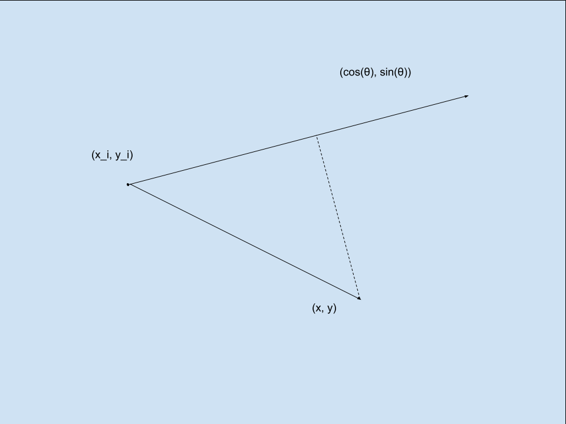
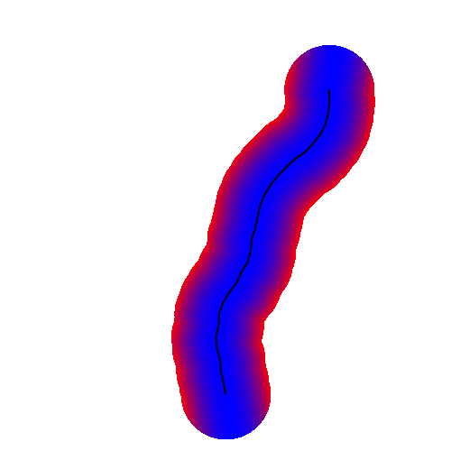
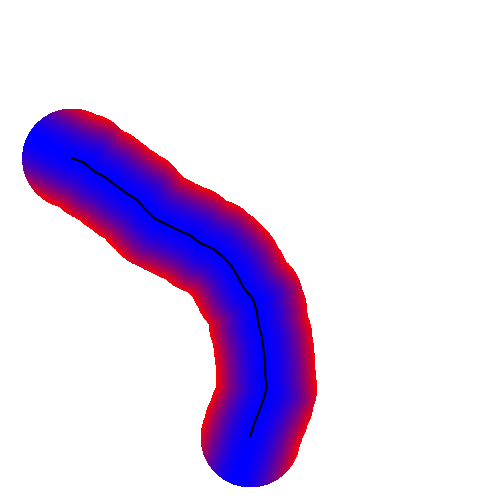
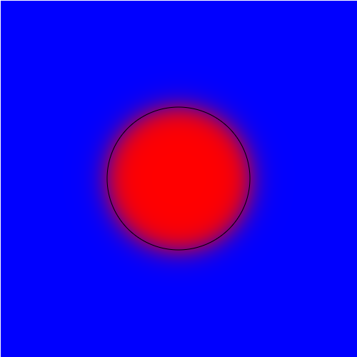

# 12_代价函数

下面来介绍几种机器人运动规划中常用到的几种代价函数的可能设计。要注意，这里提供的仅仅是可能的设计代价函数的思路，实际应用中务必要参考希望解决的优化问题的特点，以及使用的优化算法进行设计。

以下部分针对二维平面中移动机器人运动规划，并考虑前述两个特点。

## 动力学相关的代价函数

移动机器人轨迹规划中，常对动力学参数有一定的要求，例如最大加速度的限制、刹车的加速度的限制，或我们希望以绝对值尽量小的控制量来完成运动操作（从而使轨迹尽量光滑）。

针对有边界限制的量，除了把他们设置成优化问题本身的不等式约束之外，我们也可以考虑惩罚超出边界的情况，以huber loss为例，如果我们希望惩罚超出 $(-l, l)$ 范围的一个标量， 我们可以用一个小的 $\delta$ 参数在界限附近将函数光滑化：

$$
c(x) = 
\begin{cases}
-\delta (x - l + \frac{1}{2}\delta), & x \le l-\delta \\
\frac{1}{2}(x-l)^2, & l-\delta < x \le l \\
0, & l < x \le u \\
\frac{1}{2}(x-u)^2, & u < x \le u + \delta \\
\delta (x - u - \frac{1}{2}\delta), & x > u + \delta \\
\end{cases}
$$

这个分段函数看起来或许杂乱无章，但在设计这个函数的过程中其实有一些考量：

1. 我们希望当动力学参数在许可范围内的时候，这个函数的值为零。
2. 这个函数本身是连续的，其一阶导数也应是连续的。
3. 使用huber loss的好处：当初始值偏离许可范围的时候，我们会得到一个相对温和的一阶导数去指导优化过程找到一个合适的解。

其函数图像大致如下所示（ $l=-2.0, u=2.0, \delta=0.5$ ）:

针对希望绝对值尽量小的量（例如加速度，曲率等），可以简单地使用平方作为代价函数：

$$
c(x) = x^2
$$

这个图象就暂且不画了。

## lane-keeping / path tracking

移动机器人优化问题中一个常见的任务是要沿着某条轨迹，比如扫地机器人按照规划好的路线，或者自动驾驶汽车沿着车道线。这里介绍两种不同的情况：

第一种情况，我们对于机器人在每个时间点运动到的位置有要求，即假定我们已经有了一个轨迹 $(x_t, y_t)$ 。这种情况下我们可以用一个比较简单的距离函数作为代价函数：

$$
c_t(s) = [ (x - x_t)^2 + (y - y_t)^2 ] 
$$

要注意这里的下标，即对每一时刻，这个函数取到最小值的点都是我们希望跟随的轨迹对应时刻的点。

第二种情况，我们只希望机器人沿着某个轨迹 $(x_i, y_i, \theta_i)$ 运动并不偏离该轨迹太远，而不要求某个时刻要运动到某个位置。注意这里为了方便，我们在表达轨迹的时候加入了每个状态的朝向角。

这种情况更加复杂，因为我们不知道在每一个时刻，机器人应该纵向运动到什么位置，只是希望尽量减小横向偏离轨迹的偏差。我们来思考一下如何设计一个光滑的代价函数来表达这一要求。

首先对于给定的某个状态 $(x, y)$， 对于每一个路径点 $(x_i, y_i, \theta_i)$， 我们都可以求得一个横向偏差值（虚线线段长度的平方）:

$$
c_{i} = (x - x_i)^2 + (y - y_i)^2 - [(x-x_i)\cos \theta + (y - y_i) \sin \theta]^2
$$

然后对于这一给定状态，我们希望距离更近的路径点的偏差值有更大的权重。这一点有很多可能的选择，可以使用距离平方的反比：

$$
w_{i} = \frac{(d_i+0.01)^{-2}}{\sum_{j=0}^N (d_i+0.01)^{-2}}
$$

或者使用负指数幂加权平均：

$$
w_{i} = \frac{e^{-d_i}}{\sum_{j=0}^N e^{-d_j}}
$$

这两部分结合：

$$
c(s) = \sum_i w_{i} c_{i}
$$

我们试着通过heatmap来看一看这个代价函数的形状（蓝色代表较小值，红色代表较大值，优化将试图寻找代价函数更小的路径，即倾向于向蓝色区域移动）：

可以看到基本上满足了“距离目标轨迹越近，代价函数值越小”的特点。

当然这个代价函数的设计只适用于曲率较小的路径，对于掉头、270度弯等情况需要考虑用其他方法减小不应考虑的路径点对代价函数造成的影响。

## collision avoidance

对于规避圆形的障碍物 $(x_i, y_i, r_i)$ ，我们可以先计算机器人状态点到圆的边界的有向距离（在圆内为负，在圆外为正）：

$$
d =  \sqrt{ (x - x_i)^2 + (y - y_i)^2 } - r_i
$$

然后使用一个光滑的Step Function（以Sigmoid为例）：

$$
c(s) = 1 - \frac{1}{1 + e^{-d}}
$$

这个代价函数的形状看起来大概如下图：

对于规避多边形障碍物，我们可能需要一个光滑的函数判断输入状态点距离多边形边缘的距离。我们可以计算状态点到多边形每条边的有向距离（对顺时针排列的顶点/边，在右侧为正，左侧为负），设这条边是 $(x_i, y_i), (x_{i+1}, y_{i+1})$，我们有向量 $(x_{i+1} - x_i, y_{i+1}-y_i) $表示边，向量 $(x - x_i, y-y_i)$ 指向状态点，可以使用叉乘方便地得到有向距离：

$$
d_i = \frac{(x-x_i)(y_{i+1}-y_i) - (y-y_i)(x_{i+1} - x_i)}{\sqrt{(x_{i+1}-x_i)^2 + (y_{i+1}-y_i)^2}}
$$

取其中最小值，即得状态点到多边形边缘得有向距离。

然后借用Sigmoid函数，计算其Sigmoid函数值，再将每条边的Sigmoid值相乘，可以得到如下图所示的光滑二维函数：

对于以上几个代价函数，读者可以在资源文件夹找到对应的Javascript实现以作参考。
