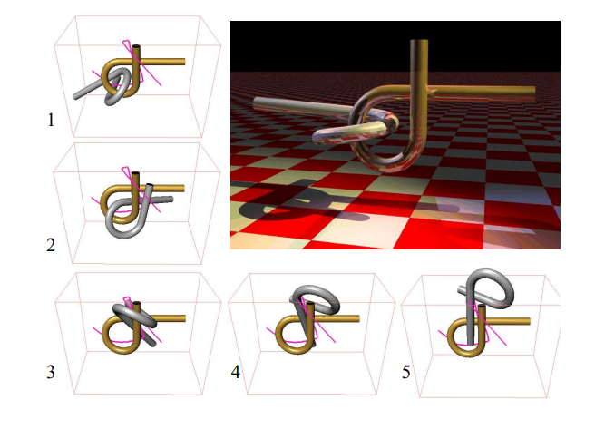
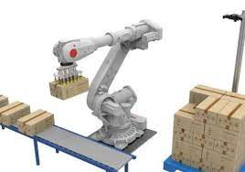

# 规划问题的拆解与分析

## 规划的要素

对于各种各样的规划问题，如果我们能用一套统一的方法论来分析它们，我们便有希望设计一些通用的算法，用于解决这些有一定共性的问题。常见的规划问题都有一些通用的要素：

### 状态

所有的规划问题都需要在*状态空间*(state space)上进行。所谓状态空间，指的是在一个规划问题中，所有可能达到的状态(state)或情形。几乎所有的规划问题都可以表达成，寻找一条从初始状态到结束状态的，合理且连续的轨迹。

在挪钢琴问题中，它是所有可能的钢琴中心坐标和旋转角度（三维空间的六个自由度）；在直升机运动规划中，它可以是直升机所有可取得的在三维空间中的位置、角度和速度；在华容道游戏中，它可以是所有可能的棋子排布的方式；在围棋中，它是所有合法的棋盘状态。

视规划问题不同、规划算法不同，状态空间既可以是连续的，也可以是离散的。当然要注意的是，在实际的规划算法当中，由于状态空间内包含的状态数目巨大（甚至可以是无穷大），我们往往难以表达所有状态空间中的状态，从而常常主要关注有限多的、有一定特点的状态。

### 时间

所有的规划问题都涉及到一连串的、需要按照时间顺序来执行的决策或行动。

我们既可以显式地表达时间，即规划结果的每一个状态都有一个对应的时间。对于时间的表达我们也有离散和连续两种方式：离散的表示法，就是把整个轨迹分成若干个小段，每一段的起点和终点都用一个点来表示，这些点构成了轨迹的离散表示。这种表示法的优势是简单明了，易于计算，缺点是轨迹的精度受到限制、两个点之间的状态还需要插值计算。连续的函数表示法，就是用一个函数来表示整个轨迹，这个函数可以是一条曲线、多条首尾相连的分段曲线等。这种表示法的优势是可以得到精确和平滑的轨迹，可以通过函数得到任意时间点的状态，缺点是轨迹的参数化可能并不直观、计算和优化过程比较复杂。

而当具体的时间没有那么重要，只需要按照顺序执行每一个行动时，我们也可以隐式地表示时间，例如华容道游戏只需要记录每一步该怎么走，而不需要关注第几秒走第几步；挪钢琴问题中我们可以只记录钢琴经历过的所有状态，而不记录经过各个状态的时间。这样在后续步骤中，我们可以通过改变各个状态的时间戳控制挪动过程的快慢。

### 行动 / 控制

一个规划问题将生成一组行动或控制，以此来改变状态。

在人工智能或强化学习中，我们常用行动(action)一词，而在机器人学或控制学中，我们会用控制(control)或输入(inputs)。行动可以是离散的，例如在华容道游戏中，每一个状态下只有数个可能的下一步，即只有数个可能的行动；也可以是连续的，例如控制机器人的马达时，我们可以采用任意的电压或电流。

取决于使用的规划算法不同、机器人的类型不同，控制在规划问题中有着不同的地位。例如挪钢琴的问题中，我们做了一些理想化的假设，假设钢琴可以有六个自由度任意地移动，而不考虑具体搬哪里、几个人来搬，从而很大程度上弱化了控制；但是对于移动机器人就不行了，目前常见的车辆或轮胎并没有横向移动的能力，因此我们不能简单地用平面或空间的全部自由度来作为状态空间——一辆常规的小汽车不可能原地旋转180度掉头。

## 规划可以解决的问题

下面我们列举几种常见的、可以通过规划解决的问题，并且试图用分析它们作为规划问题的几大要素：

### 益智解谜游戏

有一类老少咸宜的基于拆解和组合的趣味玩具，例如鲁班锁，或者Alpha Puzzle：

它们通常有两个（或者两类）状态：组合状态和分离状态。一局解谜游戏中，我们通常从组合状态开始，经过一系列的移动和操作把各个部件分离开，到达分离状态。

如果是人类来解答这样的谜题，一般会把解决方案抽象成几个特定的步骤，例如第一步先将某两个部件移动到某一相对位置，第二部再进行怎样的操作等；而对计算机而言，我们并不容易表达这样位置关系的分类，反而可以采用更一般的表达方式：如果我们将其视为一个规划问题，那么各个部件在空间中的位置（六自由度）即为状态空间，组合状态为初始状态，分离状态为目标状态；这样有六个部件的鲁班锁便有36个自由度，Alpha Puzzle有12个自由度。益智解谜游戏中的时间并不关键，重点是找到可行的路径。我们希望在状态空间中找到一条合法的（不穿模的）轨迹，这条轨迹可以离散也可以连续，但是它应该是状态空间中的轨迹，代表了每一步骤该如何移动每一部件，那么这一条轨迹便是益智游戏的解法。这里需要注意，通过在状态空间中进行轨迹规划，我们忽略了行动，这里就暂且理解为当轨迹采样得足够密集时，相邻状态点之间都十分接近，可以通过简单的操作达到吧。

### 无人机穿越复杂地形

这是一个更典型的，从一个位置到达另一个位置的规划问题。

无人机具有相对复杂的动力学模型，通过控制它的各个马达，不仅可以保持近似直立的状态从一个位置到另一个位置，更可以做出倾斜、滑翔等复杂的特技动作。对于高架桥下、树丛中的复杂情况，如果有精密的感知和先进的运动规划算法支持，无人机可以更安全地通过狭窄而复杂的地形，减小炸机的可能性。

作为一个规划问题而言，我们需要同时考虑状态和控制来进行规划——由于复杂的动力学模型，在状态空间（三维空间的六个自由度）上连续的运动轨迹对无人机而言并不一定可以做到，所以用一组控制来表达轨迹更有优势；而这组控制也会带来每个时刻都在变化的一组状态。同时，时间也是一个比较重要的因素——时间是动力学模型中重要的一个维度，所以这里的轨迹需要有各个状态点对应的时间。

### 工业机器人拆码垛

这或许对于许多读者而言相对比较陌生一点，然而它是工厂中一个常见的场景：将整齐堆放、码成垛的箱子分开摆放（平铺到地上或者放在传送带上），或者将零散摆放的箱子集中堆成垛：

这是一个更复杂的综合性的问题。总体来说，我们需要首先解决一个规划问题：按怎样的顺序，将箱子移动到什么位置；在有这样一个总体规划的基础上，我们又该如何操作机械臂，顺利完成每个箱子的移动。如果中间出现失误，又该如何进行补救，是否从头开始重新规划等。

对于两个层次的规划问题，它们的状态空间，以及时间对轨迹的重要性都不尽相同，应当独立分析。