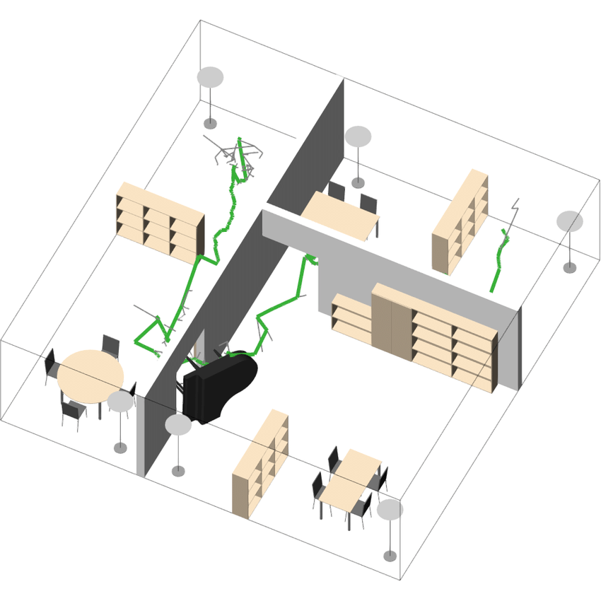
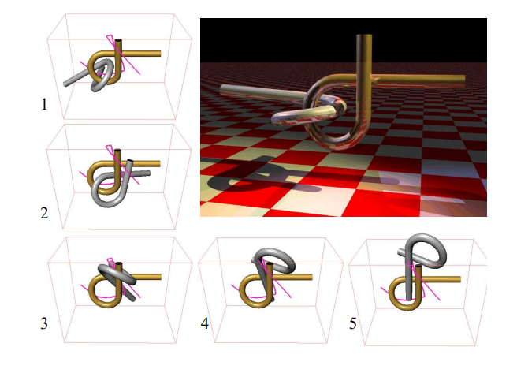
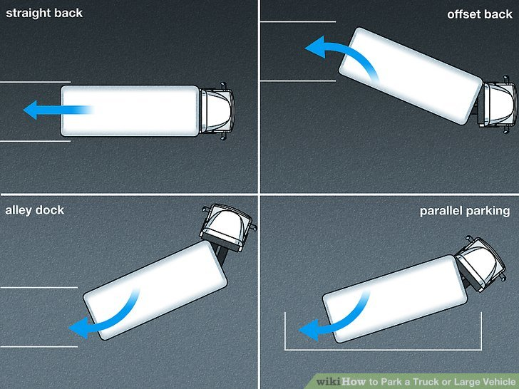

# 运动规划基础知识

本章节介绍运动规划的基本概念和常见元素。

- [运动规划基础知识](#运动规划基础知识)
  - [什么是规划](#什么是规划)
  - [规划可以解决的问题](#规划可以解决的问题)
    - [益智拼图](#益智拼图)
    - [大货车倒库](#大货车倒库)
    - [无人机穿越复杂地形](#无人机穿越复杂地形)
    - [设计NPC](#设计npc)
  - [规划的要素](#规划的要素)
    - [状态](#状态)
    - [时间](#时间)
    - [行动 / 控制](#行动--控制)

## 什么是规划

规划一词对于不同的人、在不同的领域有不同的意义。在机器人学中，一个基本的需求是设计一套算法，将高阶、抽象的任务转换成底层的机械控制。例如我们想要用一台六轴工业机器人将一个零件从一个位置移动到另一个位置，那么每个时刻机器人的每一个关节该如何转动；或者一辆自动驾驶汽车将乘客从A点运送到B点，该选择怎样的路线、又该进行怎样的油门和方向盘控制等。在介绍相对而言更复杂的问题之前，让我们先来看一个相对简单的问题，来帮助我们理解机器人运动规划中的几大要素：挪钢琴。

挪钢琴问题顾名思义，是一个在房间里移动钢琴的问题：假设我们有一架钢琴的三维模型和整个房子的三维模型，我们希望寻找一条*轨迹*，将钢琴从一个位置，经过走廊、楼梯、或许相对狭窄的门，搬到另一个指定房间的指定位置。钢琴的中心位置和旋转角度给它带来了六个自由度，所以这个规划问题是在这样一个六维空间中；而具体地，我们可以选择离散地用许多个点来表达这条轨迹，或者连续地用一个函数来表达，寻找这样一条轨迹的任务就是一个很典型的规划问题。

Image credit: [Research Gate](https://www.researchgate.net/figure/The-piano-movers-problem-EET_fig45_273396838)

## 规划可以解决的问题

运动规划可以用来解决十分广泛的问题：

### 益智拼图

例如鲁班锁，或者Alpha Puzzle：

我们可以用CAD三维建模来表达每个部分的几何形状，将各个部件纠缠在一起的状态视为初始状态，再设计一个各个部件分开的状态作为目标状态。如果我们能够通过运动规划的方法寻找一个从初始状态到目标状态的、没有碰撞（三维世界不许穿模！）的轨迹便可以解决对应的益智拼图。

### 大货车倒库

大货车倒车入库是一个比一般人设想更复杂的问题，因为货车车厢没有主动动力，其朝向的改变完全由车头控制。倒车入库时，需要先调整车头使得车厢的后轮对准车位；然后反向转动方向盘，使得车头的后轮也对准车位；最后车头回正倒车，完成整个入库的过程。

Reference: [Wikihow](https://www.wikihow.com/Park-a-Truck-or-Large-Vehicle)

### 无人机穿越复杂地形

无人机具有相对复杂的动力学模型，通过控制它的各个马达，不仅可以保持近似直立的状态从一个位置到另一个位置，更可以做出倾斜、滑翔等复杂的特技动作。对于高架桥下、树丛中的复杂情况，如果有精密的感知和先进的运动规划算法支持，无人机可以更安全地通过狭窄而复杂的地形，减小炸机的可能性。

### 设计NPC

现代游戏中的NPC，不论是AI还是Boss，逐渐都变得更加复杂，需要在不断变化的情境中做出一些决策。规划算法便可以用于帮助NPC完成一些任务，以增强其智能性。运动规划算法可以帮助NPC选择最短的路径以达到目标，例如魔兽世界中的怪物要追着攻击距离最近的敌人，它便需要理解如何缩短与目标之间的距离；战棋类游戏中的规划算法更是可以决定整体的布局策略，给玩家带来更有挑战性的体验。

## 规划的要素

各种各样的规划问题都有一些通用的要素：

### 状态

所有的规划问题都需要在*状态空间*(state space)上进行。

所谓状态空间，指的是在一个规划问题中，所有可能达到的状态(state)或情形。在挪钢琴问题中，它是所有可能的钢琴中心坐标和旋转角度；在直升机运动规划中，它可以是直升机所有可取得的在三维空间中的位置、角度和速度；在华容道游戏中，它可以是所有可能的棋子排布的方式；在围棋中，它是所有合法的棋盘状态。视规划问题不同、规划算法不同，状态空间既可以是连续的，也可以是离散的。当然要注意的是，在实际的规划算法当中，由于状态空间内包含的状态数目巨大（甚至可以是无穷大），我们往往难以表达所有状态空间中的状态，从而常常主要关注有限多的、有一定特点的状态。

### 时间

所有的规划问题都涉及到一连串的、需要按照时间顺序来执行的决策或行动。我们既可以显式地表达时间，即规划结果的每一个状态都有一个对应的时间；而当具体的时间没有那么重要，只需要按照顺序执行每一个行动时，我们也可以隐式地表示时间，例如华容道只需要记录每一步该怎么走，而不需要关注第几秒走第几步。对于运动规划的问题，有时我们也可以隐式地表达时间，比如挪钢琴问题中我们可以只记录钢琴经历过的所有状态，而不记录经过各个状态的时间；这样在后续步骤中，我们可以通过改变各个状态的时间戳控制挪动过程的快慢。

### 行动 / 控制

一个规划问题将生成一组行动或控制，以此来改变状态。在人工智能或强化学习中，我们常用行动(action)一词，而在机器人学或控制学中，我们会用控制(control)或输入(inputs)。行动可以是离散的，例如在华容道游戏中，每一个状态下只有数个可能的下一步，即只有数个可能的行动；也可以是连续的，例如控制机器人的马达时，我们可以采用任意的电压或电流。

