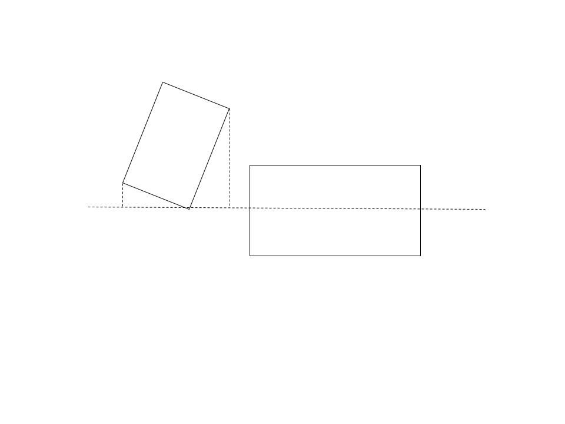

# 4_碰撞检测

我们继续探索二维平面中的位置关系。运动规划中的一项重要任务是规避碰撞，而想要规避碰撞，就需要对形状的几何表达的位置关系进行研究。一个常见的规避碰撞的方法是，对生成的轨迹或采样的点进行碰撞检测，如果该点代表的状态下有碰撞发生，我们便需要想办法将这个点剔除，或者用其他方式确保这个点不会出现在最终规划的轨迹中。

## 简单的碰撞检测

下面将相对简单的碰撞检测的解法列举如下：

| 形状     | （一种可能的）碰撞检测方法                                                                    |
| -------- | --------------------------------------------------------------------------------------------- |
| 点与圆   | 计算点与圆心距离，并与半径比较                                                                |
| 圆与圆   | 计算圆心间距，并与半径的和或差比较                                                            |
| 点与矩形 | 使用齐次变换将点变换到以矩形中心为原点，长轴方向为 $x$ 轴的坐标系中，再将坐标与矩阵半长宽作比较 |

## 线段与线段

对于线段 $(x_0, y_0, x_1, y_1)$ 与 $(x'_0, y'_0, x'_1, y'_1)$ 而言，欲判断它们的位置关系，我们可以找到它们的参数方程：

$$
\begin{cases}
x = x_0 + (x_1 - x_0)t \\
y = y_0 + (y_1 - y_0)t
\end{cases}
$$

和

$$
\begin{cases}
x = x_0' + (x_1' - x_0')t' \\
y = y_0' + (y_1' - y_0')t'
\end{cases}
$$

联立求解可得 $t, t'$ 的值（或无解/无穷多解，意味着两线段平行或两线段在同一直线上），判断其是否在 $0.0-1.0$ 之间，可确定两线段所在直线的交点是否在两线段内，从而判断其相交情况。

## 点与任意多边形

一般来说，假设这里的多边形为简单多边形，即顶点坐标所围形状没有重合的部分。更进一步可以要求多边形为凸多边形。凸多边形有很多较好的性质，可以让计算更加方便，工程上在条件允许的情况下，也常使用多边形的凸包作为近似。

我们可以从这一点向任意方向做一条射线（通常可选 $x$ 轴），然后使用前述方法计算这条射线和多边形各边的交点总数，如果点在多边形内，这条射线和多边形的边的交点总数应为奇数，反之则应为偶数。当然也要注意讨论点在多边形边上，或者射线恰好与一条边重合等特殊情况。

Reference: [Wikipedia](https://en.wikipedia.org/wiki/Point_in_polygon#:~:text=One%20simple%20way%20of%20finding,an%20even%20number%20of%20times.)

实际上我们也可以由此推广到多边形与多边形的碰撞检测--若两个多边形发生碰撞（或者说有重合的部分），则必有一个多边形的一个顶点在另一个多边形内。我们便可以通过判断点与任意多边形位置关系的方式来进行多边形的碰撞检测。

## 矩形与矩形

矩形是工程中很常用的形状，也具有很好的性质，它是一种特殊的凸多边形。这里我们重点介绍一般的情况，即任意角度的矩形（又称OBB, oriented bounding box）。我们介绍一种适用于矩形的碰撞检测算法。

先来介绍分割轴定理（Separating axis theorem）：两个形状有重合的部分，当且仅当其在所有法线（法平面）上的投影都有重合。

我们先取一个矩形某条边的中垂线，并计算两个矩形在这条线上的投影：

再取另一条中垂线并计算投影：

这里我们发现两个投影并没有重合部分，说明两个矩形并不相交。

注意，这个算法也可用于检测凸多边形之间的相交关系，并且也容易推广到三维的情况。它尤其适用于矩形的碰撞检测，因为矩形对边平行，所以法线方向重合，可以简化计算。

## 小结

许多工程中的碰撞检测都是计算的瓶颈，因此提高碰撞检测的计算效率是一项比较常见的任务。

通常可以考虑以下算法提高碰撞检测计算的速度：

* Bounding Volume Hierarchy. 通过用树状结构表示空间中的物体，用粗略的检测快速筛选出需要精细计算的部分，可以节省计算资源并提高速度。Reference: [Wikipedia](https://en.wikipedia.org/wiki/Bounding_volume_hierarchy)
* 用平方计算代替开方计算，例如在需要判断距离时，我们可以判断距离的平方的大小关系。计算机在执行不同运算时的速度有所不同，一般认为乘法远快于开方。Reference: [ithare](http://ithare.com/infographics-operation-costs-in-cpu-clock-cycles/)

因为经常需要计算多个物体之间的碰撞关系，或者对于多边形，需要遍历所有边进行计算，对于成熟的运用场景，可以考虑使用并行计算的方法加快速度：

* SIMD or Auto Vectorization: 现代CPU、现代高级编程语言在合理的优化等级下，会自动使用AVX或类似的指令集加速可以并行的计算。如果自动矢量化效果不理想，也可以自己手写SIMD等CPU并行代码进行加速。
* Multi-threading：某些情况下多线程可以算得更快。
* GPU: 对于规模更大、更复杂的场景，特别是三维空间的碰撞检测，可以考虑使用GPU进行计算。

当然，一切计算的效率以实测为准。笔者就曾遇到过信誓旦旦写了BVH算法以为会更快，结果被Auto Vectorization吊打的尴尬情况。