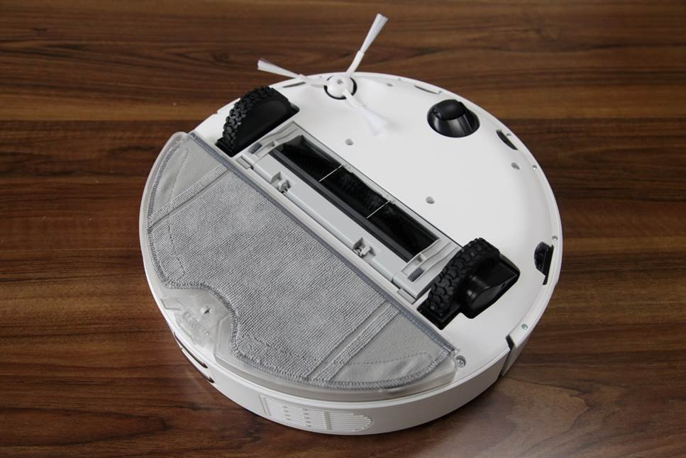
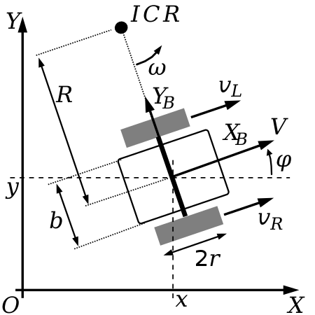
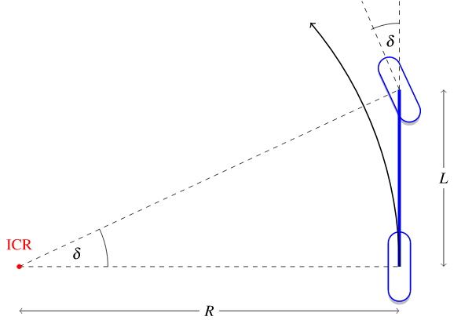

# 5_机器人的状态和控制

如果希望通过数学或者计算机的方法解决运动规划的问题，首先我们应该建立一个数学模型来表示机器人的状态。

对于一个在平地上跑的移动机器人，我们可以采用二维笛卡尔坐标系（也就是平面直角坐标系），取机器人的中心点（或其他给定点）的坐标，以及机器人的朝向，构成一组数据 $s = (x, y, \theta)$。这便是一种可能的表达状态的数学模型。对于一辆小汽车，我们可以用某个时刻的方向盘转角和油门组成一组数据 $c = (\delta, u)$，这便是一种可能的控制的表示方式。实际问题中，控制的表达方式往往与系统的设计息息相关————对于小汽车显然要从方向盘和油门上做文章，对于扫地机器人我们或许可以直接控制每个轮子上的马达，因此表达控制要视情况而定。状态的表达则相对较为灵活，我们可以视具体需求，将速度甚至加速度作为状态的一个元素。

我们记状态为 $n$ 维向量 $s$，控制为 $m$ 维向量 $c$，可以通过运动学方程表达状态和控制的关系：

$$
\dot{s} = f(s, c)
$$

要注意这里 $f$ 的维度： $f: \mathbb{R}^{m+n} \rightarrow \mathbb{R}^n$

也可对其线性展开，即可得到近似的线性关系：

$$ 
\dot{s} = As + Bc
$$

其中 $A = \frac{\partial f}{\partial s}$ 为 $n \times n$ 矩阵， $B = \frac{\partial f}{\partial c}$ 为 $n \times m$ 矩阵。

当然对于许多规划问题，方便起见我们也可以采用离散的表达方式：

$$
s_{t+1} = f(s_t, c_t)
$$

其线性近似为：

$$
s_{t+1} = A s_t + B c_t
$$

这里的 $A, B$ 与前面意义不同，数值上差一个步长 $\Delta t$ 倍。

## 积分

对于一个初始状态 $s_0$ 已知的系统，给定一系列的控制 ${c_0, c_1, \dots, c_T}$ ， 再结合前面提到的运动学模型，我们可以通过迭代的方法推知整个系列每个时刻的状态。为了方便起见，将给定的控制视为常数之后，我们的状态转移方程将仅与状态有关：

$$
\dot{s} = f(s)
$$

### 欧拉法

上式其实是一个一阶的微分方程。我们可以以 $\Delta t$ 为步长来迭代求其近似解：

$$
s_1 = s_0 + f(s_0) \Delta t \\
s_2 = s_1 + f(s_1) \Delta t \\
\dots \\
s_T = s_{T-1} + f(s_{T-1}) \Delta t
$$

这种方法便称为欧拉法。

让我们来看一个实际的例子： $f(s) = s, f(0) = 1$。数学知识告诉我们，这条轨迹实际上是一个指数函数：$s(t) = e^t$，让我们看一下以 $\Delta t = 0.1$为步长，用欧拉法积分出的 $s$ 的值：

我们可以看到欧拉积分会有一些累积的误差。通常步长越小，误差越小，但是欧拉法作为一个相对简单的积分方法，其误差相比其他积分方法较大。

Reference: [Wikipedia](https://en.wikipedia.org/wiki/Euler_method)

### Runge-Kutta法

这是1900年左右由两位德国数学家提出的一种比欧拉法更精细的积分方法。对于 $\dot{s} = f(s)$和给定的 $s_0$，我们的迭代过程如下：

$$
s_{t+1} = s_t + \frac{1}{6} (k_1 + 2k_2 + 2k_3 + k_4) \Delta t
$$

其中 $k_i$ 为对 $s$ 的变化率的几个不同的估计：

$$
k_1 = f(s_t) \\
k_2 = f(s_t + \frac{1}{2} k_1 \Delta t) \\
k_3 = f(s_t + \frac{1}{2} k_2 \Delta t) \\
k_4 = f(s_t + k_3 \Delta t)
$$

其数学意义为，在 $s_t$ 为起点， $\Delta t$ 为步长的一步中， $k_1$ 是 $s_t$ 处的导数， $k_2$ 是用 $k_1$ 估计出的半路处的导数， $k_3$ 是用 $k_2$ 估计出的半路处的导数， $k_4$ 是用 $k_3$估计出的终点处的导数。我们采用其加权平均作为这一步整体的导数的近似值。

我们可以看到这一积分方法的精度极高，同样做 $s(t) = e^t$ 以 $\Delta t = 0.1$为步长 $t=0-3$ 的积分，欧拉法的相对误差约为 $0.1312$ （或者 $13\%$ ），而RK法的相对误差为 $2.4 \times 10^{-6}$ 。

## 移动机器人运动学模型

对于不同的移动机器人，取决于其执行器的设计、算法想要完成的任务，我们或许需要使用不同的运动学模型。下面来介绍两种相对简单而常见的移动机器人的运动学模型。

### 差分模型

差分模型是一种相对简单的运动学模型，它适用于带差分轮机器人，例如非常常见的扫地机器人。差分轮指平行，等半径的一对轮子，可以分别控制两个轮子的角速度或角加速度，从而完成前进、倒退、转向等各种操作。

在此讨论的模型假定移动机器人有其他万向轮作为从动轮，起到支撑的作用，所以只需讨论二维空间的平面移动；而常见的平衡车模型还需要采用类似于倒立摆的方式处理平衡问题，在此暂不讨论。

其状态空间为：

* $x, y$：机器人中心点的二维坐标。注意这里的中心点一般指两个轮子连线的中心，如果要采用其他参考点表达机器人的位置的话，可能需要做些变换。
* $\phi$：机器人朝向的角度。

其控制空间为：

* $\omega_L, \omega_R$：左右轮转动的角速度。

下面推导其运动学方程:

$$v = \frac{(\omega_L + \omega_R) r}{2}$$

$$\dot{x} = v \cos \phi$$

$$\dot{y} = v \sin \phi$$

$$\dot{\phi} = \frac{(\omega_R - \omega_L) r}{b}$$

因此差分模型的运动学方程为：

$$
\begin{bmatrix}\dot{x}\\ \dot{y}\\ \dot{\phi}\end{bmatrix}=\begin{bmatrix}\frac{r \cos \phi}{2}&\frac{r \cos \phi}{2}\\ \frac{r \sin \phi}{2}&\frac{r \sin \phi}{2}\\ -\frac{r}{b}&\frac{r}{b}\end{bmatrix}\begin{bmatrix}\omega_L\\ \omega_R\end{bmatrix}
$$

Reference: [Wikipedia](https://en.wikipedia.org/wiki/Differential_wheeled_robot)

### 自行车模型

自行车模型是一种最简化的前轮控制转向的车辆模型。它是适用于常见的，前轮控制转向的四轮车辆的一种简化的模型，将四轮车辆近似成前轮转向的自行车。

其状态空间为：

* $x, y$：机器人中心点的二维坐标。
* $\theta$：机器人朝向的角度。
* $v$：机器人的线速度。

其控制空间为：

* $a$：机器人的线加速度。
* $\delta$：前轮转向角。

通过瞬时旋转中心(instant center of rotation)作为辅助，易推导其运动学方程为：

$$
\begin{bmatrix} \dot{x} \\ \dot{y} \\ \dot{\theta} \\ \dot{v} \end{bmatrix} = \begin{bmatrix} v \cos \theta \\ v \sin \theta \\ v/L \tan \delta \\ a \end{bmatrix}
$$

Reference: [KinematicsBycicleModel](https://thomasfermi.github.io/Algorithms-for-Automated-Driving/Control/BicycleModel.html#)
