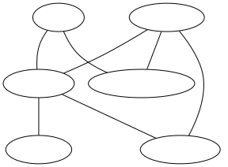

# 搜索

这里的搜索不是说百度或者谷歌，而是指在图（graph）上找到路径的算法。

## 图

计算机科学中，图是指由顶点（vertices，有时也称节点， nodes）和连接这些顶点的边（可以是有向或无向的）组成。

如下所示是一个抽象的有向图：


图可以用来表达非常丰富的信息，例如交通路线图（不要太在意各个节点间的位置关系，这里我们更看重它们的联通关系）：



## 为什么搜索是万能的

这个章节标题有点唬人，我这里其实想说的是，有非常多的实际问题可以抽象成图，其求解方法自然可以用图上的搜索算法来做。举几个例子。

首先是地图导航。非常自然地，我们可以把各个地点，包括起点和终点，视为图的顶点，而各条公路就是连接这些顶点的边。地图导航本质上就是在这个图中搜索一个从起点到终点的路线，使得总路程或总时间最短：


我们可以将围棋棋盘上的状态视为一个个节点，每一步落子视为连接这些节点的边。一局围棋比赛中，自然是从空棋盘开始，直到终盘有一方有一些优势，从而围棋的AI可以视为从当前棋局状态开始，寻找对己方更有利的棋局的搜索算法： 


当然实际工程中，围棋状态空间极大，使用传统的搜索算法几乎不可能，“寻找对己方更有利棋局”也是一个不严谨的表达，具体的数学模型和算法设计可以参见[AlphaGo](https://storage.googleapis.com/deepmind-media/alphago/AlphaGoNaturePaper.pdf)，上图也截取自该论文。

因此，图和搜索是非常强大的数学模型，可以解决很多种类的实际问题。

## 离散规划的一般形式

地图导航和围棋并不是离散规划的很好的例子，他们是更贴近于生活的例子，但是又各自有他们的复杂性：导航系统可能要考虑堵车、修路等等实际问题，围棋中双方棋手交替落子，（通常认为）没有必胜策略。

## 基础搜索算法和先进搜索算法

### BFS， DFS， A*

下面介绍几种特别常见的，程序员们应该烂熟于心的搜索算法：广度优先算法(BFS), 深度优先算法(DFS)和A*。对于一个搜索从起始点（begin）到终点（end）的路径的问题，他们有十分接近的伪代码：

```
open_list = [begin]
path_list = []
visited = []
while open_list is not empty:
    cur_node = open_list.get_one()
    visited.add(cur_node)
    if cur_node == end:
        update path_list
        return path
    else
        for s in cur_node.successors:
            if s not in visited:
                open_list.add(s)
                update path_list
return "No path found"
```

其主要区别在于`open_list.get_one()`的具体方法。广度优先算法使用队列（先入先出），深度优先算法使用栈（先入后出），而A*算法使用优先队列。

以同一个有向图，以A为起点，E为终点为例：


以下为广度优先算法的执行步骤：

| Step | cur_node | open_list | visited         | path_list                            |
| ---- | -------- | --------- | --------------- | ------------------------------------ |
| 0    | -        | [A]       | []              | [A]                                  |
| 1    | A        | [C, D]    | [A]             | [A, A->C, A->D]                      |
| 2    | C        | [D]       | [A, C]          | [A, A->C, A->D]                      |
| 3    | D        | [B]       | [A, C, D]       | [A, A->C, A->D, A->D->B]             |
| 4    | B        | [E]       | [A, C, D, B]    | [A, A->C, A->D, A->D->B, A->D->B->E] |
| 5    | E        | []        | [A, C, D, B, E] | [A, A->C, A->D, A->D->B, A->D->B->E] |

以下为深度优先算法的执行步骤：

| Step | cur_node | open_list | visited      | path_list                            |
| ---- | -------- | --------- | ------------ | ------------------------------------ |
| 0    | -        | [A]       | []           | []                                   |
| 1    | A        | [C, D]    | [A]          | [A, A->C, A->D]                      |
| 2    | D        | [C, B]    | [A, D]       | [A, A->C, A->D, A->D->B]             |
| 3    | B        | [C, E]    | [A, D, B]    | [A, A->C, A->D, A->D->B, A->D->B->E] |
| 4    | E        | [C]       | [A, D, B, E] | [A, A->C, A->D, A->D->B, A->D->B->E] |

A* 在执行`open_list.get_one()`时，会考虑列表中每个节点的启发式权重值。例如在搜索路径的任务中，常使用直线距离作为估计，并且根据直线距离选择较近的节点优先处理。

### Beam Search

Beam Search是BFS的一个变种。区别于BFS，Beam Search对于当前Open List中的节点根据某种heuristic进行排序，并且根据一个给定的常数 $\beta$ ，只探索其中比较优秀的一部分节点去做下一步的搜索。

Beam Search是一种贪婪算法，不能保证能找到最优解，但是在多数情况下可以很好地节省内存空间，提升运行速度。

Reference: [Wikipedia](https://en.wikipedia.org/wiki/Beam_search)

### Focal Search

这是一种相对比较先进的搜索算法。

要理解Focal Search，我们先来看A* 的实现。A* 是一种Best First的搜索算法，其常用从起点到当前节点的路径 $f(x)$ 和当前节点到终点的距离 $g(x)$ 作为heuristic:

```
h(x) = f(x) + g(x)
```

当 $g(x)$ 是凸函数的时候，这个heuristic可以保证搜索找到的路径是最优的。而 $g(x)$ 常常并不是一个凸函数，例如我们的搜索空间如果不只是二维空间的 $(x,y)$ 而是 $(x, y, \theta)$ ，那么简单的欧式距离就不再有这样的保障，虽然这个heuristic仍然常可以给出不错的结果。

由此，A* 其实有许多不同的变种，包括 Weighted-A*，即不使用 $g(x)$ 作为到终点的距离的估计而使用 $w g(x)$ ，其中 $w$ 为一个通常大于1的常数，从而heuristic函数变为 $f(x) = h(x) + wg(x)$ 。我们可以理解，当 $w=1$ 时，Weighted-A* 即是正常的A* 算法，当 $w \rightarrow \infty$ 时，Weighted-A* 将退化成Greedy Search，而当 $w$ 在 $(1, \infty)$ 之间变化时，Weighted-A* 也会逐渐变得更贪婪。

Focal Search把Beam Search的思想应用到A* 中，同时也结合了Weighted-A* 的思想：当生成Open List的时候，只根据Heuristic函数的值选择其中较优的一部分的节点： $f(x') < wf_{min}$ ,而从Open List选择下一个节点进行探索时，使用Weighted Heuristic函数做排序。可以证明Focal Search是一种Bounded-suboptimal Search，即其找到的解可以保证其代价不高于最优解的代价的若干倍。有兴趣的读者建议进一步阅读参考文献。

Reference: [paper](https://www.ijcai.org/proceedings/2018/0199.pdf)

