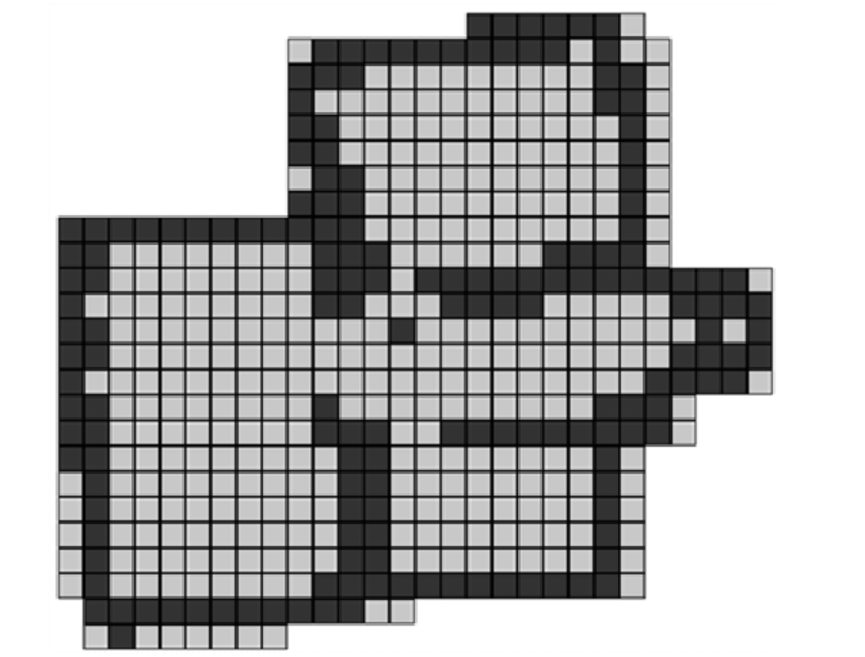
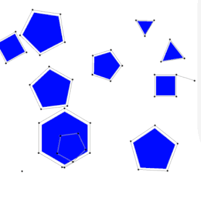

# 机器人学中的建图方法

上一讲中我们提到了机器人的状态的表示方法。对移动机器人，以及其他种类的机器人而言，我们都是用一组数据表达它目前所处的状态，而每个状态都可以视为一个节点，状态和状态之间可以用边相连，于是我们便有了一张图。路径规划问题，即寻找符合一定条件（从起点到终点，无碰撞，路径相对较短等）的状态的轨迹，当我们建立了这样一张图之后，便可以使用搜索算法求解路径规划问题。

为了方便算法的讨论，我们接下来选择二维平面作为示例。要知道，这里的空间其实是机器人的状态空间，完全可以是更高维度，不仅仅可以包含空间坐标，也可以包含加速度、曲率等各种物理参数。以二维平面为示例只是为了方便，以下介绍的各种方法都可以较方便地拓展到更高的维度。

## 随机与采样

运动规划问题常常拥有一个连续的行动空间，例如二维平面的话，理论上 $(x, y, \theta)$ 都可以取任意实数，有无穷多种可能的值。当我们的目标是找到一条可行的轨迹的时候，这样的行动空间是庞大并且并非总是必要的，于是我们可以进行采样的操作，将连续的行动空间变成离散的，从而在有限多个可能的状态节点中规划路径。

一个直观的思路是，使用网格表示地图（occupational grid map）：



我们可以把有障碍物的格子涂成黑色，可以通过的格子涂成白色，这样我们就可以将“从点A到点B”的运动规划任务变成“从一个格子到另一个格子”的搜索问题————寻找一个不经过黑色格子的路径。

当然这种方法相对来说比较粗糙且不一定具有普适性：移动机器人并不一定可以做直角转弯从一个格子运动到另一个格子，或许反而有能力斜着走格子————网格地图虽然对空间在静态情况下的可通过性有不错的描述，但是对于机器人的运动能力并没有很好的表达。或许可以在机器人的行动空间建立网格，不过这涉及到网格的维度（机器人的行动空间维度或许较高，而网格的数量是随着维度指数增长的）和障碍物在行动空间上的映射等问题。

另一个思路是在状态空间上以一定的规则取随机的点，再将这些随机选取的点以一定的方式连接起来。如此，我们可以用一个离散的图来表达状态空间。直觉上来说，我们选择的点越多，图建得越密，对整个空间的覆盖和表达也就越全面。

值得一提的是，计算机系统中使用的随机数生成器常常是伪随机数————对于给定的随机种子，生成的随机数数列是确定的，而且尽管循环周期较大，随机数生成器生成的随机数常常是周期性的。根据业务需求，有时候为了能够对于给定的输入可以始终给出可复现的相同的输出，我们可以考虑使用固定的随机种子；对于希望随机数尽量均匀而不考虑可复现性的情况，可以考虑用当前的时间戳作为随机种子等。

下面我们来介绍几种机器人学中常用的建图的方法。

## PRM

PRM指概率随机地图（Probablistic Random Map）或概率路图（Probablistic Roadmap）。生成PRM需要以下两步：

1. 在状态空间（或设置空间）中随机取样。这一步中我们也可以剔除不可用的点，比如发生碰撞的点或者出于其他原因不应当选择的状态点等。
2. 采用一个本地规划器（local planner）将邻近的点相连。
3. 加入起点和终点，并与邻近的点相连。



由此我们便可以得到一个包含起点和终点的图。我们可以在这张图上使用各种搜索算法去寻找从起点到终点的路线，从而解决规划的问题。

Reference: [Wikipedia](https://en.wikipedia.org/wiki/Probabilistic_roadmap)

## RRT及其变种

PRM是一个相对容易理解并且相对通用的建图方法，但是它也有一些缺点：

1. 为了提高搜索的成功率以及搜索到的路径的质量，往往需要取大量的点，可能会影响运算速度。
2. 对于高维度的状态空间，例如六轴机械臂的configuration space高达6维，Juke Jerk车辆运动学模型可以高达8维，我们可能需要成指数增长的采样点才能完成规划任务。这也称为运动规划的维度灾难。

所以这里来介绍RRT，一个比PRM更快的建图的方法。直接来看伪代码：

```
Algorithm BuildRRT
    Input: Initial configuration qinit, number of vertices in RRT K, incremental distance Δq
    Output: RRT graph G

    G.init(qinit)
    for k = 1 to K do
        qrand ← RAND_CONF()
        qnear ← NEAREST_VERTEX(qrand, G)
        qnew ← NEW_CONF(qnear, qrand, Δq)
        G.add_vertex(qnew)
        G.add_edge(qnear, qnew)
    return G
```
其中，`RAND_CONF`在设置空间中取随机点，`NEAREST_VERTEX`在图上找距离给定点最近的节点，`NEW_CONF`根据给定的两个节点和给定的精度值，寻找符合条件的下一个节点（或多个节点）用来加入树。

二维空间中RRT的建图过程可以可视化如下：


可以把RRT理解为，通过从起点开始，向各个随机方向连直线，快速生成一颗尽量密布整个空间的树。

RRT还有许多变种，列举几种相对知名的如下：

1. bidirectional RRT: 从起点和终点分别建立两颗树，当两棵树相连时停止继续建图。
2. RRT*: 在建立树的过程中对局部的节点和边进行调整，使得从起始点到每个节点的距离尽量短。

Reference: [Wikipedia](https://en.wikipedia.org/wiki/Rapidly-exploring_random_tree)

## State Lattice（状态晶格）

以上两种建图方法中，相邻状态之间是由直线连接的，这其实对于机器人的可控性有一定的要求--并非所有类型的机器人，其设置空间或状态空间的每一个自由度都可以独立连续移动。对于六轴机械臂或者三维空间自由移动来说这个假设还算成立，对于常见的移动机器人来说，坐标位置的变换往往与朝向角度相关，从而不能简单地从设置空间或状态空间采样。

一种可能的建图方法是，从每一个节点出发，我们根据机器人的性质和要解决的问题的性质选取一些可能的基础运动单元（motion primitive），尽量覆盖各种方向、转向等，然后再从这些运动片段的终点继续选取新的运动片段。这种方法建立的图仿佛一个个晶体的晶格：


Reference: [Matthew's paper](https://www.ri.cmu.edu/pub_files/2011/5/20100914_icra2011-mcnaughton.pdf)

这是一种相对最适合移动机器人的建图方法。