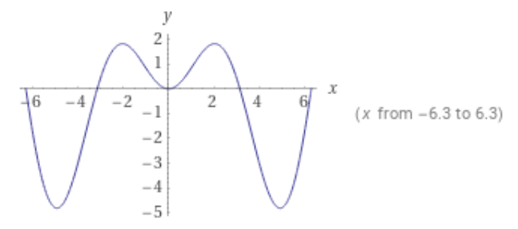
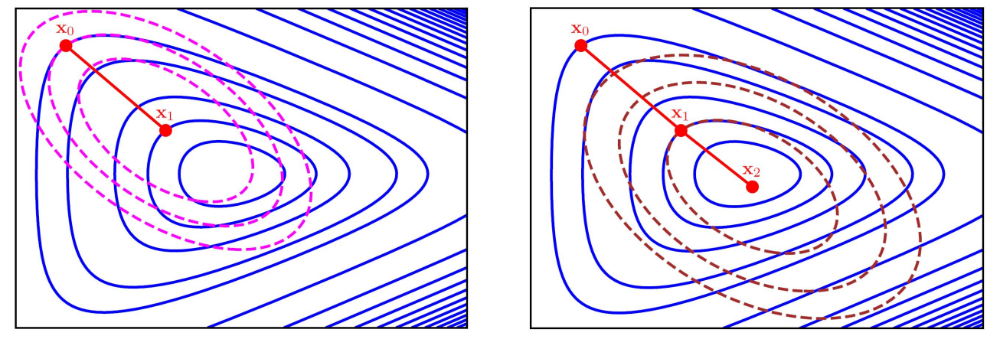
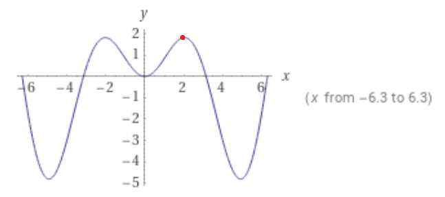

# 9_优化浅谈

本章对优化算法进行一些粗浅的介绍。优化也是一个非常通用且广泛的概念，一定程度上来说人类社会的方方面面、各种行动都可以视作优化问题：投资希望获得最优化的回报，聚餐希望在合理的开销下获得最大的快乐……而我们这里讲的是数学上的、有很好的模型的优化问题。

## 优化问题的一般形式

数学中的优化问题可以表示成以下较为通用的形式：

$$
\min f(x) \\
\text{s.t.} \\
g(x) < 0 \\
h(x) = 0
$$

这里 $f(x)$ 在不同的场景或领域中有许多不同的名字：

* 目标函数、代价函数（cost function）、损失函数（loss function）。这是数学优化问题中常见的称呼，在我们使用这几种称呼的时候，优化问题的目标通常是让这个函数取到尽量小的值。
* 奖励函数、回报函数（reward / reward function）。这个名字常见于强化学习，通常的强化学习问题希望能够得到尽量多的回报，即希望找到这个函数的最大值。

要注意的是这个函数的自变量，或者叫定义域，可以有多于一个维度，视实际问题而定，而其值域为实数，从而可以决定不同输入的优劣： $f(x): \mathbb{R}^n \rightarrow \mathbb{R}$ .

$g(x)<0$ 和 $h(x)=0$ 被称为约束条件(constraints)，分为不等式约束和等式约束。它们用来限制输入的范围。许多实际问题中变量都不可能取到任意值，例如商业问题可能会有库存总量限制，机器人运动规划可能会有马达扭矩限制等，这些都可以以不等式约束的方式来表达；而机器人动力学方程、调度问题物品总量守恒等都可以用等式约束的形式表达。

我们先来看两种适用于一般形式的优化问题的优化算法。我们先从最简单的，没有约束条件，变量为一维的情况开始研究:

$$
\min f(x) \text{ for } x \in \mathbb{R}
$$

## 梯度下降法

解优化问题常用迭代的方法，一般通过某种方式对目标函数的极值点有一个初始的估计，然后通过某种方法，逐步逼近真正的极值点。我们记初始的猜测 $x_0$ ，迭代第 $k$ 步时，状态值更新为 $x_k$ 。

梯度下降算法是一种常用的优化算法，它的基本思想是通过不断地调整自变量 $x$ 的取值（或模型参数）来最小化目标函数，从而得到最优解。

具体来说，梯度下降算法的过程如下：

1. 首先通过某种方式确定一个初始猜测 $x_0$。这一猜测可以是随机初始化，也可以是来自上游模块的一些输入（例如运动规划搜索算法的整体规划）。
2. 计算目标函数关于参数的梯度，即损失函数对每个参数的偏导数。
3. 根据梯度的方向和大小，调整参数向量的值。对于最小化损失函数的问题，需要朝着梯度的反方向调整参数向量的值：
    $$
    x_{k+1} = x_k - \tau \nabla f(x_k)
    $$
4. 重复步骤2和步骤3，直到达到某个停止条件，如达到最大迭代次数或损失函数变化不再显著。

上式中 $\tau$ 为步长，是一个可以设置的系数。我们暂且使用一个固定的常数。

以下是对于一维函数和二维函数，梯度下降法的图示：

我们来看一个实际的一维函数的例子：

$$
\min f(x) = x^2 - 6x + 10, x_0 = 5, \tau = 0.3
$$

这是一个简单的二次函数，显然在 $x=3$ 的时候取到极小值。可以看到通过梯度下降法，经过数次迭代之后 $x$的值已经十分接近最优解。

| iteration # | $x$                                               | $f(x)$      | $f'(x)$   |
| ----------- | ------------------------------------------------- | ----------- | --------- |
| 0           | 5                                                 | 5           | 4         |
| 1           | 3.8 ( $=f(x_0) - \tau f'(x_0) = 5-0.3 \times 4$ ) | 1.64        | 1.6       |
| 2           | 3.32                                              | 1.1024      | 0.64      |
| 3           | 3.128                                             | 1.016384    | 0.256     |
| 4           | 3.0512                                            | 1.00262144  | 0.1024    |
| 5           | 3.02048                                           | 1.00041943  | 0.04096   |
| 6           | 3.008192                                          | 1.000067109 | 0.016384  |
| 7           | 3.0032768                                         | 1.000010737 | 0.0065536 |

## 影响优化算法表现的两大因素

现在我们已经熟悉了一种简单的优化算法了，那么我们来看看初始值和步长会对优化算法的性能产生怎样的影响。

### 初始值的选择

我们看一个比二次函数更复杂点的例子：

$$
\min f(x) = x \sin{x}
$$

这个函数的图像如下所示：

同样选取步长 $\tau=0.3$ 当我们取初始值 $x_0 = 1.0 $ 时：

| iteration # | $x$           | $f(x)$          | $f'(x)$       |
| ----------- | ------------- | --------------- | ------------- |
| 1           | 1             | 0.8414709848    | 1.381773291   |
| 2           | 0.5854680128  | 0.3235234822    | 1.040549908   |
| 3           | 0.2733030403  | 0.07376813918   | 0.533072643   |
| 4           | 0.1133812474  | 0.01282778181   | 0.2257917308  |
| 5           | 0.04564372818 | 0.002082626606  | 0.09122407169 |
| 6           | 0.01827650667 | 0.0003340121003 | 0.0365489435  |

可以看到收敛到 $x=0.0$的极小值点；而当我们取另一初始值 $x_0 = 2.5$ 时：

| iteration # | $x$         | $f(x)$       | $f'(x)$        |
| ----------- | ----------- | ------------ | -------------- |
| 1           | 2.5         | 1.49618036   | -1.404386895   |
| 2           | 2.921316068 | 0.6383061981 | -2.632228929   |
| 3           | 3.710984747 | -2.000666661 | -3.664618625   |
| 4           | 4.810370335 | -4.787298193 | -0.5246308535  |
| 5           | 4.967759591 | -4.806653878 | 0.2873062857   |
| 6           | 4.881567705 | -4.811875417 | -0.163799885   |
| 7           | 4.930707671 | -4.813667371 | 0.09167174229  |
| 8           | 4.903206148 | -4.814210887 | -0.05190115605 |

可以看到最后收敛到 $x \approx 4.9$ 的极小值点。由此可见数值优化的方法对于有局部极小值点而非全局极小值点的函数，容易收敛到局部极小值点；初始值的选取对于优化求解的结果非常重要。

### 步长

另外一个可以注意到的地方是，在上一个例子中，在极值点附近 $f'(x)$ 的值在 $0.0$ 附近震荡。从图像中可以看到，这一极值点附近的图像更加“陡峭”。尽管优化求解的过程在极值点附近震荡，我们依然可以通过多次迭代得到相对更精确的解；而如果我们将步长设置为更大的值 $\tau = 1.0$ ：

| iteration # | $x$           | $f(x)$        | $f'(x)$       |
| ----------- | ------------- | ------------- | ------------- |
| 1           | 2.5           | 1.49618036    | -1.404386895  |
| 2           | 3.904386895   | -2.697713166  | -3.513457308  |
| 3           | 7.417844203   | 6.723460775   | 4.039996332   |
| 4           | 3.377847871   | -0.7906309598 | -3.51807919   |
| 5           | 6.895927062   | 3.965934388   | 6.216493124   |
| 6           | 0.6794339376  | 0.4269241958  | 1.156903813   |
| 7           | -0.4774698755 | 0.2194133994  | -0.8836033476 |
| 8           | 0.4061334721  | 0.1604472048  | 0.7681569091  |
| 9           | -0.3620234369 | 0.1282168411  | -0.6927250783 |
| 10          | 0.3307016414  | 0.1073810489  | 0.6374892209  |

我们可以看到，在优化的过程中“震荡”的现象更严重，甚至离开了初始值所在的邻域，到了另一个极值点 $x=0.0$附近震荡。这种收敛到另一个极值点的情况还算运气比较好，有时候过大的步长甚至会让优化问题很难收敛。

那么步长是不是越小越好呢？也并非总是如此。如果我们选用 $\tau = 0.1$， 将需要15-20个迭代，才能达到 $\tau=0.3$ 时8个迭代后的收敛效果。

步长的选择对于优化算法的性能非常重要，过大或过小的步长都会导致收敛结果不尽如人意：

一个很直观的想法是，除了使用固定的常数作为步长，我们还可以在迭代的过程中逐渐缩小步长：

$$
\tau_k = \frac{\tau_0}{k}
$$

我们再来尝试同样的优化问题，使用 $\tau=1.0$ 作为初始步长而逐渐缩小步长：

| iteration # | $x$         | $f(x)$       | $f'(x)$          |
| ----------- | ----------- | ------------ | ---------------- |
| 1           | 2.5         | 1.49618036   | -1.404386895     |
| 2           | 3.904386895 | -2.697713166 | -3.513457308     |
| 3           | 5.661115549 | -3.298836458 | 4.017923604      |
| 4           | 4.321807681 | -3.996323269 | -2.570112452     |
| 5           | 4.964335794 | -4.807606433 | 0.2691292456     |
| 6           | 4.910509945 | -4.814451306 | -0.01391524423   |
| 7           | 4.912829152 | -4.814469568 | -0.001831266874  |
| 8           | 4.913090762 | -4.814469869 | -0.0004675152299 |

可以看到这次收敛得又快又好。

那么有没有更先进的选取步长的方法呢？有。下面来介绍线搜索的方法。

最理想的步长应该满足怎样的条件呢？我们通过梯度下降的方法找到了调整自变量的方向： $d = -\nabla f(x_k)$， 那么一个最优的步长应该可以直接带我们来到（当前选定的调整方向上的）极小值点：

$$
\tau = \text{arg} \min_{\alpha} f(x_k + \alpha d)
$$

这样我们把一个可能是更高维度的目标函数 $f(x)$ 转化成了一个一维的目标函数：$ f(x_k + \alpha d) $， 如果有廉价且方便的方法求解这个一维的函数那就太好了。但是世事并不总如人意，求解这一极值问题常常并不容易。

换一个思路，我们可以接受所有满足以下条件的 $\alpha$ 作为步长：该步长下目标函数值相比之前更小（说明我们没有震荡到更差的位置），并且减小的速度超过一定的比例：

$$
\tau \in \{ \alpha | f(x_k) - f(x_k + \alpha d) \ge -c \cdot \alpha d^T f(x_k) \}
$$

实践中我们可以选取一个较大的初始步长 $\alpha$ ，如果步长不满足这一条件，就尝试 $\alpha / 2$ 作为步长。如果我们选取非常小的步长却依然无法满足这一条件，往往说明我们选取的方向有误，可能是计算错误或者目标函数局部非凸等原因造成的。

对先进的步长选择方法感兴趣的朋友可以参考[Wikipedia: wolfe condition](https://en.wikipedia.org/wiki/Wolfe_conditions)。

## 牛顿法

梯度下降法只使用了目标函数的一阶导数的信息。如果我们可以同时使用二阶导数的信息，或许可以让收敛的速度变得更快。我们先对目标函数进行泰勒展开：

$$
f(x) \approx f(x_k) + \nabla f(x_k)^T (x - x_k) + \frac{1}{2} (x - x_k)^T \nabla^2 f(x_k) (x - x_k)
$$

然后根据泰勒展开的二阶近似去找其极小值点：

$$
x_{k+1} = x_k - \frac{\nabla f(x_k)}{\nabla^2 f(x_k)} 
$$

我们当然也可以把上式的后半部分视为 $x$ 的更新方向，使用合适的步长进行更新。理想情况下（假设二阶近似误差为零） $\tau=1$ 可以直接带我们到函数的极小值。

一般认为牛顿法收敛速度优于梯度下降：

我们来试着用牛顿法解同一个优化问题：

$$
\min f(x) = x \sin{x}, x_0 = 2.5, \tau = 1.0
$$

| iteration # | $x$         | $f(x)$      | $f'(x)$               | $f''(x)$     |
| ----------- | ----------- | ----------- | --------------------- | ------------ |
| 1           | 2.5         | 1.49618036  | -1.404386895          | -3.098467591 |
| 2           | 2.046747915 | 1.819266459 | -0.04893101004        | -2.735635421 |
| 3           | 2.028861391 | 1.819705727 | -0.0002800108849      | -2.704132672 |
| 4           | 2.028757842 | 1.819705741 | -0.000000009616229035 | -2.703946933 |
| 5           | 2.028757838 | 1.819705741 | 0                     | -2.703946927 |

出问题了。这时候我们并没能收敛到一个极小值点，反而收敛到了一个极大值点：

我们来尝试另一个初始化： $x_0 = 4.0$：

| iteration # | $x$         | $f(x)$       | $f'(x)$           | $f''(x)$    |
| ----------- | ----------- | ------------ | ----------------- | ----------- |
| 1           | 4           | -3.027209981 | -3.371376979      | 1.71992274  |
| 2           | 5.960190944 | -1.891809316 | 5.334577424       | 3.788387791 |
| 3           | 4.552051725 | -4.493664818 | -1.713913766      | 4.174362528 |
| 4           | 4.962632683 | -4.808057096 | 0.2600946489      | 5.303337254 |
| 5           | 4.913589103 | -4.814469454 | 0.00213067196     | 5.214160229 |
| 6           | 4.913180471 | -4.81446989  | 0.000000163497525 | 5.213359853 |

可以看到仅仅六次迭代之后一阶导数 $f'(x)$ 已经十分接近于零，收敛速度的确优于梯度下降法。

由此我们可以看出，牛顿法对于局部非凸函数并不好用，特别是初始化到一个非凸的区间上时。其可能收敛到鞍点或极大值点。

同样，牛顿法也可以用线搜索的方法寻找合适的步长，可以进一步提升收敛的速度。

