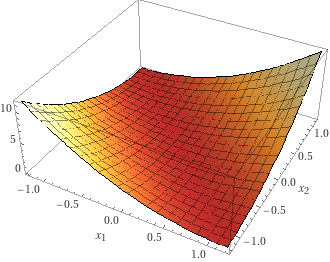
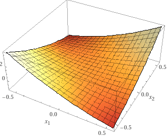
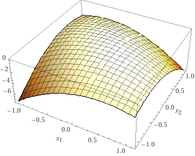

# 10_矩阵运算

上一章节中我们为了方便理解，主要使用一维的自变量进行举例和讲解。运动规划或者其他实际问题中，一维的自变量反而是少见的，很多结论都可以推广到更高维度，使用更高维度的自变量也可以对更复杂的问题进行建模和分析。所以这一章节我们来补充一些基础的矩阵相关的知识。

我们假定读者对于基本的矩阵运算（加减乘法，转置与取逆）是熟悉的，下面来介绍一些线性代数中不常讲解而对机器学习等领域非常重要的一些内容。

## 高维函数的导数

我们先来看一个高维的函数：

$$
y = f(x)
$$

这里 $y$ 是一个有 $m$ 个元素的向量， $x$ 是一个有 $n$ 个元素的向量。

我们记 $y$ 对 $x$ 的导数为

$$
\frac{\partial y}{\partial x} = \begin{bmatrix} \frac{\partial y_1}{\partial x_1} & \frac{\partial y_1}{\partial x_2} & \dots & \frac{\partial y_1}{\partial x_n} \\ \frac{\partial y_2}{\partial x_1} & \frac{\partial y_2}{\partial x_2} & \dots & \frac{\partial y_2}{\partial x_n} \\ \vdots & \vdots & \dots & \vdots \\ \frac{\partial y_m}{\partial x_1} & \frac{\partial y_m}{\partial x_2} & \dots & \frac{\partial y_m}{\partial x_n} \end{bmatrix}
$$

这是一个 $m \times n$ 的矩阵。

这实际上是一个非常符合直觉的定义。考虑

$$
f(x + \Delta x) - f(x) \approx \frac{\partial y}{\partial x} \Delta x
$$

我们把 $x$ 和 $y$ 展开来看：

$$
\begin{bmatrix} y_1 \\ y_2 \\ \vdots \\ y_m \end{bmatrix} = \begin{bmatrix} f_1(x) \\ f_2(x) \\ \vdots \\ f_m(x) \end{bmatrix}
$$

$$
\begin{bmatrix} f_1(x+\Delta x) - f_1(x) \\ f_2(x+\Delta x) - f_2(x) \\ \vdots \\ f_m(x+\Delta x) - f_m(x) \end{bmatrix} = \begin{bmatrix} \frac{\partial y_1}{\partial x_1} \Delta x_1 + \frac{\partial y_1}{\partial x_2} \Delta x_2 + \dots + \frac{\partial y_1}{\partial x_n} \Delta x_n \\ \frac{\partial y_2}{\partial x_1} \Delta x_1 + \frac{\partial y_2}{\partial x_2} \Delta x_2 + \dots + \frac{\partial y_2}{\partial x_n} \Delta x_n \\ \vdots \\ \frac{\partial y_m}{\partial x_1} \Delta x_1 + \frac{\partial y_m}{\partial x_2} \Delta x_2 + \dots + \frac{\partial y_m}{\partial x_n} \Delta x_n \end{bmatrix}
$$

其每一行分别为

$$
f_i(x+\Delta x) - f_i(x) = \frac{\partial y_i}{\partial x_1} \Delta x_1 + \frac{\partial y_i}{\partial x_2} \Delta x_2 + \dots + \frac{\partial y_i}{\partial x_n} \Delta x_n
$$

这恰好是 $y$ 为标量时偏导数的定义。

## 矩阵运算的导数

我们再来看一个矩阵运算（同样假设 $y$ 是一个有 $m$ 个元素的向量， $x$ 是一个有 $n$ 个元素的向量）：

$$
y = Ax
$$

可以将其展开：

$$
y_i = \sum_{j=1}^n a_{ij} x_j
$$

从而 

$$
\frac{\partial y_i}{\partial x_j} = a_{ij}
$$

因此

$$
\frac{\partial y}{\partial x} = A
$$

我们再来看一个标量形式的等式：

$$
\alpha = y^T A x
$$

其中$y$ 是一个有 $m$ 个元素的向量， $x$ 是一个有 $n$ 个元素的向量， $A$ 是一个 $m \times n$ 的矩阵。

那么

$$
\frac{\partial \alpha}{\partial x} = y^T A
$$

由于 $\alpha$ 是标量，我们可以将原式写为

$$
\alpha = \alpha^T = x^T A^T y
$$

从而

$$
\frac{\partial \alpha}{\partial y} = x^T A^T
$$

由以上结论，我们可知

$$
\frac{\partial x^T A x}{\partial x} = x^T (A + A^T)
$$

特别地，当 $A$ 为对称阵时， 

$$
\frac{\partial x^T A x}{\partial x} = 2 x^T A
$$

## 高维函数的二阶导数（Hessian）

对于 $y = f(x)$， $y \in \mathbb{R}$， $x \in \mathbb{R}^n$，我们先来看它的导数：

$$
\frac{\partial y}{\partial x} = \begin{bmatrix} \frac{\partial f}{\partial x_1} \\ \frac{\partial f}{\partial x_2} \\ \vdots \\ \frac{\partial f}{\partial x_n} \end{bmatrix}
$$

如果所有二阶偏导数都存在，我们定义其二阶导数，也称黑塞矩阵(Hessian Matrix)，为：

$$
H_f = \begin{bmatrix} \frac{\partial^2 f}{\partial x_1^2} & \frac{\partial^2 f}{\partial x_1 \partial x_2} & \dots & \frac{\partial^2 f}{\partial x_1 \partial x_n} \\ \frac{\partial^2 f}{\partial x_2 \partial x_1} & \frac{\partial^2 f}{\partial x_2^2} & \dots & \frac{\partial^2 f}{\partial x_2 \partial x_n} \\ \vdots & \vdots & \dots & \vdots \\ \frac{\partial^2 f}{\partial x_n \partial x_1} & \frac{\partial^2 f}{\partial x_n \partial x_2} & \dots & \frac{\partial^2 f}{\partial x_n^2} \end{bmatrix}
$$

由于二阶偏导数的对称性： $ \frac{\partial^2 f}{\partial x_i \partial x_j} = \frac{\partial^2 f}{\partial x_j \partial x_i} $，黑塞矩阵是对称矩阵。

当 $f(x)$ 为凸函数时，黑塞矩阵作为其二阶导数，是半正定矩阵。当 $f(x)$ 为严格凸函数时，黑塞矩阵是正定矩阵。

实际上，我们可以通过泰勒展开的方式，求任意二阶可导的高维函数在 $x = x_0$ 某一邻域附近的二阶近似：

$$
f(x) \approx f(x_0) + f'(x_0) (x - x_0) + \frac{1}{2} f''(x_0) (x - x_0)^2
$$

或者记 $f'(x_0) = G_{x_0}$， $f''(x_0) = H_{f(x_0)}$，我们可以把上式写成矩阵的形式：

$$
f(x) \approx f(x_0) + G_{x_0}^T (x - x_0) + (x - x_0)^T H_{f(x_0)} (x - x_0)
$$

Reference: [Wikipedia](https://en.wikipedia.org/wiki/Hessian_matrix)

## 二次矩阵运算

我们来通过一些二维的例子研究 $x^T A x$ 的性质。显然其黑塞矩阵为 $H = 2A$。

当 $A = \begin{bmatrix} 2 & 1 \\ 1 & 2 \end{bmatrix}$ 时，这是一个正定矩阵，其图像如下：

实际上， 对于 $y = 2x_1^2 + 2x_2^2 + 2 x_1 x_2$，我们可以做如下的变形：

$$
y = 2x_1^2 + 2x_2^2 + 2 x_1 x_2 = x_1^2 + x_2^2 + (x_1 + x_2)^2
$$

这是一个完全平方式，由此我们知道这个函数有两个性质：

1. 对于任意 $x = \begin{bmatrix} x_1 \\ x_2 \end{bmatrix}$， $x^T A x$的值非负；对于任意非零的 $x$， $x^T A x > 0$。
2. 在 $x = \begin{bmatrix} 0 \\ 0 \end{bmatrix}$ 时取到全局最小值 $0$。

当 $A = \begin{bmatrix} 2 & 2 \\ 2 & 2 \end{bmatrix}$ 时，这是一个半正定矩阵，其图像如下：

这是一个半正定矩阵，对于任意 $x_1 + x_2 = 0$ 的情况都有 $x^T A x = 0$。它有无穷多个最小值点。

再来看 $A = \begin{bmatrix} 2 & 4 \\ 4 & 2 \end{bmatrix}$ 时，其图像如下：

我们再来展开看看：

$$
y = 2x_1^2 + 2x_2^2 + 8 x_1 x_2 = -2 x_1^2 - 2 x_2^2 + 4 (x_1 + x_2)^2
$$

$x_2 = x_1$时其退化为 $y = 12 x_1^2$ 是一个开口向上的二次函数，而 $x_2 = -x_1$时，其退化为 $y = -4x_1^2$ 是一个开口向下的二次函数。

虽然 $x^T A x$ 在 $x=0$处一阶导数为零，但其二阶导数并非半正定矩阵（或半负定矩阵），因而 $x = 0$ 被称为鞍点，其并非极大值点或极小值点，从这一点出发沿着不同方向，函数的值可能上升也可能下降。

当 $A = \begin{bmatrix} -2 & -1 \\ -1 & -2 \end{bmatrix}$ 时，这是一个负定矩阵，其图像如下：

其在 $x = 0$ 处有唯一的全局最大值。

## 二次矩阵运算的最小值

我们来看下式：

$$
\alpha = x^T A x + b^T x + c
$$

其中 $\alpha$ 是个标量，$x \in \mathbb{R}^n$ 是个 $n$ 维矢量， $b \in \mathbb{R}^n$ 也是 $n$ 维矢量。

当 $A$ 是一个正定矩阵的时候， $\alpha$ 在 $\mathbb{R}^n$ 上有最小值。

令其导数为零。注意这里的 $0$ 并非是一个标量， 而是一个 $n$ 维矢量。导函数为零依然可以帮我们找到极值点，因为结合二阶导为正（黑塞矩阵为正定矩阵），这意味着向任意方向移动都会使得原式值增大。

$$
\frac{\partial \alpha}{\partial x} = 2 x^T A + b^T = 0
$$

可知

$$
x^T = - \frac{1}{2} b^T A^{-1} \\
x = \frac{1}{2} A^{-T} b = \frac{1}{2} A^{-1} b
$$

此时$\alpha$取得全局最小值。这一结论我们会在下一章节中用到。