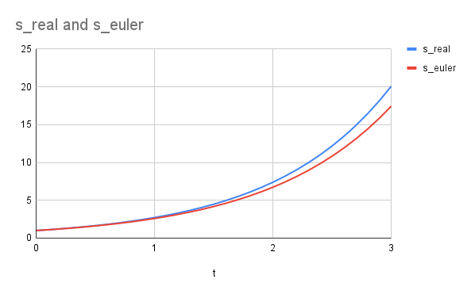
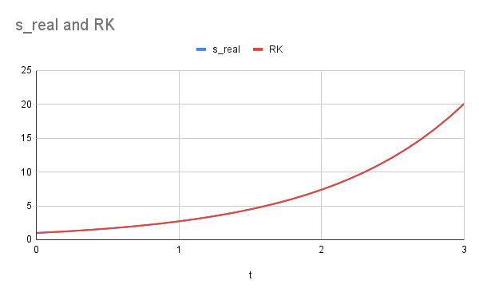
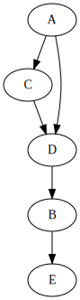
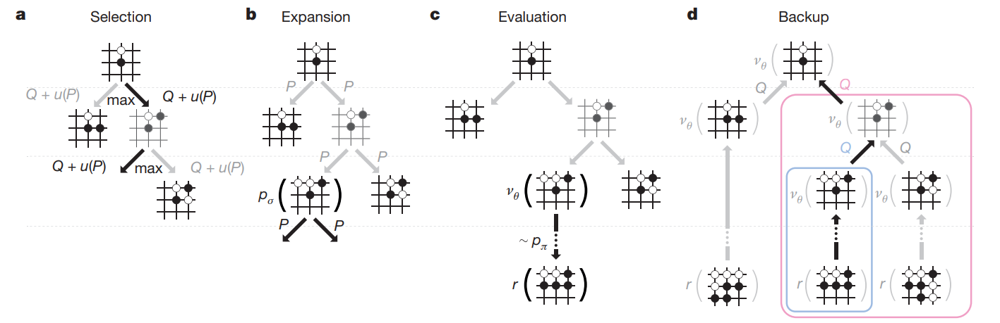
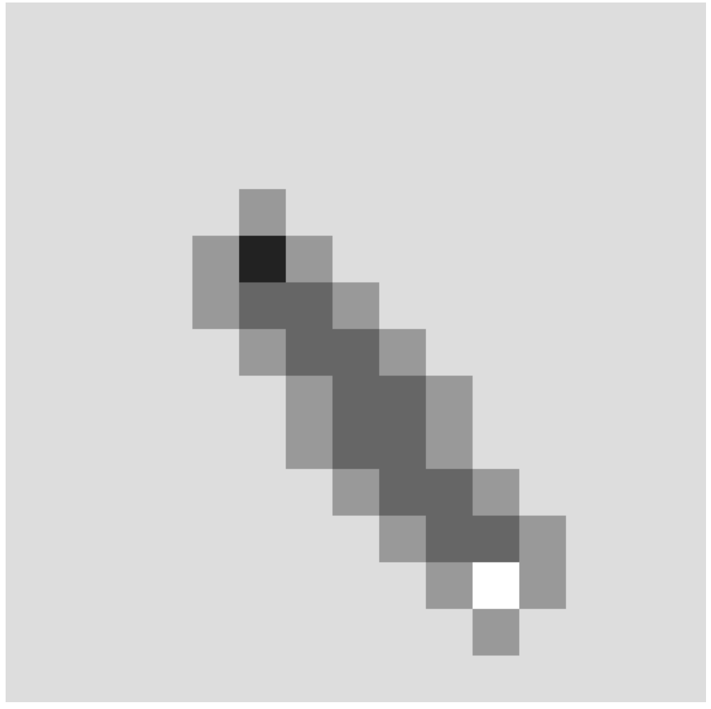
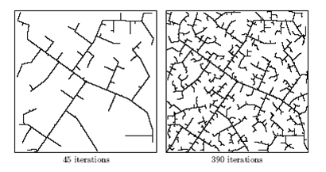

# 0_写在前面

来简单说一说这本书有怎样的内容，面向怎样的读者，该如何使用。

## 写给谁

这本书的定位相对比较独特，但与此同时可能也比较模糊。

笔者个人不希望这本书作为严肃的教科书。尽管这本书会介绍不少研究移动机器人所需的基础知识，和一些经过时间验证的经典算法，但是笔者作为一名工程师，在本书中介绍的内容更接近于工业界而非学术界，知识的讲解博而不精，尽管多多少少对于相关专业的学生也会有一些帮助，但是还是更建议有志于做学术研究的同学们参考更加系统、更加严肃的书籍来入门这个方向。

笔者动笔之时希望可以写一本各个方向、各个水平的读者都可以有所受益的书，然而随着在某些话题上的深入，将会难免涉及到一些计算机或者数学的知识，在这些方面涉足不深的同学们或许需要一些时间和精力多补一点课。

我想这本书最适合的读者，应该是有一定计算机和数学的基础，有一些简单的工程或项目经验的新人工程师。通过这本书，或许可以对自己所做的项目有一个更全面、更广泛的理解，亦可能作为技术选型、算法调优的参考。

## 怎么用

对不同的读者，应当在读这本书的时候有不同的预期。

* 文科朋友或者大学新生：这本书虽不能直指大道之巅，但是可以说大致介绍了近几十年来工业界做移动机器人运动规划的方法。某些介绍性的章节会尽量使用通俗易懂的语言讲解运动规划领域的一些概念，以及使用规划算法可以做到的事情，希望可以多多少少回答“运动规划有什么用”这个问题。
* 相关专业本科生、低年级研究生：这本书可以帮助你复习一些基础概念和数学知识，同时也会讲一些实际项目中可能遇到的问题，用来准备相关公司的算法面试也是可以的。
* 工程师：这本书有一些涉及到软件架构和各个算法的特点的介绍，主要希望可以帮助读者拓宽视野，在繁忙的工作中对公司其他部门要做的事有一些了解，对于运动规划的技术决策也会有一定的帮助。


# 1_运动规划简介

本章节介绍运动规划的基本概念，顺带简单介绍本书各个章节涵盖的内容。


## 什么是规划

规划是指在确定目标和约束条件的基础上，制定一系列有序的行动方案和措施来达成目标的过程。在不同的领域乃至日常生活中，规划都扮演着重要的角色。

通常而言，一个规划问题，都有以下几个通用的元素：

* 初始状态，或当前状态。这是规划问题的起点，我们从这里出发。对于旅游问题，即是当前所处的城市；对于一盘棋局，即是初始的棋盘状态。
* 目标状态。这是我们希望最终到达的状态。这里的状态可以是一个相对复杂的概念，可以是一个具体的位置，或者一个范围、区域，在更复杂的情境中也可以是获得棋局的胜利等。
* 行动。行动即是从初始状态到目标状态的过程中要执行的一系列操作，它帮助我们从一个状态转换到另一个状态（例如乘车从一个城市到达另一个城市，或者通过走一步棋改变棋局的状态等）。

在机器人学中，一个基本的需求是设计一套算法，将高阶、抽象的任务转换成底层的机械控制。例如我们想要用一台六轴工业机器人将一个零件从一个位置移动到另一个位置，那么每个时刻机器人的每一个关节该如何转动；或者一辆自动驾驶汽车将乘客从A点运送到B点，该选择怎样的路线、又该进行怎样的油门和方向盘控制等。

根据机器人的初始状态、目标状态、运动模型和环境信息等参数，计算出一条合适的路径或轨迹来实现特定的任务，这样的问题便是机器人学中的运动规划问题。

## 章节内容介绍

本书主要分为四大模块：

### 运动规划的基础知识

对于一个个实实在在的、现实世界中的问题，可以通过自然语言模糊地表达：“把箱子从桌子上移动到地上”、“驾驶汽车载客从起点到终点，遵守交规、避免事故”，但是如果我们希望通过严谨的方法、使用计算机来解决运动规划的问题，最好还是使用更加严谨的数学语言来表达具体的运动规划问题。

第三章介绍二维、三维世界的数学表达——我们如何使用坐标、坐标系来表示某个物体在空间中的位置，又如何使用旋转角表示物体的朝向；如果将常见物体抽象成圆、球或者矩形、长方体，需要用怎样的方式来表达它们；更一般的情况，对于形状复杂的不规则物体，又如何用数学语言来表达。

第四章介绍一个机器人运动规划中非常重要的任务——碰撞检测。其实有一个更广泛的名字叫计算几何学，它涵盖了碰撞检测、位置关系判断、距离计算等，而其背后的基本原理都是相似的。这一章节在第三章的基础上，介绍在使用数学模型表达物体的基础上，如何判断各个物体之间的位置关系；而这些判断位置关系的方法将会用在后面的章节中，用来在规划路径的过程中规避障碍物、“趋利避害”。

第五章介绍运动学模型。与第三章节试图使用数学的语言描述物体、环境信息相对应地，我们也希望可以通过严谨的数学语言描述索要研究或操作的机器人，例如对于六轴工业机器人，需要什么样的参数可以描述其运动状态与轨迹；对于扫地机器人、自动驾驶汽车，我们对马达或者油门刹车方向盘的控制又将如何影响其运动。

### 基于搜索的规划算法

第六第七章将介绍运动规划问题的一种数学模型。

许多规划任务可以抽象成图搜索——这里的图是计算机学的概念，由抽象的节点和连接节点的边构成。第七章会介绍，对于机器人在连续空间中的运动规划问题，我们可以采用怎样的方法建立这样一张图，从而近似表达这一问题。

第六章介绍在一张给定的图的基础上，我们如何使用搜索算法寻找从初始状态（初始节点）到目标状态（目标节点）的最优路径。

### 基于优化的规划算法

解决运动规划问题的另一个流派是数值优化。

第八章会简单介绍数值优化的概念，顺带介绍两种数值优化的基本方法。这一章节介绍的内容并不局限于运动规划——对于任何可以通过目标函数评价好坏、通过一个高维数组表示自变量的问题，我们都可以通过数值优化的方法来求解。

第九章会补充一点高维函数和矩阵的相关知识，它是对初高中数学介绍的二次函数、导数等内容的扩充，会在第十章大量用到。

第十章会介绍著名的LQR（线性二次型调节器），一种对于特定的数值优化问题特别好用的算法，并且会在基本版的LQR基础上进行一些拓展，让其可以用于十分复杂的实际问题。

为了解决运动规划问题，除了有强大的求解器，我们更需要明白该怎样使用数学的语言描述规划问题（即，设计目标函数）。第十一章会提到几种自动驾驶行业经常会用到的几类目标函数的表达形式。

### 机器学习浅谈

第十二章介绍监督式学习，以及自动驾驶行业曾经尝试过的一些机器学习模型。

第十三章介绍强化学习，一种可以让智能体在环境中自由探索、逐渐学会更好的行动策略的机器学习算法。

最后，第十四章作为全书的总结，简单说说作为一个复杂的工程问题，一个机器人的运动规划系统通常有哪些组成部分，这些组成部分之间又是如何相互配合的。

# 2_规划问题的拆解与分析

## 规划的要素

对于各种各样的规划问题，如果我们能用一套统一的方法论来分析它们，我们便有希望设计一些通用的算法，用于解决这些有一定共性的问题。常见的规划问题都有一些通用的要素：

### 状态

所有的规划问题都需要在*状态空间*(state space)上进行。所谓状态空间，指的是在一个规划问题中，所有可能达到的状态(state)或情形。几乎所有的规划问题都可以表达成，寻找一条从初始状态到结束状态的，合理且连续的轨迹。

在挪钢琴问题中，它是所有可能的钢琴中心坐标和旋转角度（三维空间的六个自由度）；在直升机运动规划中，它可以是直升机所有可取得的在三维空间中的位置、角度和速度；在华容道游戏中，它可以是所有可能的棋子排布的方式；在围棋中，它是所有合法的棋盘状态。

视规划问题不同、规划算法不同，状态空间既可以是连续的，也可以是离散的。当然要注意的是，在实际的规划算法当中，由于状态空间内包含的状态数目巨大（甚至可以是无穷大），我们往往难以表达所有状态空间中的状态，从而常常主要关注有限多的、有一定特点的状态。

### 时间

所有的规划问题都涉及到一连串的、需要按照时间顺序来执行的决策或行动。

我们既可以显式地表达时间，即规划结果的每一个状态都有一个对应的时间。对于时间的表达我们也有离散和连续两种方式：离散的表示法，就是把整个轨迹分成若干个小段，每一段的起点和终点都用一个点来表示，这些点构成了轨迹的离散表示。这种表示法的优势是简单明了，易于计算，缺点是轨迹的精度受到限制、两个点之间的状态还需要插值计算。连续的函数表示法，就是用一个函数来表示整个轨迹，这个函数可以是一条曲线、多条首尾相连的分段曲线等。这种表示法的优势是可以得到精确和平滑的轨迹，可以通过函数得到任意时间点的状态，缺点是轨迹的参数化可能并不直观、计算和优化过程比较复杂。

而当具体的时间没有那么重要，只需要按照顺序执行每一个行动时，我们也可以隐式地表示时间，例如华容道游戏只需要记录每一步该怎么走，而不需要关注第几秒走第几步；挪钢琴问题中我们可以只记录钢琴经历过的所有状态，而不记录经过各个状态的时间。这样在后续步骤中，我们可以通过改变各个状态的时间戳控制挪动过程的快慢。

### 行动 / 控制

一个规划问题将生成一组行动或控制，以此来改变状态。

在人工智能或强化学习中，我们常用行动(action)一词，而在机器人学或控制学中，我们会用控制(control)或输入(inputs)。行动可以是离散的，例如在华容道游戏中，每一个状态下只有数个可能的下一步，即只有数个可能的行动；也可以是连续的，例如控制机器人的马达时，我们可以采用任意的电压或电流。

取决于使用的规划算法不同、机器人的类型不同，控制在规划问题中有着不同的地位。例如挪钢琴的问题中，我们做了一些理想化的假设，假设钢琴可以有六个自由度任意地移动，而不考虑具体搬哪里、几个人来搬，从而很大程度上弱化了控制；但是对于移动机器人就不行了，目前常见的车辆或轮胎并没有横向移动的能力，因此我们不能简单地用平面或空间的全部自由度来作为状态空间——一辆常规的小汽车不可能原地旋转180度掉头。

## 规划可以解决的问题

下面我们列举几种常见的、可以通过规划解决的问题，并且试图用分析它们作为规划问题的几大要素：

### 益智解谜游戏

有一类老少咸宜的基于拆解和组合的趣味玩具，例如鲁班锁，或者Alpha Puzzle：


它们通常有两个（或者两类）状态：组合状态和分离状态。一局解谜游戏中，我们通常从组合状态开始，经过一系列的移动和操作把各个部件分离开，到达分离状态。

如果是人类来解答这样的谜题，一般会把解决方案抽象成几个特定的步骤，例如第一步先将某两个部件移动到某一相对位置，第二部再进行怎样的操作等；而对计算机而言，我们并不容易表达这样位置关系的分类，反而可以采用更一般的表达方式：如果我们将其视为一个规划问题，那么各个部件在空间中的位置（六自由度）即为状态空间，组合状态为初始状态，分离状态为目标状态；这样有六个部件的鲁班锁便有36个自由度，Alpha Puzzle有12个自由度。益智解谜游戏中的时间并不关键，重点是找到可行的路径。我们希望在状态空间中找到一条合法的（不穿模的）轨迹，这条轨迹可以离散也可以连续，但是它应该是状态空间中的轨迹，代表了每一步骤该如何移动每一部件，那么这一条轨迹便是益智游戏的解法。这里需要注意，通过在状态空间中进行轨迹规划，我们忽略了行动，这里就暂且理解为当轨迹采样得足够密集时，相邻状态点之间都十分接近，可以通过简单的操作达到吧。

### 无人机穿越复杂地形

这是一个更典型的，从一个位置到达另一个位置的规划问题。

无人机具有相对复杂的动力学模型，通过控制它的各个马达，不仅可以保持近似直立的状态从一个位置到另一个位置，更可以做出倾斜、滑翔等复杂的特技动作。对于高架桥下、树丛中的复杂情况，如果有精密的感知和先进的运动规划算法支持，无人机可以更安全地通过狭窄而复杂的地形，减小炸机的可能性。

作为一个规划问题而言，我们需要同时考虑状态和控制来进行规划——由于复杂的动力学模型，在状态空间（三维空间的六个自由度）上连续的运动轨迹对无人机而言并不一定可以做到，所以用一组控制来表达轨迹更有优势；而这组控制也会带来每个时刻都在变化的一组状态。同时，时间也是一个比较重要的因素——时间是动力学模型中重要的一个维度，所以这里的轨迹需要有各个状态点对应的时间。

### 工业机器人拆码垛

这或许对于许多读者而言相对比较陌生一点，然而它是工厂中一个常见的场景：将整齐堆放、码成垛的箱子分开摆放（平铺到地上或者放在传送带上），或者将零散摆放的箱子集中堆成垛：


这是一个更复杂的综合性的问题。总体来说，我们需要首先解决一个规划问题：按怎样的顺序，将箱子移动到什么位置；在有这样一个总体规划的基础上，我们又该如何操作机械臂，顺利完成每个箱子的移动。如果中间出现失误，又该如何进行补救，是否从头开始重新规划等。

对于两个层次的规划问题，它们的状态空间，以及时间对轨迹的重要性都不尽相同，应当独立分析。

# 3_几何表达

为了解决一个运动规划的问题，我们首先要对问题进行一定的抽象和数学建模。例如对于扫地机器人，我们该如何表达机器人的形状和周围物体的形状，又该如何避免机器人的运动路径中发生碰撞呢？对于自动驾驶汽车，我们如何表达车道线、周围的其他车辆行人等。

## 几何建模

视需要解决的具体问题不同、运行算法的硬件不同或各种其他原因，运动规划问题有许多种不同的几何建模方法。通常我们可以将几何建模的方法归为两大类：

* 边界表示法(boundary representation)：我们通过几何形状的边界来表示各个几何形状。例如二维问题中，我们用圆周表示一个圆形的障碍物，或者一组顶点和边来表示一个多边形；三维问题中，我们通过大量的三角面片表示零件的外轮廓等。
* 体表示法(solid representation)：我们通过几何形状包围范围的集合来表示几何形状。例如在占据栅格地图(occupational grid map)中，将有障碍物存在的地方标记为不可通行；或者通过“点到圆心的距离小于半径”来表达圆。

## 形状的表达

本章节主要研究二维平面中的问题。在地形并非十分复杂、环境相对可控的情况下，将机器人运动规划建模成一个二维的问题可以省去不少麻烦；许多三维情况下的表示方法和算法亦可以用二维的处理方法类比推知。以下为几种常见的二维几何形状的常见数学表达方法：

| 形状       | 数学表达                                           | 解释                                     |
| ---------- | -------------------------------------------------- | ---------------------------------------- |
| 点         | $(x, y)$                                           | 横纵坐标                                 |
| 圆         | $(x, y, r)$                                        | 圆心坐标和半径                           |
| 线段       | $(x_0, y_0, x_1, y_1)$  或 $(x_c, y_c, l, \theta)$ | 两端点坐标，或者中心点坐标、长度和旋转角 |
| 任意矩形   | $(x, y, l, w, \theta)$                             | 中心点坐标，长度，宽度，旋转角           |
| 任意多边形 | $(x_0, y_0, x_1, y_1, \dots, x_n, y_n)$            | 按逆时针顺序存放的顶点坐标               |

形状的表达不能独立于坐标系。以上表达方式在全局坐标系中直接使用，可以很方便地表达静态的物体；而对于运动的物体，我们可以在运动物体上建立独立的坐标系，这样物体相对于它自己的坐标系永远保持静止，我们便把运动物体的表达分为两部分，固有属性和状态：

| 形状     | 数学表达                                            | 固有属性        | 状态                 |
| -------- | --------------------------------------------------- | --------------- | -------------------- |
| 点       | $(x, y)$                                            |                 | $(x, y)$             |
| 圆       | $(x, y, r)$                                         | $(r)$           | $(x, y)$             |
| 线段     | $(x_0, y_0, x_1, y_1)$   或 $(x_c, y_c, l, \theta)$ | $(l)$           | $(x_c, y_c, \theta)$ |
| 任意矩形 | $(x, y, l, w, \theta)$                              | $(l, w)$  |      $(x, y, \theta)$        |

任意多边形的表达可以类比矩形，使用一组原点附近的点表示其形状，再用坐标和角度表示其位置变换。

对于任意多边形和其他一些复杂的情况，我们也可以用固有属性表达其形状，而用不多于横纵坐标与旋转角的三个量来表达它在二维空间中的状态。实际上，点和圆具有旋转对称性（或者说没有方向性），所以我们没有将 $\theta$ 记入状态，想计入也是可以的。

## 齐次变换

平面空间中的运动可以拆解成两个部分：平移和旋转。

其中平移的部分相对容易理解：只需要在横纵坐标上加减对应的位移即可。例如将位于 $(x_0, y_0)$ 的点移动 $(x_d, y_d)$ ，即可得到 $(x_0 + x_d, y_0 + y_d)$。

对于旋转的部分，我们先考虑点  $(x_0, y_0)$ 绕原点旋转 $\theta$ 角的情况：通过一定的几何运算，我们可以得到旋转之后的点 $(x \cos \theta - y \sin \theta, x \sin \theta + y \cos \theta)$。

我们可以将旋转变换写成矩阵的形式：

$$
 \begin{bmatrix} x \cos \theta - y \sin \theta \\ x \sin \theta + y \cos \theta \end{bmatrix} = \begin{bmatrix} \cos \theta & -\sin \theta \\ \sin \theta & \cos \theta \end{bmatrix}  \begin{bmatrix} x \\ y \end{bmatrix}
$$

由此方便起见我们可以定义一个以原点为中心的旋转矩阵：

$$
 R(\theta) := \begin{bmatrix} \cos \theta & -\sin \theta \\ \sin \theta & \cos \theta \end{bmatrix} 
$$

那对于既有旋转又有平移的情况该如何处理呢？要注意的是先平移 $(x_d, y_d)$ 再绕原点旋转和先绕原点旋转再平移 $(x_d, y_d)$ ，我们会得到不同的变换结果。为了方便起见，约定俗成地，我们一般先绕原点进行旋转变换，再进行平移变换。

点是表达形状的基本元素，许多几何形状都可以通过分解成若干个点来表达，所以我们先来看一看如何计算一个点变换之后的结果。对于一个任意点 $(x, y)$， 我们将其写作齐次坐标的形式： $[x y 1]^T$ ，这样的话我们便可以用矩阵乘法来表示平移变换和旋转变换。先来看平移变换，对于沿 $x$ 轴正方向移动 $x_d$ ，沿 $y$ 轴正方向移动 $y_d$ 的变换，我们可以进行如下的矩阵乘法：

$$
 \begin{bmatrix} x + x_d \\ y + y_d \\ 1 \end{bmatrix} = \begin{bmatrix} 1 & 0 & x_d \\ 0 & 1 & y_d \\ 0 & 0 & 1\end{bmatrix}  \begin{bmatrix} x \\ y \\ 1 \end{bmatrix}
$$

再来看旋转变换。纯粹的旋转变换不应包括平移，而是绕原点逆时针旋转某个角度 $\theta$。这一旋转变换可以表达如下：

$$
 \begin{bmatrix} x \cos \theta - y \sin \theta \\ x \sin \theta + y \cos \theta \\ 1 \end{bmatrix} = \begin{bmatrix} \cos \theta & -\sin \theta & 0 \\ \sin \theta & \cos \theta & 0 \\ 0 & 0 & 1 \end{bmatrix}  \begin{bmatrix} x \\ y \\ 1 \end{bmatrix}
$$

我们也可以将旋转变换和平移变换组合成一个矩阵：

$$
\begin{bmatrix} \cos \theta & -\sin \theta & x_d \\ \sin \theta & \cos \theta & y_d \\ 0 & 0 & 1 \end{bmatrix}
$$

这个矩阵便能表示先旋转后平移的变换。

注意到：

$$
\begin{bmatrix} 1 & 0 & x_d \\ 0 & 1 & y_d \\ 0 & 0 & 1\end{bmatrix} \begin{bmatrix} \cos \theta & -\sin \theta & 0 \\ \sin \theta & \cos \theta & 0 \\ 0 & 0 & 1 \end{bmatrix} = \begin{bmatrix} \cos \theta & -\sin \theta & x_d \\ \sin \theta & \cos \theta & y_d \\ 0 & 0 & 1 \end{bmatrix}
$$

也就是，这一表达先旋转再平移的变换的矩阵，是平移矩阵与旋转矩阵的乘积。

矩阵乘法不具有交换律，如果我们把顺序反过来：

$$
\begin{bmatrix} \cos \theta & -\sin \theta & 0 \\ \sin \theta & \cos \theta & 0 \\ 0 & 0 & 1 \end{bmatrix} \begin{bmatrix} 1 & 0 & x_d \\ 0 & 1 & y_d \\ 0 & 0 & 1\end{bmatrix} = \begin{bmatrix} \cos \theta & -\sin \theta & x_d \cos \theta - y_d \sin \theta \\ \sin \theta & \cos \theta & x_d \sin \theta + y_d \sin \theta \\ 0 & 0 & 1 \end{bmatrix}
$$

这恰好是先平移再绕原点旋转的结果。

更一般地讲，对于*依次*进行多个齐次变换操作 $T_1, T_2, \dots, T_n$，最终的总变换可以通过变换矩阵的连乘 $T_n T_{n-1} \dots T_2 T_1$ 计算得到。

# 4_碰撞检测

我们继续探索二维平面中的位置关系。运动规划中的一项重要任务是规避碰撞，而想要规避碰撞，就需要对形状的几何表达的位置关系进行研究。一个常见的规避碰撞的方法是，对生成的轨迹或采样的点进行碰撞检测，如果该点代表的状态下有碰撞发生，我们便需要想办法将这个点剔除，或者用其他方式确保这个点不会出现在最终规划的轨迹中。

## 简单的碰撞检测

下面将相对简单的碰撞检测的解法列举如下：

| 形状     | （一种可能的）碰撞检测方法                                                                    |
| -------- | --------------------------------------------------------------------------------------------- |
| 点与圆   | 计算点与圆心距离，并与半径比较                                                                |
| 圆与圆   | 计算圆心间距，并与半径的和或差比较                                                            |
| 点与矩形 | 使用齐次变换将点变换到以矩形中心为原点，长轴方向为 $x$ 轴的坐标系中，再将坐标与矩阵半长宽作比较 |

## 线段与线段

对于线段 $(x_0, y_0, x_1, y_1)$ 与 $(x'_0, y'_0, x'_1, y'_1)$ 而言，欲判断它们的位置关系，我们可以找到它们的参数方程：

$$
\begin{cases}
x = x_0 + (x_1 - x_0)t \\
y = y_0 + (y_1 - y_0)t
\end{cases}
$$

和

$$
\begin{cases}
x = x_0' + (x_1' - x_0')t' \\
y = y_0' + (y_1' - y_0')t'
\end{cases}
$$

这个方程组的解可能有三种情况：

* 无解，意味着两线段平行
* 无穷多解，说明两线段在同一直线上
* 有唯一解 $(t, t')$。这时候我们可以判断 $t$ 与 $t'$ 的值是否在 $0.0-1.0$ 之间，可确定两线段所在直线的交点是否在两线段内，从而判断其相交情况。

## 点与任意多边形

一般来说，假设这里的多边形为简单多边形，即顶点坐标所围形状没有重合的部分。更进一步可以要求多边形为凸多边形。凸多边形有很多较好的性质，可以让计算更加方便，工程上在条件允许的情况下，也常使用多边形的凸包作为近似。

我们可以从这一点向任意方向做一条射线（通常可选 $x$ 轴），然后使用前述方法计算这条射线和多边形各边的交点总数，如果点在多边形内，这条射线和多边形的边的交点总数应为奇数，反之则应为偶数。当然也要注意讨论点在多边形边上，或者射线恰好与一条边重合等特殊情况。

Reference: [Wikipedia](https://en.wikipedia.org/wiki/Point_in_polygon#:~:text=One%20simple%20way%20of%20finding,an%20even%20number%20of%20times.)

实际上我们也可以由此推广到多边形与多边形的碰撞检测——若两个多边形发生碰撞（或者说有重合的部分），则必有一个多边形的一个顶点在另一个多边形内。我们便可以对每一个顶点，通过判断点与任意多边形位置关系的方式来进行多边形的碰撞检测。

## 矩形与矩形

矩形是工程中很常用的形状，也具有很好的性质，它是一种特殊的凸多边形。这里我们重点介绍一般的情况，即任意角度的矩形（又称OBB, oriented bounding box）。我们介绍一种适用于矩形的碰撞检测算法。

先来介绍分割轴定理（Separating axis theorem）：两个多边形有重合的部分，当且仅当其在所有法线（法平面）上的投影都有重合。这里的法线（法平面）指每一条边（或棱）对应的法线（法平面）。

我们先取一个矩形某条边的中垂线，并计算两个矩形在这条线上的投影：


再取另一条中垂线并计算投影：


这里我们发现两个投影并没有重合部分，说明两个矩形并不相交。

注意，这个算法也可用于检测凸多边形之间的相交关系，并且也容易推广到三维的情况。它尤其适用于矩形的碰撞检测，因为矩形对边平行，所以法线方向重合，可以简化计算。

## 小结

许多工程中的碰撞检测都是计算的瓶颈，因此提高碰撞检测的计算效率是一项比较常见的任务。

通常可以考虑以下算法提高碰撞检测计算的速度：

* Bounding Volume Hierarchy. 通过用树状结构表示空间中的物体，用粗略的检测快速筛选出需要精细计算的部分，可以节省计算资源并提高速度。Reference: [Wikipedia](https://en.wikipedia.org/wiki/Bounding_volume_hierarchy)
* 用平方计算代替开方计算，例如在需要判断距离时，我们可以判断距离的平方的大小关系。计算机在执行不同运算时的速度有所不同，一般认为乘法远快于开方。Reference: [ithare](http://ithare.com/infographics-operation-costs-in-cpu-clock-cycles/)

因为经常需要计算多个物体之间的碰撞关系，或者对于多边形，需要遍历所有边进行计算，对于成熟的运用场景，可以考虑使用并行计算的方法加快速度：

* SIMD or Auto Vectorization: 现代CPU、现代高级编程语言在合理的优化等级下，会自动使用AVX或类似的指令集加速可以并行的计算。如果自动矢量化效果不理想，也可以自己手写SIMD等CPU并行代码进行加速。
* Multi-threading：某些情况下多线程可以算得更快。
* GPU: 对于规模更大、更复杂的场景，特别是三维空间的碰撞检测，可以考虑使用GPU进行计算。

当然，一切计算的效率以实测为准。笔者就曾遇到过信誓旦旦写了BVH算法以为会更快，结果被Auto Vectorization吊打的尴尬情况。

# 5_运动模型

如果希望通过数学或者计算机的方法解决运动规划的问题，首先我们应该建立一个数学模型来表示机器人的状态。

对于一个在平地上跑的移动机器人，我们可以采用二维笛卡尔坐标系（也就是平面直角坐标系），取机器人的中心点（或其他给定点）的坐标，以及机器人的朝向，构成一组数据 $s = (x, y, \theta)$。这便是一种可能的表达状态的数学模型。对于一辆小汽车，我们可以用某个时刻的方向盘转角和油门组成一组数据 $c = (\delta, u)$，这便是一种可能的控制的表示方式。实际问题中，控制的表达方式往往与系统的设计息息相关————对于小汽车显然要从方向盘和油门上做文章，对于扫地机器人我们或许可以直接控制每个轮子上的马达，因此表达控制要视情况而定。状态的表达则相对较为灵活，我们可以视具体需求，将速度甚至加速度作为状态的一个元素。

我们记状态为 $n$ 维向量 $s$，控制为 $m$ 维向量 $c$，可以通过运动学方程表达状态和控制的关系：

$$
\dot{s} = f(s, c)
$$

要注意这里 $f$ 的维度： $f: \mathbb{R}^{m+n} \rightarrow \mathbb{R}^n$

也可对其线性展开，即可得到近似的线性关系：

$$ 
\dot{s} = As + Bc
$$

其中 $A = \frac{\partial f}{\partial s}$ 为 $n \times n$ 矩阵， $B = \frac{\partial f}{\partial c}$ 为 $n \times m$ 矩阵。

当然对于许多规划问题，方便起见我们也可以采用离散的表达方式：

$$
s_{t+1} = f(s_t, c_t)
$$

其线性近似为：

$$
s_{t+1} = A s_t + B c_t
$$

这里的 $A, B$ 与前面意义不同，数值上差一个步长 $\Delta t$ 倍。

## 积分

对于一个初始状态 $s_0$ 已知的系统，给定一系列的控制 ${c_0, c_1, \dots, c_T}$ ， 再结合前面提到的运动学模型，我们可以通过迭代的方法推知整个系列每个时刻的状态。为了方便起见，将给定的控制视为常数之后，我们的状态转移方程将仅与状态有关：

$$
\dot{s} = f(s)
$$

### 欧拉法

上式其实是一个一阶的微分方程。我们可以以 $\Delta t$ 为步长来迭代求其近似解：

$$
s_1 = s_0 + f(s_0) \Delta t \\
s_2 = s_1 + f(s_1) \Delta t \\
\dots \\
s_T = s_{T-1} + f(s_{T-1}) \Delta t
$$

这种方法便称为欧拉法。

让我们来看一个实际的例子： $f(s) = s, f(0) = 1$。数学知识告诉我们，这条轨迹实际上是一个指数函数：$s(t) = e^t$，让我们看一下以 $\Delta t = 0.1$为步长，用欧拉法积分出的 $s$ 的值：



我们可以看到欧拉积分会有一些累积的误差。通常步长越小，误差越小，但是欧拉法作为一个相对简单的积分方法，其误差相比其他积分方法较大。

Reference: [Wikipedia](https://en.wikipedia.org/wiki/Euler_method)

### Runge-Kutta法

这是1900年左右由两位德国数学家提出的一种比欧拉法更精细的积分方法。对于 $\dot{s} = f(s)$和给定的 $s_0$，我们的迭代过程如下：

$$
s_{t+1} = s_t + \frac{1}{6} (k_1 + 2k_2 + 2k_3 + k_4) \Delta t
$$

其中 $k_i$ 为对 $s$ 的变化率的几个不同的估计：

$$
k_1 = f(s_t) \\
k_2 = f(s_t + \frac{1}{2} k_1 \Delta t) \\
k_3 = f(s_t + \frac{1}{2} k_2 \Delta t) \\
k_4 = f(s_t + k_3 \Delta t)
$$

其数学意义为，在 $s_t$ 为起点， $\Delta t$ 为步长的一步中， $k_1$ 是 $s_t$ 处的导数， $k_2$ 是用 $k_1$ 估计出的半路处的导数， $k_3$ 是用 $k_2$ 估计出的半路处的导数， $k_4$ 是用 $k_3$估计出的终点处的导数。我们采用其加权平均作为这一步整体的导数的近似值。



我们可以看到这一积分方法的精度极高，同样做 $s(t) = e^t$ 以 $\Delta t = 0.1$为步长 $t=0-3$ 的积分，欧拉法的相对误差约为 $0.1312$ （或者 $13\%$ ），而RK法的相对误差为 $2.4 \times 10^{-6}$ 。

## 移动机器人运动学模型

对于不同的移动机器人，取决于其执行器的设计、算法想要完成的任务，我们或许需要使用不同的运动学模型。下面来介绍两种相对简单而常见的移动机器人的运动学模型。

### 差分模型

差分模型是一种相对简单的运动学模型，它适用于带差分轮机器人，例如非常常见的扫地机器人。差分轮指平行，等半径的一对轮子，可以分别控制两个轮子的角速度或角加速度，从而完成前进、倒退、转向等各种操作。


在此讨论的模型假定移动机器人有其他万向轮作为从动轮，起到支撑的作用，所以只需讨论二维空间的平面移动，相对比较简便；而常见的平衡车模型还需要采用类似于倒立摆的方式处理平衡问题，在此暂不讨论。


其状态空间为：

* $x, y$：机器人中心点的二维坐标。注意这里的中心点一般指两个轮子连线的中心，如果要采用其他参考点表达机器人的位置的话，可能需要做些变换。
* $\phi$：机器人朝向的角度。

其控制空间为：

* $\omega_L, \omega_R$：左右轮转动的角速度。

下面推导其运动学方程。差分机器人的速度为两轮平均线速度:

$$v = \frac{(\omega_L + \omega_R) r}{2}$$

而差分机器人在 $x, y$ 两个方向上的导数为线速度在这两个方向上的分量：

$$\dot{x} = v \cos \phi$$

$$\dot{y} = v \sin \phi$$

差分机器人旋转的角速度由两轮转速之差决定：

$$\dot{\phi} = \frac{(\omega_R - \omega_L) r}{b}$$

因此差分模型的运动学方程为：

$$
\begin{bmatrix}\dot{x}\\ \dot{y}\\ \dot{\phi}\end{bmatrix}=\begin{bmatrix}\frac{r \cos \phi}{2}&\frac{r \cos \phi}{2}\\ \frac{r \sin \phi}{2}&\frac{r \sin \phi}{2}\\ -\frac{r}{b}&\frac{r}{b}\end{bmatrix}\begin{bmatrix}\omega_L\\ \omega_R\end{bmatrix}
$$

Reference: [Wikipedia](https://en.wikipedia.org/wiki/Differential_wheeled_robot)

### 自行车模型

自行车模型是一种最简化的前轮控制转向的车辆模型。它是适用于常见的，前轮控制转向的四轮车辆的一种简化的模型，将四轮车辆近似成前轮转向的自行车。


其状态空间为：

* $x, y$：机器人中心点的二维坐标。
* $\theta$：机器人朝向的角度。
* $v$：机器人的线速度。

其控制空间为：

* $a$：机器人的线加速度。
* $\delta$：前轮转向角。

通过瞬时旋转中心(instant center of rotation)作为辅助，易推导其运动学方程为：

$$
\begin{bmatrix} \dot{x} \\ \dot{y} \\ \dot{\theta} \\ \dot{v} \end{bmatrix} = \begin{bmatrix} v \cos \theta \\ v \sin \theta \\ v/L \tan \delta \\ a \end{bmatrix}
$$

Reference: [KinematicsBycicleModel](https://thomasfermi.github.io/Algorithms-for-Automated-Driving/Control/BicycleModel.html#)


# 6_搜索

这里的搜索不是说百度或者谷歌，而是指在图（graph）上找到路径的算法。

## 图

计算机科学中，图是指由顶点（vertices，有时也称节点， nodes）和连接这些顶点的边（可以是有向或无向的）组成。

如下所示是一个抽象的有向图：



图可以用来表达非常丰富的信息，例如交通路线图（不要太在意各个节点间的位置关系，这里我们更看重它们的联通关系）：


## 为什么搜索是万能的

这个章节标题有点唬人，我这里其实想说的是，有非常多的实际问题可以抽象成图，其求解方法自然可以用图上的搜索算法来做。举几个例子。

首先是地图导航。非常自然地，我们可以把各个地点，包括起点和终点，视为图的顶点，而各条公路就是连接这些顶点的边。地图导航本质上就是在这个图中搜索一个从起点到终点的路线，使得总路程或总时间最短：


我们可以将围棋棋盘上的状态视为一个个节点，每一步落子视为连接这些节点的边。一局围棋比赛中，自然是从空棋盘开始，直到终盘有一方有一些优势，从而围棋的AI可以视为从当前棋局状态开始，寻找对己方更有利的棋局的搜索算法： 



当然实际工程中，围棋状态空间极大，使用传统的搜索算法几乎不可能，“寻找对己方更有利棋局”也是一个不严谨的表达，具体的数学模型和算法设计可以参见[AlphaGo](https://storage.googleapis.com/deepmind-media/alphago/AlphaGoNaturePaper.pdf)，上图也截取自该论文。

因此，图和搜索是非常强大的数学模型，可以解决很多种类的实际问题。

## 离散规划的一般形式

地图导航和围棋并不是离散规划的很好的例子，他们是更贴近于生活的例子，但是又各自有他们的复杂性：导航系统可能要考虑堵车、修路等等实际问题，围棋中双方棋手交替落子，并不是单纯可以通过离散规划解决的问题（虽然理论上有必胜策略，但是以人类目前的科技水平暂时还看不到解法）。

下面来介绍一个离散可行性规划问题（Discrete Feasible Planning）的一般形式：

1. 非空的状态空间 $X$，包含有限多或可数无穷多个状态。
2. 对于任意一个状态 $x \in X$，有对应的有限的行动空间 $U(x)$。
3. 一个状态转移方程： $f(x, u) \in X$，对于所有的状态 $x \in X $ ，和合法行动 $ u \in U(x)$。
4. 初始状态 $x_I$。
5. 目标集合 $x_G \subset X$。

## 离散规划的两个例子

### 棋盘格迷宫

一个入门级的例子是二维的棋盘格，我们可以简单地使用二维数组表示每个格子以及格子是否可以通过等：


它的状态转移方程也比较简单，对于四联通(4-connect)的棋盘格，我们可以从一个格子到上下左右任意一个格子，所以每个格子的位置（状态）下有至多四个可能的行动：


### 魔方

对于一个常见的三阶魔方，我们可以用56(3x3x9)个格子的颜色来表示其状态；而在任意状态下，我们都可以执行以下6种可能的行动：

* F(Front)：将魔方的正面（正对解题者的面）顺时针旋转90度
* B(Back)：将魔方的背面（背对解题者的面）顺时针旋转90度
* U(Up)：将魔方的上面顺时针旋转90度
* D(Down)：将魔方的下面顺时针旋转90度
* L(Left)：将魔方的左面顺时针旋转90度
* R(Right)：将魔方的右面顺时针旋转90度

当然这些行动只是所有可能行动的子集，例如将正面逆时针旋转90度就不在其中，但是这一子集的组合可以表达所有可能的行动，例如正面逆时针旋转90度可以表达为顺时针旋转90度三次：FFF。

有了这样的模型，对于给定的初始状态（一个打乱但是合法的魔方）和目标状态的集合（每个面颜色都一样），我们便可以采用图搜索的方法来找到魔方的解。

## 基础搜索算法和先进搜索算法

### BFS， DFS， A*

下面介绍几种特别常见的，程序员们应该烂熟于心的搜索算法：广度优先算法(BFS), 深度优先算法(DFS)和A*。对于一个搜索从起始点（begin）到终点（end）的路径的问题，他们有十分接近的伪代码：

```
open_list = [begin]
path_list = []
visited = []
while open_list is not empty:
    cur_node = open_list.get_one()
    visited.add(cur_node)
    if cur_node == end:
        update path_list
        return path
    else
        for s in cur_node.successors:
            if s not in visited:
                open_list.add(s)
                update path_list
return "No path found"
```

其主要区别在于`open_list.get_one()`的具体方法。广度优先算法使用队列（先入先出），深度优先算法使用栈（先入后出），而A*算法使用优先队列。

以同一个有向图，以A为起点，E为终点为例：


以下为广度优先算法的执行步骤：

| Step | cur_node | open_list | visited         | path_list                            |
| ---- | -------- | --------- | --------------- | ------------------------------------ |
| 0    | -        | [A]       | []              | [A]                                  |
| 1    | A        | [C, D]    | [A]             | [A, A->C, A->D]                      |
| 2    | C        | [D]       | [A, C]          | [A, A->C, A->D]                      |
| 3    | D        | [B]       | [A, C, D]       | [A, A->C, A->D, A->D->B]             |
| 4    | B        | [E]       | [A, C, D, B]    | [A, A->C, A->D, A->D->B, A->D->B->E] |
| 5    | E        | []        | [A, C, D, B, E] | [A, A->C, A->D, A->D->B, A->D->B->E] |

以下为深度优先算法的执行步骤：

| Step | cur_node | open_list | visited      | path_list                            |
| ---- | -------- | --------- | ------------ | ------------------------------------ |
| 0    | -        | [A]       | []           | []                                   |
| 1    | A        | [C, D]    | [A]          | [A, A->C, A->D]                      |
| 2    | D        | [C, B]    | [A, D]       | [A, A->C, A->D, A->D->B]             |
| 3    | B        | [C, E]    | [A, D, B]    | [A, A->C, A->D, A->D->B, A->D->B->E] |
| 4    | E        | [C]       | [A, D, B, E] | [A, A->C, A->D, A->D->B, A->D->B->E] |

A* 在执行`open_list.get_one()`时，会考虑列表中每个节点的启发式权重值。例如在搜索路径的任务中，常使用直线距离作为估计，并且根据直线距离选择较近的节点优先处理。

为了更好地理解不同搜索算法遍历节点的顺序，我们考虑二维棋盘格的情况。以下所有图示中，棋盘格颜色由深到浅依次表示：起点，已访问节点，队列中的节点（open list），背景板，终点。

BFS:


可以看到对于BFS，我们将优先访问距离起点更近的点。节点到起始点的“距离”是影响访问顺序的唯一因素，对节点的访问并没有方向性。

DFS:


对于DFS，我们将优先访问更“远”的节点。这里的远不一定是直线距离上的远，而是最后才加入队列的节点。

使用到起点和终点距离之和作为启发式函数的A*：



可以看到A*算法非常高效地优先考虑“最优”的节点，在选择接下来访问的节点的过程中有较明显的方向性。

### Beam Search

首先介绍best first search。这种搜索方法会对Open List中的节点指定一个值（heuristic），在选取下一个访问的节点时由这个值决定。不同的值函数（heuristic function）的选择会对搜索的顺序产生影响。

例如，如果我们选择节点到起始点的$L1$ distance作为值函数，此时搜索算法与BFS等同；如果我们选择节点到起始点和目标点的直线距离之和作为值函数，则变成了A*算法。

Beam Search是best first search的一个变种。区别于一般的best first search，Beam Search根据一个给定的常数 $\beta$ ，只探索其中比较优秀的一部分节点去做下一步的搜索。

Beam Search是一种贪婪算法，不能保证能找到最优解，但是在多数情况下可以很好地节省内存空间，提升运行效率。

Reference: [Wikipedia](https://en.wikipedia.org/wiki/Beam_search)

### Focal Search

这是一种比较先进的搜索算法。

要理解Focal Search，我们先来看A* 的实现。A* 是一种Best First的搜索算法，其常用从起点到当前节点的路径 $f(x)$ 和当前节点到终点的距离 $g(x)$ 作为heuristic:

```
h(x) = f(x) + g(x)
```

当 $g(x)$ 是凸函数的时候，这个heuristic可以保证搜索找到的路径是最优的。而 $g(x)$ 常常并不是一个凸函数，例如我们的搜索空间如果不只是二维空间的 $(x,y)$ 而是 $(x, y, \theta)$ ，那么简单的欧式距离就不再有这样的保障，虽然这个heuristic仍然常可以给出不错的结果。

由此，A* 其实有许多不同的变种，包括 Weighted-A*，即不使用 $g(x)$ 作为到终点的距离的估计而使用 $w g(x)$ ，其中 $w$ 为一个通常大于1的常数，从而heuristic函数变为 $f(x) = h(x) + wg(x)$ 。我们可以理解，当 $w=1$ 时，Weighted-A* 即是正常的A* 算法，当 $w \rightarrow \infty$ 时，Weighted-A* 将退化成Greedy Search，而当 $w$ 在 $(1, \infty)$ 之间变化时，Weighted-A* 也会逐渐变得更贪婪。

Focal Search把Beam Search的思想应用到A* 中，同时也结合了Weighted-A* 的思想：当生成Open List的时候，只根据Heuristic函数的值选择其中较优的一部分的节点： $f(x') < wf_{min}$ ,而从Open List选择下一个节点进行探索时，使用Weighted Heuristic函数做排序。可以证明Focal Search是一种Bounded-suboptimal Search，即其找到的解可以保证其代价函数的值不高于最优解的代价的若干倍。有兴趣的读者建议进一步阅读参考文献。

Reference: [paper](https://www.ijcai.org/proceedings/2018/0199.pdf)

# 7_机器人学中的建图方法

上一讲中我们提到了机器人的状态的表示方法。对移动机器人，以及其他种类的机器人而言，我们都是用一组数据表达它目前所处的状态，而每个状态都可以视为一个节点，状态和状态之间可以用边相连，于是我们便有了一张图。路径规划问题，即寻找符合一定条件（从起点到终点，无碰撞，路径相对较短等）的状态的轨迹，当我们建立了这样一张图之后，便可以使用搜索算法求解路径规划问题。

为了方便算法的讨论，我们接下来选择二维平面作为示例。要知道，这里的空间其实是机器人的状态空间，完全可以是更高维度，不仅仅可以包含空间坐标，也可以包含加速度、曲率等各种物理参数。以二维平面为示例只是为了方便，以下介绍的各种方法都可以较方便地拓展到更高的维度。

## 随机与采样

运动规划问题常常拥有一个连续的行动空间，例如二维平面的话，理论上 $(x, y, \theta)$ 都可以取任意实数，有无穷多种可能的值。当我们的目标是找到一条可行的轨迹的时候，这样的行动空间是庞大并且并非总是必要的，于是我们可以进行采样的操作，将连续的行动空间变成离散的，从而在有限多个可能的状态节点中规划路径。

一个直观的思路是，使用网格表示地图（occupational grid map）：


我们可以把有障碍物的格子涂成黑色，可以通过的格子涂成白色，这样我们就可以将“从点A到点B”的运动规划任务变成“从一个格子到另一个格子”的搜索问题————寻找一个不经过黑色格子的路径。

当然这种方法相对来说比较粗糙且不一定具有普适性：移动机器人并不一定可以做直角转弯从一个格子运动到另一个格子，或许反而有能力斜着走格子————网格地图虽然对空间在静态情况下的可通过性有不错的描述，但是对于机器人的运动能力并没有很好的表达。或许可以在机器人的行动空间建立网格，不过这涉及到网格的维度（机器人的行动空间维度或许较高，而网格的数量是随着维度指数增长的）和障碍物在行动空间上的映射等问题。

另一个思路是在状态空间上以一定的规则取随机的点，再将这些随机选取的点以一定的方式连接起来。如此，我们可以用一个离散的图来表达状态空间。直觉上来说，我们选择的点越多，图建得越密，对整个空间的覆盖和表达也就越全面。

值得一提的是，计算机系统中使用的随机数生成器常常是伪随机数————对于给定的随机种子，生成的随机数数列是确定的，而且尽管循环周期较大，随机数生成器生成的随机数常常是周期性的。根据业务需求，有时候为了能够对于给定的输入可以始终给出可复现的相同的输出，我们可以考虑使用固定的随机种子；对于希望随机数尽量均匀而不考虑可复现性的情况，可以考虑用当前的时间戳作为随机种子等。

下面我们来介绍几种机器人学中常用的建图的方法。

## PRM

PRM指概率随机地图（Probablistic Random Map）或概率路图（Probablistic Roadmap）。生成PRM需要以下两步：

1. 在状态空间（或设置空间）中随机取样。这一步中我们也可以剔除不可用的点，比如发生碰撞的点或者出于其他原因不应当选择的状态点等。
2. 采用一个本地规划器（local planner）将邻近的点相连。
3. 加入起点和终点，并与邻近的点相连。


由此我们便可以得到一个包含起点和终点的图。我们可以在这张图上使用各种搜索算法去寻找从起点到终点的路线，从而解决规划的问题。

Reference: [Wikipedia](https://en.wikipedia.org/wiki/Probabilistic_roadmap)

## RRT及其变种

PRM是一个相对容易理解并且相对通用的建图方法，但是它也有一些缺点：

1. 为了提高搜索的成功率以及搜索到的路径的质量，往往需要取大量的点，可能会影响运算速度。
2. 对于高维度的状态空间，例如六轴机械臂的configuration space高达6维，Juke Jerk车辆运动学模型可以高达8维，我们可能需要成指数增长的采样点才能完成规划任务。这也称为运动规划的维度灾难。

所以这里来介绍RRT，一个比PRM更快的建图的方法。直接来看伪代码：

```
Algorithm BuildRRT
    Input: Initial configuration qinit, number of vertices in RRT K, incremental distance Δq
    Output: RRT graph G

    G.init(qinit)
    for k = 1 to K do
        qrand ← RAND_CONF()
        qnear ← NEAREST_VERTEX(qrand, G)
        qnew ← NEW_CONF(qnear, qrand, Δq)
        G.add_vertex(qnew)
        G.add_edge(qnear, qnew)
    return G
```
其中，`RAND_CONF`在设置空间中取随机点，`NEAREST_VERTEX`在图上找距离给定点最近的节点，`NEW_CONF`根据给定的两个节点和给定的精度值，寻找符合条件的下一个节点（或多个节点）用来加入树。

二维空间中RRT的建图过程可以可视化如下：



可以把RRT理解为，通过从起点开始，向各个随机方向连直线，快速生成一颗尽量密布整个空间的树。

RRT还有许多变种，列举几种相对知名的如下：

1. bidirectional RRT: 从起点和终点分别建立两颗树，当两棵树相连时停止继续建图。
2. RRT*: 在建立树的过程中对局部的节点和边进行调整，使得从起始点到每个节点的距离尽量短。

Reference: [Wikipedia](https://en.wikipedia.org/wiki/Rapidly-exploring_random_tree)

## State Lattice（状态晶格）

以上两种建图方法中，相邻状态之间是由直线连接的，这其实对于机器人的可控性有一定的要求--并非所有类型的机器人，其设置空间或状态空间的每一个自由度都可以独立连续移动。对于六轴机械臂或者三维空间自由移动来说这个假设还算成立，对于常见的移动机器人来说，坐标位置的变换往往与朝向角度相关，从而不能简单地从设置空间或状态空间采样。

一种可能的建图方法是，从每一个节点出发，我们根据机器人的性质和要解决的问题的性质选取一些可能的基础运动单元（motion primitive），尽量覆盖各种方向、转向等，然后再从这些运动片段的终点继续选取新的运动片段。这种方法建立的图仿佛一个个晶体的晶格：


Reference: [Matthew's paper](https://www.ri.cmu.edu/pub_files/2011/5/20100914_icra2011-mcnaughton.pdf)

这是一种相对最适合移动机器人的建图方法，每一个基础运东单元都有对应的、可行的控制，可以让移动机器人沿着该轨迹移动。

# 8_优化浅谈

本章对优化算法进行一些粗浅的介绍。优化也是一个非常通用且广泛的概念，一定程度上来说人类社会的方方面面、各种行动都可以视作优化问题：投资希望获得最优化的回报，聚餐希望在合理的开销下获得最大的快乐……而我们这里讲的是数学上的、有很好的模型的优化问题。

## 优化问题的一般形式

数学中的优化问题可以表示成以下较为通用的形式：

$$
\min f(x) \\
\text{s.t.} \\
g(x) < 0 \\
h(x) = 0
$$

这里 $f(x)$ 在不同的场景或领域中有许多不同的名字：

* 目标函数、代价函数（cost function）、损失函数（loss function）。这是数学优化问题中常见的称呼，在我们使用这几种称呼的时候，优化问题的目标通常是让这个函数取到尽量小的值。
* 奖励函数、回报函数（reward / reward function）。这个名字常见于强化学习，通常的强化学习问题希望能够得到尽量多的回报，即希望找到这个函数的最大值。

要注意的是这个函数的自变量，或者叫定义域，可以有多于一个维度，视实际问题而定，而其值域为实数，从而可以决定不同输入的优劣： $f(x): \mathbb{R}^n \rightarrow \mathbb{R}$ .

$g(x)<0$ 和 $h(x)=0$ 被称为约束条件(constraints)，分为不等式约束和等式约束。它们用来限制输入的范围。许多实际问题中变量都不可能取到任意值，例如商业问题可能会有库存总量限制，机器人运动规划可能会有马达扭矩限制等，这些都可以以不等式约束的方式来表达；而机器人动力学方程、调度问题物品总量守恒等都可以用等式约束的形式表达。

我们先来看两种适用于一般形式的优化问题的优化算法。我们先从最简单的，没有约束条件，变量为一维的情况开始研究:

$$
\min f(x) \text{ for } x \in \mathbb{R}
$$

## 梯度下降法

解优化问题常用迭代的方法，一般通过某种方式对目标函数的极值点有一个初始的估计，然后通过某种方法，逐步逼近真正的极值点。我们记初始的猜测 $x_0$ ，迭代第 $k$ 步时，状态值更新为 $x_k$ 。

梯度下降算法是一种常用的优化算法，它的基本思想是通过不断地调整自变量 $x$ 的取值（或模型参数）来最小化目标函数，从而得到最优解。

具体来说，梯度下降算法的过程如下：

1. 首先通过某种方式确定一个初始猜测 $x_0$。这一猜测可以是随机初始化，也可以是来自上游模块的一些输入（例如运动规划搜索算法的整体规划）。
2. 计算目标函数关于参数的梯度，即损失函数对每个参数的偏导数。
3. 根据梯度的方向和大小，调整参数向量的值。对于最小化损失函数的问题，需要朝着梯度的反方向调整参数向量的值：
    $$
    x_{k+1} = x_k - \tau \nabla f(x_k)
    $$
4. 重复步骤2和步骤3，直到达到某个停止条件，如达到最大迭代次数或损失函数变化不再显著。

上式中 $\tau$ 为步长，是一个可以设置的系数。我们暂且使用一个固定的常数。

以下是对于一维函数和二维函数，梯度下降法的图示：


我们来看一个实际的一维函数的例子：

$$
\min f(x) = x^2 - 6x + 10, x_0 = 5, \tau = 0.3
$$

这是一个简单的二次函数，显然在 $x=3$ 的时候取到极小值。可以看到通过梯度下降法，经过数次迭代之后 $x$的值已经十分接近最优解。


| iteration # | $x$                                               | $f(x)$      | $f'(x)$   |
| ----------- | ------------------------------------------------- | ----------- | --------- |
| 0           | 5                                                 | 5           | 4         |
| 1           | 3.8 ( $=f(x_0) - \tau f'(x_0) = 5-0.3 \times 4$ ) | 1.64        | 1.6       |
| 2           | 3.32                                              | 1.1024      | 0.64      |
| 3           | 3.128                                             | 1.016384    | 0.256     |
| 4           | 3.0512                                            | 1.00262144  | 0.1024    |
| 5           | 3.02048                                           | 1.00041943  | 0.04096   |
| 6           | 3.008192                                          | 1.000067109 | 0.016384  |
| 7           | 3.0032768                                         | 1.000010737 | 0.0065536 |

## 影响优化算法表现的两大因素

现在我们已经熟悉了一种简单的优化算法了，那么我们来看看初始值和步长会对优化算法的性能产生怎样的影响。

### 初始值的选择

我们看一个比二次函数更复杂点的例子：

$$
\min f(x) = x \sin{x}
$$

这个函数的图像如下所示：


同样选取步长 $\tau=0.3$ 当我们取初始值 $x_0 = 1.0 $ 时：

| iteration # | $x$           | $f(x)$          | $f'(x)$       |
| ----------- | ------------- | --------------- | ------------- |
| 1           | 1             | 0.8414709848    | 1.381773291   |
| 2           | 0.5854680128  | 0.3235234822    | 1.040549908   |
| 3           | 0.2733030403  | 0.07376813918   | 0.533072643   |
| 4           | 0.1133812474  | 0.01282778181   | 0.2257917308  |
| 5           | 0.04564372818 | 0.002082626606  | 0.09122407169 |
| 6           | 0.01827650667 | 0.0003340121003 | 0.0365489435  |

可以看到收敛到 $x=0.0$的极小值点；而当我们取另一初始值 $x_0 = 2.5$ 时：

| iteration # | $x$         | $f(x)$       | $f'(x)$        |
| ----------- | ----------- | ------------ | -------------- |
| 1           | 2.5         | 1.49618036   | -1.404386895   |
| 2           | 2.921316068 | 0.6383061981 | -2.632228929   |
| 3           | 3.710984747 | -2.000666661 | -3.664618625   |
| 4           | 4.810370335 | -4.787298193 | -0.5246308535  |
| 5           | 4.967759591 | -4.806653878 | 0.2873062857   |
| 6           | 4.881567705 | -4.811875417 | -0.163799885   |
| 7           | 4.930707671 | -4.813667371 | 0.09167174229  |
| 8           | 4.903206148 | -4.814210887 | -0.05190115605 |

可以看到最后收敛到 $x \approx 4.9$ 的极小值点。由此可见数值优化的方法对于有局部极小值点而非全局极小值点的函数，容易收敛到局部极小值点；初始值的选取对于优化求解的结果非常重要。

### 步长

另外一个可以注意到的地方是，在上一个例子中，在极值点附近 $f'(x)$ 的值在 $0.0$ 附近震荡。从图像中可以看到，这一极值点附近的图像更加“陡峭”。尽管优化求解的过程在极值点附近震荡，我们依然可以通过多次迭代得到相对更精确的解；而如果我们将步长设置为更大的值 $\tau = 1.0$ ：

| iteration # | $x$           | $f(x)$        | $f'(x)$       |
| ----------- | ------------- | ------------- | ------------- |
| 1           | 2.5           | 1.49618036    | -1.404386895  |
| 2           | 3.904386895   | -2.697713166  | -3.513457308  |
| 3           | 7.417844203   | 6.723460775   | 4.039996332   |
| 4           | 3.377847871   | -0.7906309598 | -3.51807919   |
| 5           | 6.895927062   | 3.965934388   | 6.216493124   |
| 6           | 0.6794339376  | 0.4269241958  | 1.156903813   |
| 7           | -0.4774698755 | 0.2194133994  | -0.8836033476 |
| 8           | 0.4061334721  | 0.1604472048  | 0.7681569091  |
| 9           | -0.3620234369 | 0.1282168411  | -0.6927250783 |
| 10          | 0.3307016414  | 0.1073810489  | 0.6374892209  |

我们可以看到，在优化的过程中“震荡”的现象更严重，甚至离开了初始值所在的邻域，到了另一个极值点 $x=0.0$附近震荡。这种收敛到另一个极值点的情况还算运气比较好，有时候过大的步长甚至会让优化问题很难收敛。

那么步长是不是越小越好呢？也并非总是如此。如果我们选用 $\tau = 0.1$， 将需要15-20个迭代，才能达到 $\tau=0.3$ 时8个迭代后的收敛效果。

步长的选择对于优化算法的性能非常重要，过大或过小的步长都会导致收敛结果不尽如人意：


一个很直观的想法是，除了使用固定的常数作为步长，我们还可以在迭代的过程中逐渐缩小步长：

$$
\tau_k = \frac{\tau_0}{k}
$$

我们再来尝试同样的优化问题，使用 $\tau=1.0$ 作为初始步长而逐渐缩小步长：

| iteration # | $x$         | $f(x)$       | $f'(x)$          |
| ----------- | ----------- | ------------ | ---------------- |
| 1           | 2.5         | 1.49618036   | -1.404386895     |
| 2           | 3.904386895 | -2.697713166 | -3.513457308     |
| 3           | 5.661115549 | -3.298836458 | 4.017923604      |
| 4           | 4.321807681 | -3.996323269 | -2.570112452     |
| 5           | 4.964335794 | -4.807606433 | 0.2691292456     |
| 6           | 4.910509945 | -4.814451306 | -0.01391524423   |
| 7           | 4.912829152 | -4.814469568 | -0.001831266874  |
| 8           | 4.913090762 | -4.814469869 | -0.0004675152299 |

可以看到这次收敛得又快又好。

那么有没有更先进的选取步长的方法呢？有。下面来介绍线搜索的方法。

最理想的步长应该满足怎样的条件呢？我们通过梯度下降的方法找到了调整自变量的方向： $d = -\nabla f(x_k)$， 那么一个最优的步长应该可以直接带我们来到（当前选定的调整方向上的）极小值点：

$$
\tau = \text{arg} \min_{\alpha} f(x_k + \alpha d)
$$

这样我们把一个可能是更高维度的目标函数 $f(x)$ 转化成了一个一维的目标函数：$ f(x_k + \alpha d) $， 如果有廉价且方便的方法求解这个一维的函数那就太好了。但是世事并不总如人意，求解这一极值问题常常并不容易。

换一个思路，我们可以接受所有满足以下条件的 $\alpha$ 作为步长：该步长下目标函数值相比之前更小（说明我们没有震荡到更差的位置），并且减小的速度超过一定的比例：

$$
\tau \in \{ \alpha | f(x_k) - f(x_k + \alpha d) \ge -c \cdot \alpha d^T f(x_k) \}
$$

实践中我们可以选取一个较大的初始步长 $\alpha$ ，如果步长不满足这一条件，就尝试 $\alpha / 2$ 作为步长。如果我们选取非常小的步长却依然无法满足这一条件，往往说明我们选取的方向有误，可能是计算错误或者目标函数局部非凸等原因造成的。

对先进的步长选择方法感兴趣的朋友可以参考[Wikipedia: wolfe condition](https://en.wikipedia.org/wiki/Wolfe_conditions)。

## 牛顿法

梯度下降法只使用了目标函数的一阶导数的信息。如果我们可以同时使用二阶导数的信息，或许可以让收敛的速度变得更快。我们先对目标函数进行泰勒展开：

$$
f(x) \approx f(x_k) + \nabla f(x_k)^T (x - x_k) + \frac{1}{2} (x - x_k)^T \nabla^2 f(x_k) (x - x_k)
$$

然后根据泰勒展开的二阶近似去找其极小值点：

$$
x_{k+1} = x_k - \frac{\nabla f(x_k)}{\nabla^2 f(x_k)} 
$$

我们当然也可以把上式的后半部分视为 $x$ 的更新方向，使用合适的步长进行更新。理想情况下（假设二阶近似误差为零） $\tau=1$ 可以直接带我们到函数的极小值。

一般认为牛顿法收敛速度优于梯度下降：


我们来试着用牛顿法解同一个优化问题：

$$
\min f(x) = x \sin{x}, x_0 = 2.5, \tau = 1.0
$$

| iteration # | $x$         | $f(x)$      | $f'(x)$               | $f''(x)$     |
| ----------- | ----------- | ----------- | --------------------- | ------------ |
| 1           | 2.5         | 1.49618036  | -1.404386895          | -3.098467591 |
| 2           | 2.046747915 | 1.819266459 | -0.04893101004        | -2.735635421 |
| 3           | 2.028861391 | 1.819705727 | -0.0002800108849      | -2.704132672 |
| 4           | 2.028757842 | 1.819705741 | -0.000000009616229035 | -2.703946933 |
| 5           | 2.028757838 | 1.819705741 | 0                     | -2.703946927 |

出问题了。这时候我们并没能收敛到一个极小值点，反而收敛到了一个极大值点：


我们来尝试另一个初始化： $x_0 = 4.0$：

| iteration # | $x$         | $f(x)$       | $f'(x)$           | $f''(x)$    |
| ----------- | ----------- | ------------ | ----------------- | ----------- |
| 1           | 4           | -3.027209981 | -3.371376979      | 1.71992274  |
| 2           | 5.960190944 | -1.891809316 | 5.334577424       | 3.788387791 |
| 3           | 4.552051725 | -4.493664818 | -1.713913766      | 4.174362528 |
| 4           | 4.962632683 | -4.808057096 | 0.2600946489      | 5.303337254 |
| 5           | 4.913589103 | -4.814469454 | 0.00213067196     | 5.214160229 |
| 6           | 4.913180471 | -4.81446989  | 0.000000163497525 | 5.213359853 |

可以看到仅仅六次迭代之后一阶导数 $f'(x)$ 已经十分接近于零，收敛速度的确优于梯度下降法。

由此我们可以看出，牛顿法对于局部非凸函数并不好用，特别是初始化到一个非凸的区间上时。其可能收敛到鞍点或极大值点。

同样，牛顿法也可以用线搜索的方法寻找合适的步长，可以进一步提升收敛的速度。

## 收敛的定义

前面的章节在用一种比较直观的表达表示收敛，当自变量的值逐渐接近某一个值，目标函数（代价函数）逐渐趋于一个局部极小值的时候，我们直觉上就认为这一优化问题收敛到了某一个解。那么数学上如何严谨地表达这一点呢？

通常我们会关注代价函数的变化。假设某个优化问题有非负的代价函数，上一个迭代结束后代价函数的值为 $f_{t-1}$， 当前迭代结束后代价函数的值为 $f_t$ ，我们常用两个条件来判断收敛与否：

1. 绝对容忍度(absolute tolerance)：对某一个相对小的 $\alpha$ ， 当 $0 < f_{t-1} - f{t} < \alpha$ 时我们认为优化问题的求解收敛了。
2. 相对容忍度(relative tolerance)：对某一个相对小的 $\alpha$ ， 当 $0 < f_{t-1} - f{t} < \alpha f_{t-1}$ 时我们认为优化问题的求解收敛了。

这两种判定方法的选取视实际需求而定，通常可以结合在一起使用，即满足任一条件即可视为收敛。

# 9_矩阵运算

上一章节中我们为了方便理解，主要使用一维的自变量进行举例和讲解。运动规划或者其他实际问题中，一维的自变量反而是少见的，很多结论都可以推广到更高维度，使用更高维度的自变量也可以对更复杂的问题进行建模和分析。所以这一章节我们来补充一些基础的矩阵相关的知识。

我们假定读者对于基本的矩阵运算（加减乘法，转置与取逆）是熟悉的，下面来介绍一些线性代数中不常讲解而对机器学习等领域非常重要的一些内容。

## 高维函数的导数

我们先来看一个高维的函数：

$$
y = f(x)
$$

这里 $y$ 是一个有 $m$ 个元素的向量， $x$ 是一个有 $n$ 个元素的向量。

我们记 $y$ 对 $x$ 的导数为

$$
\frac{\partial y}{\partial x} = \begin{bmatrix} \frac{\partial y_1}{\partial x_1} & \frac{\partial y_1}{\partial x_2} & \dots & \frac{\partial y_1}{\partial x_n} \\ \frac{\partial y_2}{\partial x_1} & \frac{\partial y_2}{\partial x_2} & \dots & \frac{\partial y_2}{\partial x_n} \\ \vdots & \vdots & \dots & \vdots \\ \frac{\partial y_m}{\partial x_1} & \frac{\partial y_m}{\partial x_2} & \dots & \frac{\partial y_m}{\partial x_n} \end{bmatrix}
$$

这是一个 $m \times n$ 的矩阵。

这实际上是一个非常符合直觉的定义。考虑

$$
f(x + \Delta x) - f(x) \approx \frac{\partial y}{\partial x} \Delta x
$$


我们把 $x$ 和 $y$ 展开来看：

$$
\begin{bmatrix} y_1 \\ y_2 \\ \vdots \\ y_m \end{bmatrix} = \begin{bmatrix} f_1(x) \\ f_2(x) \\ \vdots \\ f_m(x) \end{bmatrix}
$$

$$
\begin{bmatrix} f_1(x+\Delta x) - f_1(x) \\ f_2(x+\Delta x) - f_2(x) \\ \vdots \\ f_m(x+\Delta x) - f_m(x) \end{bmatrix} = \begin{bmatrix} \frac{\partial y_1}{\partial x_1} \Delta x_1 + \frac{\partial y_1}{\partial x_2} \Delta x_2 + \dots + \frac{\partial y_1}{\partial x_n} \Delta x_n \\ \frac{\partial y_2}{\partial x_1} \Delta x_1 + \frac{\partial y_2}{\partial x_2} \Delta x_2 + \dots + \frac{\partial y_2}{\partial x_n} \Delta x_n \\ \vdots \\ \frac{\partial y_m}{\partial x_1} \Delta x_1 + \frac{\partial y_m}{\partial x_2} \Delta x_2 + \dots + \frac{\partial y_m}{\partial x_n} \Delta x_n \end{bmatrix}
$$

其每一行分别为

$$
f_i(x+\Delta x) - f_i(x) = \frac{\partial y_i}{\partial x_1} \Delta x_1 + \frac{\partial y_i}{\partial x_2} \Delta x_2 + \dots + \frac{\partial y_i}{\partial x_n} \Delta x_n
$$

这恰好是 $y$ 为标量时偏导数的定义。

## 矩阵运算的导数

我们再来看一个矩阵运算（同样假设 $y$ 是一个有 $m$ 个元素的向量， $x$ 是一个有 $n$ 个元素的向量）：

$$
y = Ax
$$

可以将其展开：

$$
y_i = \sum_{j=1}^n a_{ij} x_j
$$

从而 

$$
\frac{\partial y_i}{\partial x_j} = a_{ij}
$$

因此

$$
\frac{\partial y}{\partial x} = A
$$

我们再来看一个标量形式的等式：

$$
\alpha = y^T A x
$$

其中$y$ 是一个有 $m$ 个元素的向量， $x$ 是一个有 $n$ 个元素的向量， $A$ 是一个 $m \times n$ 的矩阵。

那么

$$
\frac{\partial \alpha}{\partial x} = y^T A
$$

由于 $\alpha$ 是标量，我们可以将原式写为

$$
\alpha = \alpha^T = x^T A^T y
$$

从而

$$
\frac{\partial \alpha}{\partial y} = x^T A^T
$$

由以上结论，我们可知

$$
\frac{\partial x^T A x}{\partial x} = x^T (A + A^T)
$$

特别地，当 $A$ 为对称阵时， 

$$
\frac{\partial x^T A x}{\partial x} = 2 x^T A
$$

## 高维函数的二阶导数（Hessian）

对于 $y = f(x)$， $y \in \mathbb{R}$， $x \in \mathbb{R}^n$，我们先来看它的导数：

$$
\frac{\partial y}{\partial x} = \begin{bmatrix} \frac{\partial f}{\partial x_1} \\ \frac{\partial f}{\partial x_2} \\ \vdots \\ \frac{\partial f}{\partial x_n} \end{bmatrix}
$$

如果所有二阶偏导数都存在，我们定义其二阶导数，也称黑塞矩阵(Hessian Matrix)，为：

$$
H_f = \begin{bmatrix} \frac{\partial^2 f}{\partial x_1^2} & \frac{\partial^2 f}{\partial x_1 \partial x_2} & \dots & \frac{\partial^2 f}{\partial x_1 \partial x_n} \\ \frac{\partial^2 f}{\partial x_2 \partial x_1} & \frac{\partial^2 f}{\partial x_2^2} & \dots & \frac{\partial^2 f}{\partial x_2 \partial x_n} \\ \vdots & \vdots & \dots & \vdots \\ \frac{\partial^2 f}{\partial x_n \partial x_1} & \frac{\partial^2 f}{\partial x_n \partial x_2} & \dots & \frac{\partial^2 f}{\partial x_n^2} \end{bmatrix}
$$

由于二阶偏导数的对称性： $ \frac{\partial^2 f}{\partial x_i \partial x_j} = \frac{\partial^2 f}{\partial x_j \partial x_i} $，黑塞矩阵是对称矩阵。

当 $f(x)$ 为凸函数时，黑塞矩阵作为其二阶导数，是半正定矩阵。当 $f(x)$ 为严格凸函数时，黑塞矩阵是正定矩阵。

实际上，我们可以通过泰勒展开的方式，求任意二阶可导的高维函数在 $x = x_0$ 某一邻域附近的二阶近似：

$$
f(x) \approx f(x_0) + f'(x_0) (x - x_0) + \frac{1}{2} f''(x_0) (x - x_0)^2
$$

或者记 $f'(x_0) = G_{x_0}$， $f''(x_0) = H_{f(x_0)}$，我们可以把上式写成矩阵的形式：

$$
f(x) \approx f(x_0) + G_{x_0}^T (x - x_0) + (x - x_0)^T H_{f(x_0)} (x - x_0)
$$


Reference: [Wikipedia](https://en.wikipedia.org/wiki/Hessian_matrix)

## 二次矩阵运算

我们来通过一些二维的例子研究 $x^T A x$ 的性质。显然其黑塞矩阵为 $H = 2A$。

当 $A = \begin{bmatrix} 2 & 1 \\ 1 & 2 \end{bmatrix}$ 时，这是一个正定矩阵，其图像如下：


实际上， 对于 $y = 2x_1^2 + 2x_2^2 + 2 x_1 x_2$，我们可以做如下的变形：

$$
y = 2x_1^2 + 2x_2^2 + 2 x_1 x_2 = x_1^2 + x_2^2 + (x_1 + x_2)^2
$$

这是一个完全平方式，由此我们知道这个函数有两个性质：

1. 对于任意 $x = \begin{bmatrix} x_1 \\ x_2 \end{bmatrix}$， $x^T A x$的值非负；对于任意非零的 $x$， $x^T A x > 0$。
2. 在 $x = \begin{bmatrix} 0 \\ 0 \end{bmatrix}$ 时取到全局最小值 $0$。

当 $A = \begin{bmatrix} 2 & 2 \\ 2 & 2 \end{bmatrix}$ 时，这是一个半正定矩阵，其图像如下：


这是一个半正定矩阵，对于任意 $x_1 + x_2 = 0$ 的情况都有 $x^T A x = 0$。它有无穷多个最小值点。

再来看 $A = \begin{bmatrix} 2 & 4 \\ 4 & 2 \end{bmatrix}$ 时，其图像如下：


我们再来展开看看：

$$
y = 2x_1^2 + 2x_2^2 + 8 x_1 x_2 = -2 x_1^2 - 2 x_2^2 + 4 (x_1 + x_2)^2
$$

$x_2 = x_1$时其退化为 $y = 12 x_1^2$ 是一个开口向上的二次函数，而 $x_2 = -x_1$时，其退化为 $y = -4x_1^2$ 是一个开口向下的二次函数。

虽然 $x^T A x$ 在 $x=0$处一阶导数为零，但其二阶导数并非半正定矩阵（或半负定矩阵），因而 $x = 0$ 被称为鞍点，其并非极大值点或极小值点，从这一点出发沿着不同方向，函数的值可能上升也可能下降。

当 $A = \begin{bmatrix} -2 & -1 \\ -1 & -2 \end{bmatrix}$ 时，这是一个负定矩阵，其图像如下：


其在 $x = 0$ 处有唯一的全局最大值。

## 二次矩阵运算的最小值

我们来看下式：

$$
\alpha = x^T A x + b^T x + c
$$

其中 $\alpha$ 是个标量，$x \in \mathbb{R}^n$ 是个 $n$ 维矢量， $b \in \mathbb{R}^n$ 也是 $n$ 维矢量。

当 $A$ 是一个正定矩阵的时候， $\alpha$ 在 $\mathbb{R}^n$ 上有最小值。

令其导数为零。注意这里的 $0$ 并非是一个标量， 而是一个 $n$ 维矢量。导函数为零依然可以帮我们找到极值点，因为结合二阶导为正（黑塞矩阵为正定矩阵），这意味着向任意方向移动都会使得原式值增大。

$$
\frac{\partial \alpha}{\partial x} = 2 x^T A + b^T = 0
$$

可知

$$
x^T = - \frac{1}{2} b^T A^{-1} \\
x = \frac{1}{2} A^{-T} b = \frac{1}{2} A^{-1} b
$$

此时$\alpha$取得全局最小值。这一结论我们会在下一章节中用到。

# 10_LQR和其拓展

当我们采用离散的状态和控制来描述机器人的运动轨迹的时候，机器人运动规划问题相比于更一般的规划问题有一些很好的特点：轨迹被表示成一个个状态点，并符合马尔可夫过程的特点，即下一状态只与当前状态和当前控制有关，而与更早的状态或控制无关。用优化的一般形式来表达的话，我们其实可以得到一组等式约束：
$$
x_t = d(x_{t-1}, u_{t-1}), \forall i \in [1, t] 
$$
其中d为运动学方程。

同时，如果我们希望通过优化的方法来解决机器人运动规划的问题，我们在选择和设计代价函数的时候有较大的自由度。

我们来看一个具体的例子，例如同样是表达“机器人最终运动到目标区域”，记轨迹的最后一个状态为 $s_t$，目标区域的集合为 $G$ ，我们可以选取不光滑的指示函数（或称阶跃函数）：

$$
f(x_T) = \begin{cases} 0, x_T \in G \\ 1, x_T \notin G \end{cases}
$$

假设计算状态点到目标集合边界的距离的函数为 $dist(x, G)$，当 $x$ 在 $G$ 以外时取正值，当 $x$ 在 $G$ 以内时取负值 （我们会在下一章具体讲解这一函数的实现），我们也可以借助Sigmoid或者其他光滑的阶跃函数选择一个光滑的指示函数：

$$
f(x_T) = Sigmoid(dist(x_T, G))
$$

为了更方便用优化的方法解决运动规划问题，我们在设计代价函数的时候可以秉承以下几个要点：

1. 我们可以选用只和每一时刻的状态和控制相关的代价函数，从而有效地将一个维度很高地优化问题解耦成每一个时刻的较小的优化问题：
$$
c_t = c(x_{t}, u_{t})
$$
2. 我们可以设计光滑、具有连续的导数的函数。条件允许的情况下，我们还应当尽量选用凸函数。

在满足以上条件的情况下，我们可以使用性能更好的优化算法更有效地求解运动规划问题。

## LQR

前面说到我们想要将一个维度很高地优化问题解耦成每一个时刻的较小的优化问题。如果我们用优化的方法求解运动规划问题，实际上是在以下空间上优化代价函数：

$$
(x_0, u_0, x_1, u_1, \dots, x_T, u_T)
$$

其中 $x_0$ 为初始状态，是一个给定的值，并不能调整；$u_T$ 为轨迹最终状态的控制，我们也并不关心；但为方便起见我们暂且将它们列出。对于符合马尔可夫过程的优化问题，我们有一系列的等式约束：

$$
x_t = d(x_{t-1}, u_{t-1}), \forall i \in [1, t] 
$$

这样优化问题的自变量其实变为

$$
(u_0, u_1, \dots, u_{T-1})
$$

我们再做一些假设（或者说近似），控制或状态是自由没有界限地，代价函数为二次型，运动学模型为线性（这些条件看起来限制很多，但是实际上依然在数学建模上保留了很大的自由度，在实践中非常好用）。这样一个运动规划问题就可以描述为

$$
\text{min} \sum_{t=0}^T c = \sum_{t=0}^T x_t^T Q x_t + u_t^T R u^t\\
\text{s.t. } x_{t+1} = Ax_t + Bu_t
$$

其中 $Q \succ 0, R \succ 0$。这两个矩阵是正定矩阵意味着代价函数是标准的二次型。

我们记 $J_t(x) = \sum_t^T c_t$ 。 我们称其为cost-to-go函数，其意义为 $t$时刻（步）之后的代价函数之和。对于最末状态，可以将其cost-to-go函数记为 (令 $P_T = Q$ )：

$$
J_T = c_T = x_T^T P_T x_T
$$

我们并不一定要把它视为一个优化问题去求解——最末的状态实际上是由前面一系列控制组成的，这一小的优化问题并没有自变量可以调整。

试着从后往前看，尝试用 $J_t$ 来表达 $J_{t-1}$。如果我们有二次型的表达 $J_t = x_t^T P_t x_t$，将其代入到前一状态中：

$$
\begin{split}
J_{t-1}(x) &= x_{t-1}^T Q x_{t-1} + u_{t-1}^T R u_{t-1} + J_t (x_t) \\
&= x_{t-1}^T Q x_{t-1} + u_{t-1}^T R u_{t-1} + x_t^T P_t x_t \\
&= x_{t-1}^T Q x_{t-1} + u_{t-1}^T R u_{t-1} + (Ax_{Tt-1} + Bu_{t-1})^T P_t (Ax_{t-1} + Bu_{t-1}) \\
\end{split}
$$

下标 $t-1$ 太烦了，我们暂且去掉它：

$$
\begin{split}
J(x) &= x^T Q x + u^T R u + (Ax + Bu)^T P_t (Ax + Bu) \\
&=  x^T Q x + u^T R u + x^TA^T P_t (Ax + Bu) + u^TB^T P_t (Ax + Bu) \\
&= x^T (Q + A^T P_t A) x + x^T A^T P_t B u + u^T B^T P_t A x + u^T (R + B^T P_t B) u 
\end{split}
$$

$J$ 是一个标量，中间两项互为转置，所以他们其实是相等的：

$$
J(x) = x^T (Q + A^T P_t A) x + 2 u^T B^T P_t A x + u^T (R + B^T P_t B) u 
$$

求解这一关于 $u$ 的优化问题，这是对于 $u$ 的二次型：

$$
u = -(R + B^T P_t B)^{-1} B^T P_t A x
$$

将 $u$ 带回到 $J_{t-1}$，为了方便我们记

$$
K_{t-1} = -(R + B^T P_t B)^{-1} B^T P_t A \\
P_{t-1} = Q + K_{t-1}^T R K_{t-1} + (A + B K_{t-1})^T  P_T (A + B K_{t-1}) 
$$

从而

$$
J_{T-1}(x) = x^T P_{t-1} x
$$


这又是一个二次型，从而我们可以从后向前一直迭代到$t=0$，由给定的初始状态 $x_0$ 求解出最优的控制 $u_0$ ，代入运动学方程进而得到 $x_1$ ， 再求解出最优的 $u_1$，迭代向后得知每一个时刻的最佳控制 $u_t$ 。这从后往前的迭代也被称为Riccati recursion。

## LQR 的一些变种

前面我们花了一些篇幅来具体推导LQR。LQR本身也很有用，但是它的一些变种让它更加强大而实用。

### 非线性系统

LQR的一个假设是线性系统：

$$
x_{t+1} = Ax_t + Bu_t
$$

那么对于更一般的，非线性的情况：

$$
x_{t+1} = f(x_t, u_t)
$$

我们能否使用LQR呢？

如果这一系统存在某个不动点 $(x^*, u^*)$ 使得 $x^* = f(x^*, u^*)$，那么我们可以在不动点附近对动力学方程进行泰勒展开：

$$
\begin{split}
x_{t+1} &\approx f(x^*, u^*) + \frac{\partial f}{\partial x}(x^*, u^*) (x_t - x^*) + \frac{\partial f}{\partial u}(x^*, u^*) (u_t - u^*) \\
x_{t+1} - x^* &= \frac{\partial f}{\partial x}(x^*, u^*) (x_t - x^*) + \frac{\partial f}{\partial u} (x^*, u^*) (u_t - u^*)
\end{split}
$$

我们做一些代换： $z_t = x_t - x^*, v_t = u_t - u^*, A = \frac{\partial f}{\partial x}(x^*, u^*), B = \frac{\partial f(x^*, u^*)}{\partial u}(x^*, u^*) $， 便得到了LQR的标准形式：

$$
z_{t+1} = A z_t + B v_t
$$

求解这一LQR问题，并且通过 $(x^*, u^*)$ 还原，便可以使用LQR的方法求解非线性系统。

### 时变系统

这里我们直接使用了《信号与系统》这门课程中的名词。所谓的时变系统，即代价函数和动力学方程都与时间有关：

$$
c(x_t, u_t) = x_t^T Q_t x_t + u_t^T R_t u_t \\
x_{t+1} = A_{t} x_t + B_t u_t
$$

这在实际的机器人运动规划问题中也很常见，例如当我们只关心运动的末状态时，可以只针对末状态设计一些代价函数而不把这一代价函数同时加在之前的状态上。

通过与标准的LQR相似的推导，可知时变系统与标准LQR求解过程中唯一的区别是，我们迭代计算$P_t, K_t$时要使用每个时刻不同的 $Q_t, R_t, A_t$ 和 $B_t$。

### 轨迹跟随

我们再来看一个问题：假设已经有了一条目标轨迹 $(x_0^*, u_0^*, x_1^*, u_1^*, \dots, x_{T-1}^*, u_{T-1}^*, x_T^*)$ 满足 $x_{t+1}^* = f(x_t^*, u_t^*)$，我们从另一个初始状态 $x_0$ 出发，该使用怎样的控制序列可以尽量跟随目标轨迹呢？

这个问题用数学符号来表达则是：

$$
\min_{u_0, u_1, \dots, u_{T-1}} \sum_{t=0}^T (x_t - x_t^*)^T Q (x_t - x_t^*) + (u_t - u_t^*)^T R (u_t - u_t^*) \\
\text{s.t.} x_{t+1} = f(x_t, u_t)
$$

这里的 $Q, R$ 可以是简单的对角阵，代价函数是状态与控制误差的二次型。

我们可以先将非线性的运动学方程线性化：

$$
x_{t+1} - x_{t+1}^* = \frac{\partial f}{\partial x}(x_t^*, u_t^*) (x_t - x_t^*) + \frac{\partial f}{\partial u}(x_t^*, u_t^*) (u_t - u_t^*)
$$

再做代换： $z_t = x_t - x_t^*, v_t = u_t - u_t^*, A_t = \frac{\partial f}{\partial x}(x_t^*, u_t^*), B = \frac{\partial f}{\partial u}(x_t^*, u_t^*) $，这样我们得到了一个时变的LQR问题。

### iLQR

那么对于更加一般的形式：

$$
\min_u \sum g(x_t, u_t) \\
\text{s.t. } x_{t+1} = f(x_t, u_t)
$$

我们该怎样处理呢？

我们同样需要一条初始轨迹： $(x_0^*, u_0^*, x_1^*, u_1^*, \dots, x_{T-1}^*, u_{T-1}^*, x_T^*)$ 满足 $x_{t+1}^* = f(x_t^*, u_t^*)$ 。它可以完全是由随机的控制序列生成的，也可以是通过搜索算法得到的；但是实际应用中这条轨迹应当与优化的目标尽量接近，这样我们可以用更快的求解速度得到更优的解。

对于非线性时变系统的处理方法前面已经讲过：

$$
x_{t+1} - x_{t+1}^* = \frac{\partial f}{\partial x}(x_t^*, u_t^*) (x_t - x_t^*) + \frac{\partial f}{\partial u}(x_t^*, u_t^*) (u_t - u_t^*)
$$

对于非二次型的代价函数 $g(x_t, u_t)$ ，在 $(x_t^*, u_t^*)$ 附近使用泰勒展开找其二阶近似：

$$
g(x_t, u_t) \approx g(x_t^*, u_t^*) + \frac{\partial g}{\partial x} (x_t^*, u_t^*) (x_t - x_t^*) + \frac{\partial g}{\partial u} (x_t^*, u_t^*) (u_t - u_t^*) + \frac{1}{2} (x_t - x_t^*)^T \mathbb{H}_g (x_t - x_t^*) + \frac{1}{2} (u_t - u_t^*)^T \mathbb{H}_g (u_t - u_t^*)
$$

其中 $\mathbb{H}_g$ 是 $g$ 的 [Hessian matrix](https://en.wikipedia.org/wiki/Hessian_matrix)。 

这样我们得到了一个不太完美的二次型的代价函数：

$$
g(z_t, v_t) = c + p_t z_t + q_t v_t + z_t^T Q_t z_t + v_t^T R_t v_t
$$

我们可以使用代换的技巧将一次项消去： $z_t' = \begin{bmatrix} z_t \\ 1 \end{bmatrix}$， $Q_t' = \begin{bmatrix} Q_t & \frac{p_t}{2} \\ \frac{p_t}{2}  & \frac{c}{2} \end{bmatrix}$， 还可以直接忽略与变量无关的常数项，抑或用推导LQR的步骤去推导带一次项的问题的解。

要注意的是通过这些近似，我们得到了一个在初始轨迹附近的LQR问题，对它求解得到的很可能并非全局最优解。我们可以重复这一过程，再去求当前最优轨迹附近，原问题的LQR近似，由此往复直到收敛。这种方法被称为iterative LQR或iLQR， 是用于解决非线性动力学模型、非二次型代价函数的，比较一般的运动规划问题的好方法。

## 应用中的考量

* iLQR由于每个迭代中，针对初始轨迹进行线性化和二次化，因此在优化的过程中容易陷入局部最优解而并不能得到全局最优解。因此，优秀的初始轨迹对iLQR求解的结果至关重要。
* 有时候，由于代价函数的设计或者其他原因，每个时刻的 $Q_t$ 和 $R_t$ 可能并非是正定的（这意味着代价函数局部非凸）。如我们在前面介绍Gaussian Method时所说，考虑二阶导的方法在这种情况下表现可能很糟。这时候我们可以武断地增大一个代价函数，用于惩罚偏离当前的状态和控制，从而得到正定的 $Q_t$ 和 $R_t$ 的值，从而避免代价函数局部非凸的情况。

Reference: [Pieter's slides](https://people.eecs.berkeley.edu/~pabbeel/cs287-fa12/slides/LQR.pdf)


# 11_代价函数

下面来介绍几种机器人运动规划中常用到的几种代价函数的可能设计。要注意，这里提供的仅仅是可能的设计代价函数的思路，实际应用中务必要参考希望解决的优化问题的特点，以及使用的优化算法进行设计。

以下部分针对二维平面中移动机器人运动规划，并考虑前述两个特点。

## 动力学相关的代价函数

移动机器人轨迹规划中，常对动力学参数有一定的要求，例如最大加速度的限制、刹车的加速度的限制，或我们希望以绝对值尽量小的控制量来完成运动操作（从而使轨迹尽量光滑）。

针对有边界限制的量，除了把他们设置成优化问题本身的不等式约束之外，我们也可以考虑惩罚超出边界的情况，以huber loss为例，如果我们希望惩罚超出 $(-l, l)$ 范围的一个标量， 我们可以用一个小的 $\delta$ 参数在界限附近将函数光滑化：

$$
c(x) = 
\begin{cases}
-\delta (x - l + \frac{1}{2}\delta), & x \le l-\delta \\
\frac{1}{2}(x-l)^2, & l-\delta < x \le l \\
0, & l < x \le u \\
\frac{1}{2}(x-u)^2, & u < x \le u + \delta \\
\delta (x - u - \frac{1}{2}\delta), & x > u + \delta \\
\end{cases}
$$

这个分段函数看起来或许杂乱无章，但在设计这个函数的过程中其实有一些考量：

1. 我们希望当动力学参数在许可范围内的时候，这个函数的值为零。
2. 这个函数本身是连续的，其一阶导数也应是连续的。
3. 使用huber loss的好处：当初始值偏离许可范围的时候，我们会得到一个相对温和的一阶导数去指导优化过程找到一个合适的解。

其函数图像大致如下所示（ $l=-2.0, u=2.0, \delta=0.5$ ）:


针对希望绝对值尽量小的量（例如加速度，曲率等），可以简单地使用平方作为代价函数：

$$
c(x) = x^2
$$

这个图象就暂且不画了。

## lane-keeping / path tracking

移动机器人优化问题中一个常见的任务是要沿着某条轨迹，比如扫地机器人按照规划好的路线，或者自动驾驶汽车沿着车道线。这里介绍两种不同的情况：

第一种情况，我们对于机器人在每个时间点运动到的位置有要求，即假定我们已经有了一个轨迹 $(x_t, y_t)$ 。这种情况下我们可以用一个比较简单的距离函数作为代价函数：

$$
c_t(s) = [ (x - x_t)^2 + (y - y_t)^2 ] 
$$

要注意这里的下标，即对每一时刻，这个函数取到最小值的点都是我们希望跟随的轨迹对应时刻的点。

第二种情况，我们只希望机器人沿着某个轨迹 $(x_i, y_i, \theta_i)$ 运动并不偏离该轨迹太远，而不要求某个时刻要运动到某个位置。注意这里为了方便，我们在表达轨迹的时候加入了每个状态的朝向角。

这种情况更加复杂，因为我们不知道在每一个时刻，机器人应该纵向运动到什么位置，只是希望尽量减小横向偏离轨迹的偏差。我们来思考一下如何设计一个光滑的代价函数来表达这一要求。

首先对于给定的某个状态 $(x, y)$， 对于每一个路径点 $(x_i, y_i, \theta_i)$， 我们都可以求得一个横向偏差值（虚线线段长度的平方）:


$$
c_{i} = (x - x_i)^2 + (y - y_i)^2 - [(x-x_i)\cos \theta + (y - y_i) \sin \theta]^2
$$

然后对于这一给定状态，我们希望距离更近的路径点的偏差值有更大的权重。这一点有很多可能的选择，可以使用距离平方的反比：

$$
w_{i} = \frac{(d_i+0.01)^{-2}}{\sum_{j=0}^N (d_i+0.01)^{-2}}
$$

或者使用负指数幂加权平均：

$$
w_{i} = \frac{e^{-d_i}}{\sum_{j=0}^N e^{-d_j}}
$$

这两部分结合：

$$
c(s) = \sum_i w_{i} c_{i}
$$

我们试着通过heatmap来看一看这个代价函数的形状（蓝色代表较小值，红色代表较大值，优化将试图寻找代价函数更小的路径，即倾向于向蓝色区域移动）：


可以看到基本上满足了“距离目标轨迹越近，代价函数值越小”的特点。

当然这个代价函数的设计只适用于曲率较小的路径，对于掉头、270度弯等情况需要考虑用其他方法减小不应考虑的路径点对代价函数造成的影响。

## collision avoidance

对于规避圆形的障碍物 $(x_i, y_i, r_i)$ ，我们可以先计算机器人状态点到圆的边界的有向距离（在圆内为负，在圆外为正）：

$$
d =  \sqrt{ (x - x_i)^2 + (y - y_i)^2 } - r_i
$$

然后使用一个光滑的Step Function（以Sigmoid为例）：

$$
c(s) = 1 - \frac{1}{1 + e^{-d}}
$$

这个代价函数的形状看起来大概如下图：


对于规避多边形障碍物，我们可能需要一个光滑的函数判断输入状态点距离多边形边缘的距离。我们可以计算状态点到多边形每条边的有向距离（对顺时针排列的顶点/边，在右侧为正，左侧为负），设这条边是 $(x_i, y_i), (x_{i+1}, y_{i+1})$，我们有向量 $(x_{i+1} - x_i, y_{i+1}-y_i) $表示边，向量 $(x - x_i, y-y_i)$ 指向状态点，可以使用叉乘方便地得到有向距离：

$$
d_i = \frac{(x-x_i)(y_{i+1}-y_i) - (y-y_i)(x_{i+1} - x_i)}{\sqrt{(x_{i+1}-x_i)^2 + (y_{i+1}-y_i)^2}}
$$

取其中最小值，即得状态点到多边形边缘得有向距离。

然后借用Sigmoid函数，计算其Sigmoid函数值，再将每条边的Sigmoid值相乘，可以得到如下图所示的光滑二维函数：


对于以上几个代价函数，读者可以在资源文件夹找到对应的Javascript实现以作参考。

# 14_架构浅谈

这一章节从宏观的角度介绍移动机器人的软件系统常见的模块，以及业界常见的自动驾驶软件架构。本章节首要目的在于帮助读者了解运动规划模块在整个系统中的位置和作用。

一个自动驾驶的软件系统，或者更宽泛来说，移动机器人的软件系统，有以下常见模块：


## 感知、定位
不同场景下往往使用不同的感知定位系统。自动驾驶常用激光雷达、毫米波雷达、各种摄像头、GPS与GNSS等硬件，而室内移动机器人常用激光雷达、深度摄像头（TOF，结构光等）、多目成像方案等。

感知部分侧重于理解周边的环境，目前工业界常见使用后融合的方法，将来自不同类型传感器的数据分别处理，再将处理之后的数据进行综合，给出感知的结果。学术界和部分企业会使用实验性的前融合方法，使用一个神经网络处理来自不同类型的传感器的数据。

定位部分比较成熟的做法是SLAM，通过解一个优化问题，来确定机器人和周围一些路标点的位置。SLAM本身就是一个比较复杂的问题，人们也针对其特定结构、工程需要做了许多常见的算法设计，感兴趣的同学可以参考《视觉SLAM十四讲》。

这一模块并非本笔记重点，之后的章节仅在不得不涉及之处做浅显的介绍。

## 运动预测
这一部分侧重于对环境中其他物体的行为和运动进行预测，在周围环境比较复杂的场景下（没错，说的就是自动驾驶）相对更加重要，而其他应用场景的移动机器人并不一定特别需要这一模块。这一模块在工程上有时与感知模块结合较为紧密，因为运动预测的输入数据来自于感知，而有时又与运动规划模块结合更紧密，因为运动规划作为下游模块直接使用运动预测的输出，并且算法角度来说运动预测与运动规划也比较相近。因此，尽管运动预测也不是本笔记的重点内容，在此也会稍作介绍。

业界相对主流的方法包括：

### 基于规则的运动预测

感知系统常常能分辨环境中其他物体的位置，形状，类别，当前速度甚至加速度，朝向甚至运动曲率等，与此同时我们也会有其他方面的环境信息，包括车辆所属车道线、转弯指示灯、交通信号灯状态等。所有这些数据都可能用于定义某个运动预测规则：

* 形状与类别。公交车、小汽车、自行车和行人有着不同的形状和运动学模型，特别对于车辆而言，作为一种非完整约束的移动机器人，其可能做出的行为有一定可预见性，采用合适的动力学模型，结合其速度、朝向、转角等信息可以提高运动预测的精度。

* 所属车道线、转弯指示灯与交通信号灯。所属车道线往往能确定车辆接下来行动的方向，比如转弯或直行，站在斑马线上的行人相比站在人行道上的行人过马路的可能性也更大。

常见的基于规则的运动预测系统会先考虑几种可能的意图，比如转弯、直行、变道等，再在每个意图中添加一些限制，比如“沿车道线行驶”、“避免碰撞”等，从而组成一个基本的运动预测系统。

### 基于机器学习的运动预测

所有可以用于运动预测的输入，都可以作为一个机器学习系统的输入，特别如今（2023年1月）有大量开源的自动驾驶数据集：

* [Woven Planet](https://www.woven-planet.global/en/woven-alpha/future-automated-driving-applications): Nuro, Toyota等合作

* [Udacity Self Driving Car Dataset](https://public.roboflow.com/object-detection/self-driving-car): 在线教育网站Udacity提供的数据集

* [Waymo Open Dataset](https://waymo.com/open/): Waymo提供的开放数据集

以及随着自动驾驶业界的进展，很多企业都倾向于“数据飞轮”的概念，采取前装量产等商业路线，也积累了自己的数据，完全可以支持大模型的训练，所以使用机器学习的方法做运动预测已经成为一个重要的趋势。

按照时间顺序，人们尝试过如下方法：

* 递归神经网络。自动驾驶的感知信息是一个时序序列，而RNN天然适合用于有序的序列，由此很多可用于语言模型的机器学习架构也可以用于运动预测。

* 专用的编码器。移动机器人的感知有自己的数据结构，比如车辆朝向、车道线等。这些数据如果作为图像输入会比较浪费，而结构性的数据可以有效减少输入数据规模、降低训练难度。这里不得不提一个非常有趣的作品：[Vector Net](https://blog.waymo.com/2020/05/vectornet.html)，很多后续相关工作都参考了其思想。

* 更合适的解码器与更大的模型。[TNT](https://arxiv.org/abs/2008.08294)，[DenseTNT](https://arxiv.org/abs/2108.09640)都是非常有代表性的工作，其他适合用在大语言模型中的解码器结构，比如Transformer, 也非常有潜力带来不错的效果。

随着数据的积累和机器学习算法的发展，可以预见运动预测的准确度、可靠性都将持续提升，特别是近来LLM的发展让人对机器学习模型的智能化的表现有了更多的期待。

## 运动规划

运动规划是根据机器人对周围环境的感知，规划一条完成特定任务的运动轨迹的核心任务。常见的运动规划算法由搜索、轨迹优化、基于机器学习的运动规划等一个或数个模块组合而成，有时也包含运动预测、运动控制等。

### 搜索

这里说的搜索并非类似于百度或者谷歌的搜索，而是算法的角度来说的图搜索。很多现实中的问题都可以抽象成一个马尔可夫过程，由以下要素构成：

* 状态 (state)。这里的状态包罗万象，在围棋中可以是当前棋盘的状态，在运动规划系统中可以包括所有车辆位置、速度、车道线信息等。

* 行为 (action)。这里的行为在围棋中可以是可选的下一步，在运动规划系统中可以是某种可能的控制组合。行为空间常有连续与不连续之分，比如围棋的落子只有离散的选项，而移动机器人控制可以是一个浮点数的转向角或者加速度。

* 状态转移方程 (state transition function)。在给定的状态下，采取某一行为，将以怎样的概率到达怎样的状态。围棋与移动机器人常常被认为是确定性的，也就是给定状态和行为，将可以达到一个确定的下一状态。

* 值函数，或者代价函数 (value function / cost)。用于评价某一状态好坏的函数。比如围棋中的昏招或者神之一手，或者自动驾驶的舒适度、是否碰撞、是否达到目的地等。

移动机器人的运动规划问题也可以如此抽象成一个有向图，节点为各种状态，包括位置、朝向甚至速度，而边就是从一个状态到达另一个状态所需要采取的行动，比如某种控制的组合。由此出发，我们便把运动规划问题抽象成了一个有向图，从而可以用搜索的方法来解决。

由于之后有专门的篇幅介绍这部分，所以这里仅作目录式的粗略介绍。常见的建图方法包括：

* 栅格化。使用occupation map表达周围位置的可达性。这是比较粗略的方法，优点是实现相对简单，缺点包括难以考虑动力学模型、难以表达可达性之外的信息等。

* [PRM](https://en.wikipedia.org/wiki/Probabilistic_roadmap) / [RRT](https://en.wikipedia.org/wiki/Rapidly-exploring_random_tree)。这是机器人运动规划经典的运动方法（经典到被收入维基百科了），采用随机采样的方法建立遍布行为/状态空间的图。这些经典方法有许多扩充，包括RRT-Star等，也因解决了一些学术界有挑战性的问题而出名。

* [State Lattice](https://www.ri.cmu.edu/pub_files/2011/5/20100914_icra2011-mcnaughton.pdf)。这是非常适用于移动机器人的运动规划算法，可以结合移动机器人的运动学特点、状态空间的特点（车道线等）进行建图。

常见的搜索方法包括：

* BFS, DFS, Dijkstra, A*。这些都是非常经典的图搜索算法。

* [Beam search](https://en.wikipedia.org/wiki/Beam_search#:~:text=In%20computer%20science%2C%20beam%20search,that%20reduces%20its%20memory%20requirements.)。严格来说这是一种通过价值函数，提高建图（或搜索）效率的算法。

* [Focal search](https://www.ijcai.org/proceedings/2018/0199.pdf)。这是一种基于A*的搜索算法，适用于解决复杂的搜索问题。


### 轨迹优化

之后也有专门的章节介绍这一部分，所以这里也只是粗略的介绍。

基于搜索的算法虽然可以在意图的层面给出不错的参考解，但是也有动力学模型的挑战、维度灾难等问题。因此业界常用轨迹优化的方法生成符合动力学模型的控制序列。常见算法包括：

* 差分动态编程([DDP](https://en.wikipedia.org/wiki/Differential_dynamic_programming))。这里假设运动模型和价值函数都是二次函数，或者采用运动模型和价值函数在某一状态附近的二阶近似。

* 二次规划([LQR](https://en.wikipedia.org/wiki/Linear%E2%80%93quadratic_regulator))。通过用运动模型的线性近似和价值函数的二阶近似来求最优轨迹。有大量衍生算法，曾被用来解决带腿的机器人、直升机的运动规划等各种看似复杂而困难的问题，都取得了不错的效果。

### 运动控制

运动控制模块是将上游产生的运动轨迹真正送到执行器（方向盘或油门）的模块。严格来说它并不一定是一个单独的模块，而是对整个运动规划系统的要求：

1. 运动规划产生的轨迹应该在执行器可执行的范围内。这不仅包括加速、刹车和转弯的上限，也包括横向加速度等的限制（防止漂移）。
2. 运动规划产生的轨迹应尽量光滑，不应短时间内有巨大、激烈的变化。

这些要求有时可以通过对已规划好的轨迹进行加工来达到，有时则需要在其他算法模块进行一些限制。

## 日志与通讯

这些模块严格角度来讲是出于工程与商业的考虑。日志可以用来分析、查错、积累训练数据，通过双向实时通讯可以调整移动机器人的目的地、给予一些高级别意图的引导，或者在多机器人规划、车路协同等场景有所发挥。

至于哪些数据仅存在于本地日志中，哪些数据通过实时通讯与服务器联系，则要考虑不同的商业模式。这里举几个常见的例子：

* Robotaxi。自动驾驶出租车行业往往需要实时通讯来确定旅行的目的地，而感知、规划产生的数据较大，只能有选择地实时传递一些关键信息到服务端，其他大量数据通常只储存于本地，仅在车辆维护时上传到服务器，作为训练数据的积累等。

* 前装量产。作为一种积累数据的方式，可以选择通过实时传递数据的方法记录一些关键决策数据，或者按照一定的规则将“有趣”的场景的数据传到服务器备用。

* 扫地机器人。为保护顾客隐私，往往会选择将大部分感知数据储存在本地，将任务、使用数据等上传到服务器。

## 横纵向分别规划与时空联合规划

业界比较主流的两种规划架构为，横纵向分别规划（亦有几何/速度分别规划等其他名称）和时空联合规划（动力学模型规划）。横纵向分别规划可解释性更强，业务上来说不同团队或模块有相对明确的任务，也方便分工合作，但是在处理复杂场景（特别是强交互的场景，比如自动驾驶中的变道等）时相对时空联合规划来说灵活度略差。时空联合规划更加灵活，数学模型更符合直觉，不过在业务场景、工作内容的分配上可能会有一些额外的挑战。

### 横纵向分别规划

横纵向分别规划，即分别表达轨迹的几何形状和运动速度。表达几何形状的时候，会采用离散的节点，并且用分段的光滑的曲线将这些节点连接起来。曲线的数学表达有以下几种常见方式：

*  Clothoid Path， 又有欧拉曲线等其他名称。它的特点是其曲率与路程为线性关系，所以对于有方向盘的车辆来说，每段曲线中方向盘是匀速转动的。

*  Cubic Spline， 又称三次样条曲线，采用三次多项式的参数方程表示轨迹上各个点的坐标。

在确定了轨迹的几何形状后， 可以通过求解一个较简单的优化问题规划出轨迹对应的速度。

### 时空联合规划

时空联合规划法会直接采用车辆的动力学模型，将实际规划问题抽象成马尔可夫过程并进行求解。这往往意味着需要解决维度更高的搜索或优化问题，但是也使得规划更为灵活，有潜力完成更加复杂的任务。这种方法在学术界更加常见，工业界有部分企业采用这种架构。

## 小结

机器人的运动规划是一个涉猎非常广的学科，在学术界，运动规划可以与SLAM、多传感器融合和机器视觉等领域进行有机的结合；工业界来说，最重要的是解决问题和创造价值，不管黑猫白猫能抓耗子就是好猫，所以业界的系统架构是一个工程问题，只要能达到目的，可以灵活安排不同的模块，按需设计。
