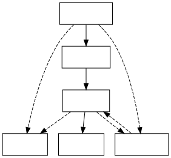

# 架构浅谈

这一章节从宏观的角度介绍移动机器人的软件系统常见的模块，以及业界常见的自动驾驶软件架构。

## 常见模块与作用

一个自动驾驶的软件系统，或者更宽泛来说，移动机器人的软件系统，有以下常见模块：

### 感知、定位
不同场景下往往使用不同的感知定位系统。自动驾驶常用激光雷达、毫米波雷达、各种摄像头、GPS与GNSS等硬件，而室内移动机器人常用激光雷达、深度摄像头（TOF，结构光等）、多目成像方案等。这一部分并非本笔记重点，除了不可避免之处将尽量不会提及。

### 运动预测
这一部分侧重于对环境中其他物体的行为和运动进行预测，在周围环境比较复杂的场景下（没错，说的就是自动驾驶）相对更加重要，而其他应用场景的移动机器人并不一定特别需要这一模块。这一模块在工程上有时与感知模块结合较为紧密，因为运动预测的输入数据来自于感知，而有时又与运动规划模块结合更紧密，因为运动规划作为下游模块直接使用运动预测的输出，并且算法角度来说运动预测与运动规划也比较相近。因此，尽管运动预测也不是本笔记的重点内容，在此也会稍作介绍。

业界相对主流的方法包括：

#### 基于规则的运动预测

感知系统常常能分辨环境中其他物体的位置，形状，类别，当前速度甚至加速度，朝向甚至运动曲率等，与此同时我们也会有其他方面的环境信息，包括车辆所属车道线、转弯指示灯、交通信号灯状态等。所有这些数据都可能用于定义某个运动预测规则：

* 形状与类别。公交车、小汽车、自行车和行人有着不同的形状和运动学模型，特别对于车辆而言，作为一种非完整约束的移动机器人，其可能做出的行为有一定可预见性，采用合适的动力学模型，结合其速度、朝向、转角等信息可以提高运动预测的精度。

* 所属车道线、转弯指示灯与交通信号灯。所属车道线往往能确定车辆接下来行动的方向，比如转弯或直行，站在斑马线上的行人相比站在人行道上的行人过马路的可能性也更大。

常见的基于规则的运动预测系统会先考虑几种可能的意图，比如转弯、直行、变道等，再在每个意图中添加一些限制，比如“沿车道线行驶”、“避免碰撞”等，从而组成一个基本的运动预测系统。

#### 基于机器学习的运动预测

所有可以用于运动预测的输入，都可以作为一个机器学习系统的输入，特别如今（2023年1月）有大量开源的自动驾驶数据集：

* [Woven Planet](https://www.woven-planet.global/en/woven-alpha/future-automated-driving-applications): Nuro, Toyota等合作

* [Udacity Self Driving Car Dataset](https://public.roboflow.com/object-detection/self-driving-car): 在线教育网站Udacity提供的数据集

* [Waymo Open Dataset](https://waymo.com/open/): Waymo提供的开放数据集

以及随着自动驾驶业界的进展，很多企业都倾向于“数据飞轮”的概念，采取前装量产等商业路线，也积累了自己的数据，完全可以支持大模型的训练，所以使用机器学习的方法做运动预测已经成为一个重要的趋势。

按照时间顺序，人们尝试过如下方法：

* 递归神经网络。自动驾驶的感知信息是一个时序序列，而RNN天然适合用于有序的序列，由此很多可用于语言模型的机器学习架构也可以用于运动预测。

* 专用的编码器。移动机器人的感知有自己的数据结构，比如车辆朝向、车道线等。这些数据如果作为图像输入会比较浪费，而结构性的数据可以有效减少输入数据规模、降低训练难度。这里不得不提一个非常有趣的作品：[Vector Net](https://blog.waymo.com/2020/05/vectornet.html)，很多后续相关工作都参考了其思想。

* 更合适的解码器与更大的模型。[TNT](https://arxiv.org/abs/2008.08294)，[DenseTNT](https://arxiv.org/abs/2108.09640)都是非常有代表性的工作，其他适合用在大语言模型中的解码器结构，比如Transformer, 也非常有潜力带来不错的效果。

随着数据的积累和机器学习算法的发展，可以预见运动预测的准确度、可靠性都将持续提升。

### 搜索

这里说的搜索并非类似于百度或者谷歌的搜索，而是算法的角度来说的图搜索。很多现实中的问题都可以抽象成一个马尔可夫过程，由以下要素构成：

* 状态 (state)。这里的状态包罗万象，在围棋中可以是当前棋盘的状态，在运动规划系统中可以包括所有车辆位置、速度、车道线信息等。

* 行为 (action)。这里的行为在围棋中可以是可选的下一步，在运动规划系统中可以是某种可能的控制组合。行为空间常有连续与不连续之分，比如围棋的落子只有离散的选项，而移动机器人控制可以是一个浮点数的转向角或者加速度。

* 状态转移方程 (state transition function)。在给定的状态下，采取某一行为，将以怎样的概率到达怎样的状态。围棋与移动机器人常常被认为是确定性的，也就是给定状态和行为，将可以达到一个确定的下一状态。

* 值函数，或者代价函数 (value function / cost)。用于评价某一状态好坏的函数。比如围棋中的昏招或者神之一手，或者自动驾驶的舒适度、是否碰撞、是否达到目的地等。

移动机器人的运动规划问题也可以如此抽象成一个有向图，节点为各种状态，包括位置、朝向甚至速度，而边就是从一个状态到达另一个状态所需要采取的行动，比如某种控制的组合。由此出发，我们便把运动规划问题抽象成了一个有向图，从而可以用搜索的方法来解决。

由于之后有专门的篇幅介绍这部分，所以这里仅作目录式的粗略介绍。常见的建图方法包括：

* 栅格化。使用occupation map表达周围位置的可达性。这是比较粗略的方法，优点是实现相对简单，缺点包括难以考虑动力学模型、难以表达可达性之外的信息等。

* [PRM](https://en.wikipedia.org/wiki/Probabilistic_roadmap) / [RRT](https://en.wikipedia.org/wiki/Rapidly-exploring_random_tree)。这是机器人运动规划经典的运动方法（经典到被收入维基百科了），采用随机采样的方法建立遍布行为/状态空间的图。这些经典方法有许多扩充，包括RRT-Star等，也因解决了一些学术界有挑战性的问题而出名。

* [State Lattice](https://www.ri.cmu.edu/pub_files/2011/5/20100914_icra2011-mcnaughton.pdf)。这是非常适用于移动机器人的运动规划算法，可以结合移动机器人的运动学特点、状态空间的特点（车道线等）进行建图。

常见的搜索方法包括：

* BFS, DFS, Dijkstra, A*。这些都是非常经典的图搜索算法。

* [Beam search](https://en.wikipedia.org/wiki/Beam_search#:~:text=In%20computer%20science%2C%20beam%20search,that%20reduces%20its%20memory%20requirements.)。严格来说这是一种通过价值函数，影响建图的算法。

* [Focal search](https://www.ijcai.org/proceedings/2018/0199.pdf)。这是一种基于A*的搜索算法，适用于解决复杂的搜索问题。

### 轨迹优化

之后也有专门的章节介绍这一部分，所以这里也只是粗略的介绍。

基于搜索的算法虽然可以在意图的层面给出不错的参考解，但是也有动力学模型的挑战、维度灾难等问题。因此业界常用轨迹优化的方法生成符合动力学模型的控制序列。常见算法包括：

* 差分动态编程([DDP](https://en.wikipedia.org/wiki/Differential_dynamic_programming))。这里假设运动模型和价值函数都是二次函数，或者采用运动模型和价值函数在某一状态附近的二阶近似。

* 二次规划([LQR](https://en.wikipedia.org/wiki/Linear%E2%80%93quadratic_regulator))。通过用运动模型的线性近似和价值函数的二阶近似来求最优轨迹。有大量衍生算法，曾被用来解决带腿的机器人、直升机的运动规划等各种看似复杂而困难的问题，都取得了不错的效果。

### 机器学习

参见[基于机器学习的运动预测](#基于机器学习的运动预测)。

值得一提的是，在需要考虑交互的复杂问题中（没错，又是在说自动驾驶），将移动机器人的规划与周围物体的运动预测一同求解往往会带来更好的效果。

### 日志与通讯

这些模块严格角度来讲是出于工程与商业的考虑。日志可以用来分析、查错、积累训练数据，通过双向实时通讯可以调整移动机器人的目的地、给予一些高级别意图的引导，或者在多机器人规划、车路协同等场景有所发挥。

至于哪些数据仅存在于本地日志中，哪些数据通过实时通讯与服务器联系，则要考虑不同的商业模式。这里举几个常见的例子：

* Robotaxi。自动驾驶出租车行业往往需要实时通讯来确定旅行的目的地，而感知、规划产生的数据较大，只能有选择地实时传递一些关键信息到服务端，其他大量数据通常只储存于本地，仅在车辆维护时上传到服务器，作为训练数据的积累等。

* 前装量产。作为一种积累数据的方式，可以选择通过实时传递数据的方法记录一些关键决策数据。

* 扫地机器人。为保护顾客隐私，往往会选择将大部分感知数据储存在本地，将任务、使用数据等上传到服务器。

## 横纵向分别规划与时空联合规划

业界比较主流的两种规划架构为，横纵向分别规划（亦有几何/速度分别规划等其他名称）和时空联合规划（动力学模型规划）。横纵向分别规划可解释性更强，业务上来说不同团队或模块有相对明确的任务，也方便分工合作，但是在处理复杂场景（特别是强交互的场景，比如自动驾驶中的变道等）时相对时空联合规划来说灵活度略差。时空联合规划更加灵活，数学模型更符合直觉，不过在业务场景、工作内容的分配上可能会有一些额外的挑战。

### 横纵向分别规划

横纵向分别规划，即分别表达轨迹的几何形状和运动速度。表达几何形状的时候，会采用离散的节点，并且用分段的光滑的曲线将这些节点连接起来。曲线的数学表达有以下几种常见方式：

*  Clothoid Path， 又有欧拉曲线等其他名称。它的特点是其曲率与路程为线性关系，所以对于有方向盘的车辆来说，每段曲线中方向盘是匀速转动的。

*  Cubic Spline， 又称三次样条曲线，采用三次多项式的参数方程表示轨迹上各个点的坐标。

在确定了轨迹的几何形状后， 可以通过求解一个较简单的优化问题规划出轨迹对应的速度。

### 时空联合规划

时空联合规划法会直接采用车辆的动力学模型，将实际规划问题抽象成马尔可夫过程并进行求解。这往往意味着需要解决维度更高的搜索或优化问题，但是也使得规划更为灵活，有潜力完成更加复杂的任务。