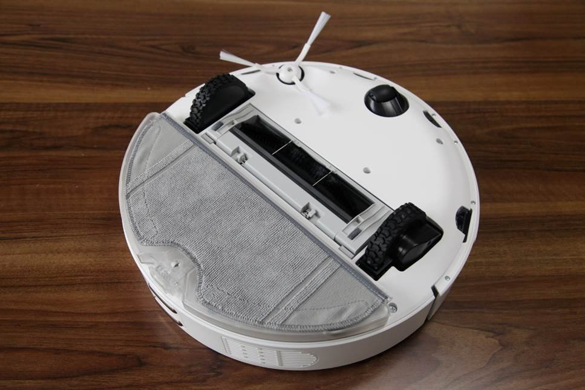
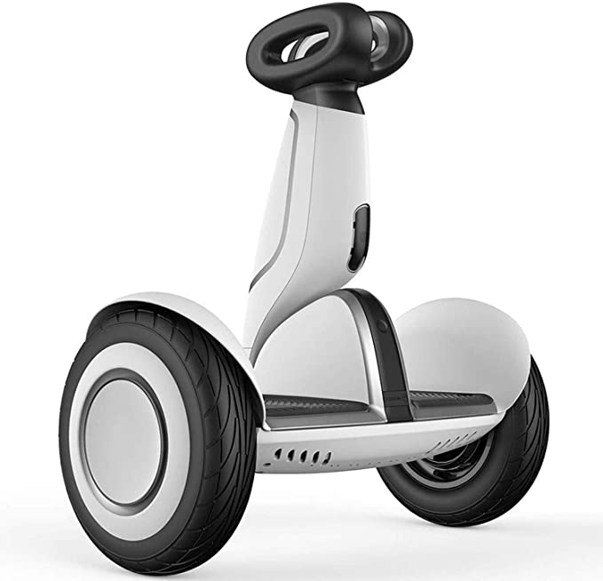
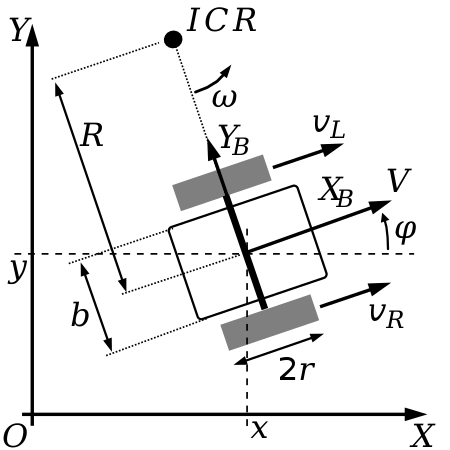
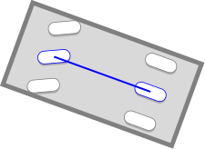
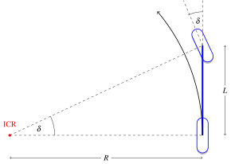

# 运动规划基础知识

本章节介绍一些运动规划算法中常遇到的数学和算法知识，包括运动学模型和简单的碰撞检测。

## 移动机器人运动学模型

这里先列举一些基础概念：

* 控制（control）：指机器人的执行器（马达等）收到的输入，常见包括电压电流，力矩，加速度，加加速度，角加速度等。

* 状态（state）：指机器人的当前状态，比如重心位置，各关节角度，前轮转向角，速度与加速度等。

可以看到加速度有时候被认为是状态的一个元素，有时候被认为是控制的一部分，这取决于不同的动力学模型。有的运动学模型较精确，使用加加速度作为控制，这时候加速度就是状态的一部分了。

动力学模型的选择取决于机器人的构型，执行器可接受的输入等。在移动机器人中，常用以下几种动力学模型：

### 差分模型

差分模型是一种相对简单的运动学模型，它适用于带差分轮的扫地机器人或其他室内机器人。差分轮指平行，等半径的一对轮子，可以分别控制两个轮子的角速度或角加速度，从而完成前进、倒退、转向等各种操作。

在此讨论的模型假定移动机器人有其他万向轮作为从动轮，起到支撑的作用，所以只需讨论二维空间的平面移动；而常见的平衡车模型还需要采用类似于倒立摆的方式处理平衡问题，在此暂不讨论。

其状态空间为：

* $x, y$：机器人中心点的二维坐标。注意这里的中心点一般指两个轮子连线的中心，如果要采用其他参考点表达机器人的位置的话，可能需要做些变换。
* $\phi$：机器人朝向的角度。

其控制空间为：

* $\omega_L, \omega_R$：左右轮转动的角速度。

下面推导其运动学方程:

$$ v = \frac{(\omega_L + \omega_R) r}{2} $$
$$ \dot{x} = v \cos \phi $$
$$ \dot{y} = v \sin \phi $$
$$ \dot{\phi} = \frac{(\omega_R - \omega_L) r}{b} $$

因此差分模型的运动学方程为：

$$ \begin{bmatrix} \dot{x} \\ \dot{y} \\ \dot{\phi} \end{bmatrix} = \begin{bmatrix} \frac{r \cos \phi}{2} & \frac{r \cos \phi}{2} \\ \frac{r \sin \phi}{2} & \frac{r \sin \phi}{2} \\ -\frac{r}{b} & \frac{r}{b} \end{bmatrix} \begin{bmatrix} \omega_L \\ \omega_R \end{bmatrix} $$

Reference: [Wikipedia](https://en.wikipedia.org/wiki/Differential_wheeled_robot)

### 自行车模型

自行车模型是一种最简化的前轮控制转向的车辆模型。它是适用于常见的，前轮控制转向的四轮车辆的一种简化的模型，将四轮车辆近似成前轮转向的自行车。

其状态空间为：

* $x, y$：机器人中心点的二维坐标。
* $\theta$：机器人朝向的角度。
* $v$：机器人的线速度。

其控制空间为：

* $a$：机器人的线加速度。
* $\delta$：前轮转向角。

通过瞬时旋转中心(instant center of rotation)作为辅助，易推导其运动学方程为：

$$ \begin{bmatrix} \dot{x} \\ \dot{y} \\ \dot{\theta} \\ \dot{v} \end{bmatrix} = \begin{bmatrix} v \cos \theta \\ v \sin \theta \\ v/L \tan \delta \\ a \end{bmatrix} $$

Reference: [KinematicsBycicleModel](https://thomasfermi.github.io/Algorithms-for-Automated-Driving/Control/BicycleModel.html#)

## 计算几何学

### 状态和形状的表达

### 碰撞检测

#### 点与矩形

#### OBB与AABB

#### 几种可能的加速方法

