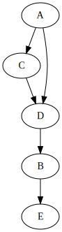
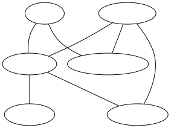
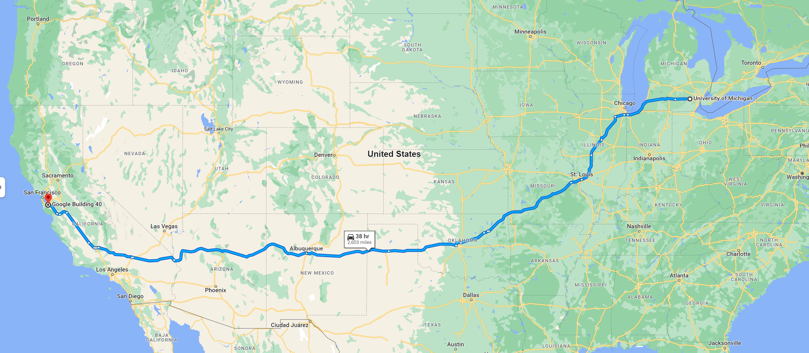
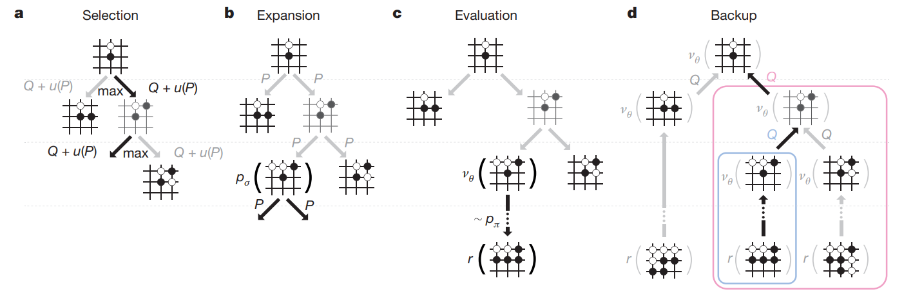
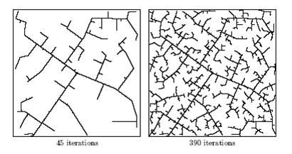
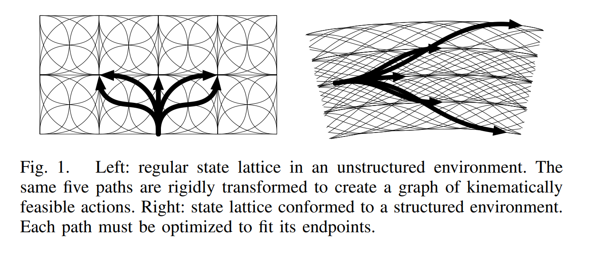

# 搜索

这里的搜索不是说百度或者谷歌，而是指在图（graph）上找到路径的算法。

## 图

计算机科学中，图是指由顶点（vertices，有时也称节点， nodes）和连接这些顶点的边（可以是有向或无向的）组成。

如下所示是一个抽象的有向图：



图可以用来表达非常丰富的信息，例如交通路线图（不要太在意各个节点间的位置关系，这里我们更看重它们的联通关系）：



## 为什么搜索是万能的

这个章节标题有点唬人，我这里其实想说的是，有非常多的实际问题可以抽象成图，其求解方法自然可以用图上的搜索算法来做。举几个例子。

首先是地图导航。非常自然地，我们可以把各个地点，包括起点和终点，视为图的顶点，而各条公路就是连接这些顶点的边。地图导航本质上就是在这个图中搜索一个从起点到终点的路线，使得总路程或总时间最短：



我们可以将围棋棋盘上的状态视为一个个节点，每一步落子视为连接这些节点的边。一局围棋比赛中，自然是从空棋盘开始，直到终盘有一方有一些优势，从而围棋的AI可以视为从当前棋局状态开始，寻找对己方更有利的棋局的搜索算法： 



当然实际工程中，围棋状态空间极大，使用传统的搜索算法几乎不可能，“寻找对己方更有利棋局”也是一个不严谨的表达，具体的数学模型和算法设计可以参见[AlphaGo](https://storage.googleapis.com/deepmind-media/alphago/AlphaGoNaturePaper.pdf)，上图也截取自该论文。

因此，图和搜索是非常强大的数学模型，可以解决很多种类的实际问题。

## 基础搜索算法和先进搜索算法

### BFS， DFS， A*

下面介绍几种特别常见的，程序员们应该烂熟于心的搜索算法：广度优先算法(BFS), 深度优先算法(DFS)和A*。对于一个搜索从起始点（begin）到终点（end）的路径的问题，他们有十分接近的伪代码：

```
open_list = [begin]
path_list = []
visited = []
while open_list is not empty:
    cur_node = open_list.get_one()
    visited.add(cur_node)
    if cur_node == end:
        update path_list
        return path
    else
        for s in cur_node.successors:
            if s not in visited:
                open_list.add(s)
                update path_list
return "No path found"
```

其主要区别在于`open_list.get_one()`的具体方法。广度优先算法使用队列（先入先出），深度优先算法使用栈（先入后出），而A*算法使用优先队列。

以同一个有向图，以A为起点，E为终点为例：


以下为广度优先算法的执行步骤：

| Step | cur_node | open_list | visited         | path_list                            |
| ---- | -------- | --------- | --------------- | ------------------------------------ |
| 0    | -        | [A]       | []              | [A]                                  |
| 1    | A        | [C, D]    | [A]             | [A, A->C, A->D]                      |
| 2    | C        | [D]       | [A, C]          | [A, A->C, A->D]                      |
| 3    | D        | [B]       | [A, C, D]       | [A, A->C, A->D, A->D->B]             |
| 4    | B        | [E]       | [A, C, D, B]    | [A, A->C, A->D, A->D->B, A->D->B->E] |
| 5    | E        | []        | [A, C, D, B, E] | [A, A->C, A->D, A->D->B, A->D->B->E] |

以下为深度优先算法的执行步骤：

| Step | cur_node | open_list | visited      | path_list                            |
| ---- | -------- | --------- | ------------ | ------------------------------------ |
| 0    | -        | [A]       | []           | []                                   |
| 1    | A        | [C, D]    | [A]          | [A, A->C, A->D]                      |
| 2    | D        | [C, B]    | [A, D]       | [A, A->C, A->D, A->D->B]             |
| 3    | B        | [C, E]    | [A, D, B]    | [A, A->C, A->D, A->D->B, A->D->B->E] |
| 4    | E        | [C]       | [A, D, B, E] | [A, A->C, A->D, A->D->B, A->D->B->E] |

A* 在执行`open_list.get_one()`时，会考虑列表中每个节点的启发式权重值。例如在搜索路径的任务中，常使用直线距离作为估计，并且根据直线距离选择较近的节点优先处理。

### Beam Search

TODO(fanmx): work in progress.

### Focal Search

TODO(fanmx): work in progress.

## 机器人学中的建图方法

上一讲中我们提到了机器人的状态的表示方法。对移动机器人，以及其他种类的机器人而言，我们都是用一组数据表达它目前所处的状态，而每个状态都可以视为一个节点，状态和状态之间可以用边相连，于是我们便有了一张图。路径规划问题，即寻找符合一定条件（从起点到终点，无碰撞，路径相对较短等）的状态的轨迹，当我们建立了这样一张图之后，便可以使用搜索算法求解路径规划问题。

为了方便算法的讨论，我们接下来选择二维平面作为示例。要知道，这里的空间其实是机器人的状态空间，完全可以是更高维度，不仅仅可以包含空间坐标，也可以包含加速度、曲率等各种物理参数。

下面我们来介绍几种机器人学中常用的建图的方法。

### PRM

PRM指概率随机地图（Probablistic Random Map）或概率路图（Probablistic Roadmap）。生成PRM需要以下两步：

1. 在状态空间（或设置空间）中随机取样。这一步中我们也可以剔除不可用的点，比如发生碰撞的点或者出于其他原因不应当选择的状态点等。
2. 采用一个本地规划器（local planner）将邻近的点相连。
3. 加入起点和终点，并与邻近的点相连。


由此我们便可以得到一个包含起点和终点的图。我们可以在这张图上使用各种搜索算法去寻找从起点到终点的路线，从而解决规划的问题。

Reference: [Wikipedia](https://en.wikipedia.org/wiki/Probabilistic_roadmap)

### RRT及其变种

PRM是一个相对容易理解并且相对通用的建图方法，但是它也有一些缺点：

1. 为了提高搜索的成功率以及搜索到的路径的质量，往往需要取大量的点，可能会影响运算速度。
2. 对于高维度的状态空间，例如六轴机械臂的configuration space高达6维，Juke Jerk车辆运动学模型可以高达8维，我们可能需要成指数增长的采样点才能完成规划任务。这也称为运动规划的维度灾难。

所以这里来介绍RRT，一个比PRM更快的建图的方法。直接来看伪代码：

```
Algorithm BuildRRT
    Input: Initial configuration qinit, number of vertices in RRT K, incremental distance Δq
    Output: RRT graph G

    G.init(qinit)
    for k = 1 to K do
        qrand ← RAND_CONF()
        qnear ← NEAREST_VERTEX(qrand, G)
        qnew ← NEW_CONF(qnear, qrand, Δq)
        G.add_vertex(qnew)
        G.add_edge(qnear, qnew)
    return G
```
其中，`RAND_CONF`在设置空间中取随机点，`NEAREST_VERTEX`在图上找距离给定点最近的节点，`NEW_CONF`根据给定的两个节点和给定的精度值，寻找符合条件的下一个节点（或多个节点）用来加入树。

二维空间中RRT的建图过程可以可视化如下：



可以把RRT理解为，通过从起点开始，向各个随机方向连直线，快速生成一颗尽量密布整个空间的树。

RRT还有许多变种，列举几种相对知名的如下：

1. bidirectional RRT: 从起点和终点分别建立两颗树，当两棵树相连时停止继续建图。
2. RRT*: 在建立树的过程中对局部的节点和边进行调整，使得从起始点到每个节点的距离尽量短。

Reference: [Wikipedia](https://en.wikipedia.org/wiki/Rapidly-exploring_random_tree)

### State Lattice（状态晶格）

以上两种建图方法中，相邻状态之间是由直线连接的，这其实对于机器人的可控性有一定的要求--并非所有类型的机器人，其设置空间或状态空间的每一个自由度都可以独立连续移动。对于六轴机械臂或者三维空间自由移动来说这个假设还算成立，对于常见的移动机器人来说，坐标位置的变换往往与朝向角度相关，从而不能简单地从设置空间或状态空间采样。

一种可能的建图方法是，从每一个节点出发，我们根据机器人的性质和要解决的问题的性质选取一些可能的基础运动单元（motion primitive），尽量覆盖各种方向、转向等，然后再从这些运动片段的终点继续选取新的运动片段。这种方法建立的图仿佛一个个晶体的晶格：



Reference: [Matthew's paper](https://www.ri.cmu.edu/pub_files/2011/5/20100914_icra2011-mcnaughton.pdf)

这是一种相对最适合移动机器人的建图方法。