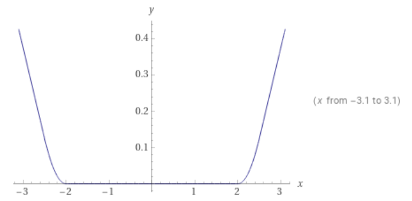
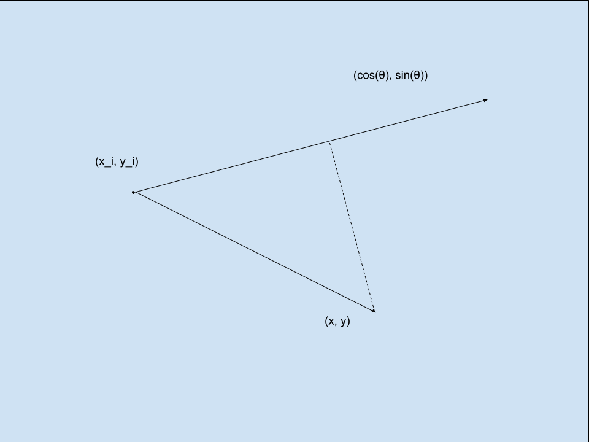
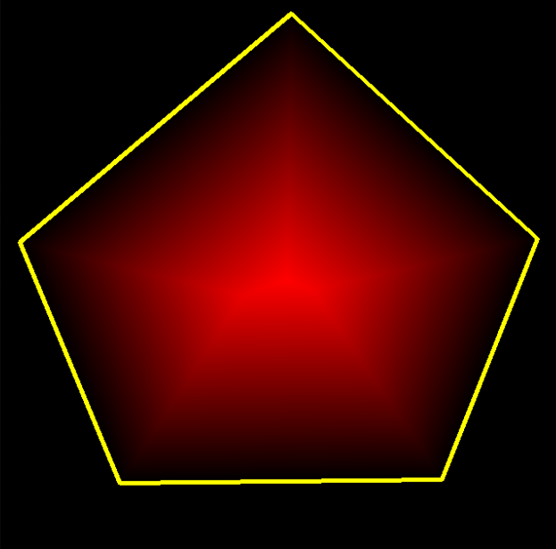
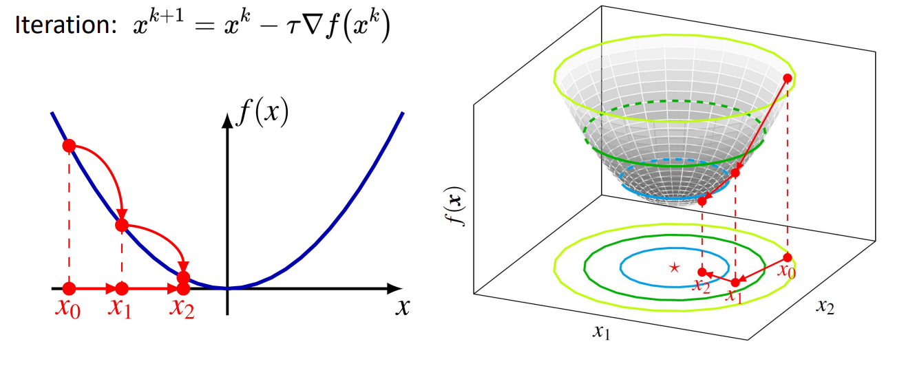
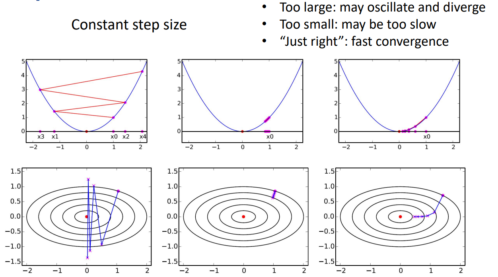

# 基于优化的规划算法

本章介绍基于优化的轨迹规划算法。

## 优化问题的一般形式

数学中的优化问题可以表示成以下较为通用的形式：

```math
\min f(x) \\
\text{s.t.} \\
g(x) < 0 \\
h(x) = 0
```

这里 $f(x)$ 为一个 $\mathbb{R}^n \rightarrow \mathbb{R}$ 的函数，在优化问题中常被称为代价函数(Cost function)，而在强化学习等其他领域有时也将其相反数称为奖励函数(Reward)。其定义域可以有多于一个维度，视实际问题而定，而其值域为实数或其他偏序空间，从而可以决定不同输入的优劣。

$g(x)<0$ 和 $h(x)=0$ 被称为约束条件(constraints)，分为不等式约束和等式约束。它们用来限制输入的范围。

许多实际问题中变量都不可能取到任意值，例如商业问题可能会有库存总量限制，机器人运动规划可能会有马达扭矩限制等，这些都可以以不等式约束的方式来表达；而机器人动力学方程、调度问题物品总量守恒等都可以用等式约束的形式表达。

## 移动机器人优化问题特点

机器人运动规划问题相比于更一般的规划问题有以下两个特点：

1. 机器人运动规划一般采用离散的形式，将轨迹表示成一个个状态点，并用马尔可夫过程来建模，即下一状态只与当前状态下的行动有关而与更早的状态无关，从而我们其实可以得到一组等式约束：
```math
s_t = d(s_{t-1}, a_{t-1}), \forall i \in [1, t] 
```
其中d为运动学方程。
从而在设计代价函数的过程中，也可以对轨迹上各个状态独立设计：
```math
c_t = c(s_{t}, a_{t})
```
2. 机器人运动规划中常用的优化算法一般希望代价函数的一阶导数是连续的。

## 代价函数

下面来介绍几种机器人运动规划中常用到的几种代价函数的可能设计。要注意，这里提供的仅仅是可能的设计代价函数的思路，实际应用中务必要参考希望解决的优化问题的特点，以及使用的优化算法进行设计。

以下部分针对二维平面中移动机器人运动规划，并考虑前述两个特点。

### 动力学相关的代价函数

移动机器人轨迹规划中，常对动力学参数有一定的要求，例如最大加速度的限制、刹车的加速度的限制，或我们希望以绝对值尽量小的控制量来完成运动操作（从而使轨迹尽量光滑）。

针对有边界限制的量，除了把他们设置成优化问题本身的不等式约束之外，我们也可以考虑惩罚超出边界的情况，以huber loss为例：

```math
c(x) = 
\begin{cases}
-\delta (x - l + \frac{1}{2}\delta), & x \le l-\delta \\
\frac{1}{2}(x-l)^2, & l-\delta < x \le l \\
0, & l < x \le u \\
\frac{1}{2}(x-u)^2, & u < x \le u + \delta \\
\delta (x - u - \frac{1}{2}\delta), & x > u + \delta \\
\end{cases}
```

其函数图像大致如下所示（ $l=-2.0, u=2.0, \delta=0.5$ ）:



而针对希望绝对值尽量小的量（例如加速度，曲率等），可以简单地使用平方作为代价函数：

$$
c(x) = x^2
$$

这个图象就暂且不画了。

### lane-keeping / path tracking

移动机器人优化问题中一个常见的任务是要沿着某条轨迹，比如扫地机器人按照规划好的路线，或者自动驾驶汽车沿着车道线。这里介绍两种不同的情况：

第一种情况，我们对于机器人在每个时间点运动到的位置有要求，即假定我们已经有了一个轨迹 $(x_t, y_t)$ 。这种情况下我们可以用一个比较简单的距离函数作为代价函数：

$$
c_t(s) = [ (x - x_t)^2 + (y - y_t)^2 ] 
$$

要注意这里的下标，即对每一时刻，这个函数取到最小值的点都是我们希望跟随的轨迹对应时刻的点。

第二种情况，我们只希望机器人沿着某个轨迹 $(x_i, y_i, \theta_i)$ 运动并不偏离该轨迹太远，而不要求某个时刻要运动到某个位置。注意这里为了方便，我们在表达轨迹的时候加入了每个状态的朝向角。

这种情况更加复杂，因为我们不知道在每一个时刻，机器人应该纵向运动到什么位置，只是希望尽量减小横向的偏差。我们可以设计这样一个代价函数，首先对于每一个路径点求一个偏差值（虚线线段长度的平方）:



$$
c_{i} = (x - x_i)^2 + (y - y_i)^2 - [(x-x_i)\cos \theta + (y - y_i) \sin \theta]^2
$$

再根据机器人坐标到路径点的距离做光滑的加权平均：

$$
w_{i} = \frac{e^{-d_i}}{\sum_{j=0}^N e^{-d_j}}
$$

这两部分结合：

$$
c(s) = \sum_i w_{i} c_{i}
$$

当然这个代价函数的设计只适用于曲率较小的路径，对于掉头、270度弯等情况需要考虑用其他方法减小不应考虑的路径点对代价函数造成的影响。

### collision avoidance

对于规避圆形的障碍物 $(x_i, y_i, r_i)$ ，我们可以先计算机器人状态点到障碍物的距离，然后使用一个光滑的Step Function（以Sigmoid为例）：

$$
c(s) = \frac{1}{1 + e^{(x-x_i)^2 + (y - y_i)^2 - r_i^2}}
$$

对于规避多边形障碍物，我们可能需要一个光滑的函数判断输入状态点距离多边形边缘的距离。我们可以计算状态点到多边形每条边的有向距离（对顺时针排列的顶点/边，在右侧为正，左侧为负），然后计算其Sigmoid函数值，再将每条边的Sigmoid值相乘，可以得到如下图所示的光滑二维函数：



TODO(fanmx)：补充具体数学形式。

## 通用优化算法

我们先来看两种适用于一般形式的优化问题的优化算法。我们先从最简单的，没有约束条件的情况开始研究。

### 梯度下降法

解优化问题常用迭代的方法，一般通过某种方式对目标函数的极值点有一个初始的估计，然后通过某种方法，逐步逼近真正的极值点。我们记初始的猜测 $x_0$ ，迭代第 $k$ 步时，状态值更新为 $x_k$ 。

梯度下降法，顾名思义，是沿着梯度下降的方向更新当前的猜测：

$$
x_{k+1} = x_k - \tau \nabla f(x_k)
$$

以下是对于一维函数和二位函数，梯度下降法的图示：



注意上式中的 $\tau$ 被称为步长。步长的选择对于梯度下降法的性能非常重要，过大或过小的步长都会导致收敛结果不尽如人意：



除了常数大小的步长，我们还可以使用逐渐缩小的步长：

$$
\tau_k = \frac{\tau_0}{k}
$$

或者使用线搜索(line search、Armijo condition)的方法：

$$
\tau = \text{arg} \min_{\alpha} f(x_k + \alpha d)
$$

### 牛顿法

梯度下降法只使用了目标函数的一阶导数的信息。如果我们可以同时使用二阶导数的信息，或许可以让收敛的速度变得更快。我们先对目标函数进行泰勒展开：

$$
f(x) \approx f(x_k) + \nabla f(x_k)^T (x - x_k) + \frac{1}{2} (x - x_k)^T \nabla^2 f(x_k) (x - x_k)
$$

然后根据泰勒展开的二阶近似去找其极小值点：

$$
x_{k+1} = x_k - \frac{\nabla f(x_k)}{\nabla^2 f(x_k)} 
$$

一般认为牛顿法收敛速度优于梯度下降：


注：

1. 牛顿法对于非凸函数并不好用，因为某些情况下其将收敛到鞍点或极大值点。
2. 牛顿法也可以用线搜索的方法寻找合适的步长，可以处理一些非凸的情况。

## 基于马尔可夫过程结构的优化算法

如果我们用优化的方法求解运动规划问题，实际上是在以下空间上优化代价函数：

$$
(x_0, u_0, x_1, u_1, \dots, x_n, u_n)
$$

其中 $x_0$ 为初始状态， $u_n$ 为轨迹最终状态的控制，可以省略；但为方便起见我们暂且列出。

如第二章中所讲，运动规划问题的任务是生成一条符合运动学模型的轨迹：

$$
x_{t+1} = f(x_t, u_t)
$$

从而我们有了许多个限制条件。而这些限制条件符合马尔可夫过程的特点：未来的状态只与当前状态和控制有关，与过去的状态无关。我们可以针对这一特点设计一些优化算法。

### LQR

我们假定代价函数为二次型，运动学模型为线性的，即：

```math
x_{k+1} = Ax_k + Bu_k \\
c(x_k, u_k) = x_k^T Q x_k + u_k^T R u^k
```

其中 $Q \succ 0, R \succ 0$ 。

考虑 $t$ 时刻的cost-to-go函数的最小值：

$$
J_t(x) = \min_u x_k^T Q x_k + u_k^T R u^k + J_{t+1} (Ax + Bu)
$$

而对于最末状态，我们可以取其代价函数(可令 $P_0 = Q$ )：

$$
J_T(x) = x^T P_0 x
$$

从而

$$
J_{T-1}(x) = \min_u x_k^T Q x_k + u_k^T R u^k + (Ax + Bu)^T Q (Ax + Bu)
$$

这是对于 $u$ 的二次型，可知

$$
u = -(R + B^T P_0 B)^{-1} B^T P_0 A x
$$

代回得：

$$
J_{T-1}(x) = x^T P_1 x
$$

其中

```math
P_1 = Q + K_1^T R K_1 + (A + B K_1)^T  P_0 (A + B K_1) \\

K_1 = -(R + B^T P_0 B)^{-1} B^T P_0 A
```

这又是一个二次型，从而可以一直迭代到$t=0$，我们可以从给定的初始状态 $x_0$ 得到 $u_0$ ，进而得知每一个时刻的最佳控制 $u_t$ 。


### iLQR

iterative LQR是用于解决非线性动力学模型、非二次型代价函数的，比较一般的运动规划问题的好方法。

我们对于一条初始轨迹：

$$
(x_0*, u_0*, x_1*, u_1*, \dots, x_T*, u_T*)
$$

取其运动学方程的泰勒展开进行一阶近似得到线性的运动学方程：

```math
x_{t+1} \approx f(x_t*, u_t*) + \frac {\partial f(x_t*, u_t*) } {\partial x} (x_t - x_t*) + \frac {\partial f(x_t*, u_t*) } {\partial u} (u_t - u_t*) \\

x_{t+1} - x_{t+1}* \approx A_t (x - x_t*) + B_t (u - u_t*)
```

从而我们将问题近似化为了以 $(x-x*, u-u*)$ 为中心的，线性时变的LQR问题。

我们可以用LQR的方法求解此问题，得到初始轨迹附近的最优轨迹，然后重复此过程直到收敛。

Reference: [Pieter's slides](https://people.eecs.berkeley.edu/~pabbeel/cs287-fa12/slides/LQR.pdf)
