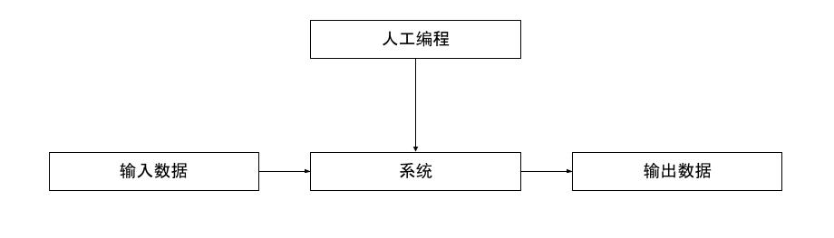
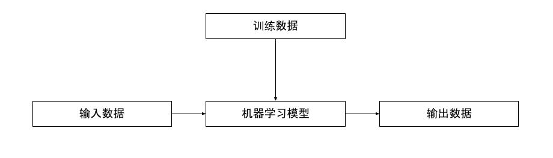

# 12_机器学习浅谈

这里我们对机器学习进行一个粗浅的介绍。机器学习本身是一个庞大的话题，穷尽本书的篇幅亦只能浅谈一二，所以这里我们不求为读者介绍非常详实的信息，转而以整体概念为重点。对于希望入门机器学习的读者，建议参考如下资料：

* 吴恩达的机器学习课程 （Stanford CS 229）
* 模式识别与机器学习（Pattern Recognition and Machine Learning, M. Jordan）
* Tensorflow 官网教程

## 什么是机器学习

机器学习是计算机科学的一个领域，能让计算机不通过具体的程序逻辑，而是通过学习训练数据中的模式，完成预测或决策等任务。

它与传统计算机软件或算法的主要区别在于，传统计算机软件或算法通过人工编程的方法实现业务逻辑，而机器学习通过在输入数据上进行训练得到一个模型。

不同的机器学习算法具体形式也不尽相同，不过几乎所有机器学习算法都包含以下两个重要的部分：

首先是模型。模型是对一个系统的数学抽象，它常由一些参数、一些算式构成，形成一个由输入数据到输出数据的映射。它可以是根据某个阈值进行分类的决策树，也可以是一些矩阵乘法与加法，也可以是卷积运算，甚至也可以是RNN或LSTM等更复杂的结构。

其次是损失函数（有的领域也称代价函数）。它用来评判模型的表现，通过将模型的输出与训练数据的真实值（ground truth，有时可以称为标签lable）做对比评价模型的优劣，并且对更新模型参数的方向给出指导。最直观的损失函数包括均方差（mean square error, MSE），平均绝对误差（mean absolute error, MAE）等，根据具体需求有时也会设计出更复杂的损失函数，例如二维图像中的物体检测，由于输出值代表检测目标的位置和形状，难以直接使用均方差作为损失函数，从而在RCNN等方法中都设计了其他形式的损失函数。

## 机器学习的类别

由于机器学习的本质是建立一个形成从输入到输出的映射的数学模型，它是十分灵活、可以用来解决非常多种类的问题的方法，所以也发展出了形态各异的各种机器学习算法，各种算法都有其独特的优势与劣势，也有其适用的场景，互相之间也有各种各样的关联，因此也有很多不同的分类方法。

### 由输入数据分类

从输入数据的类型的角度来说，可以将机器学习分为以下几类：

* 监督学习。监督学习在标注好的数据上进行训练，其输入数据已经过处理，对于给定的输入，我们对机器学习系统的输出值有一个明确的标注。
* 无监督学习。无监督学习的输入数据并未进行标注，机器学习算法会自己发掘数据的模式，从而进行分类等任务。
* 强化学习。不同于其他类型的机器学习，强化学习的“输入”是一个可以交互的环境，而强化学习的模型常被称为一个Agent，它可以通过在给定状态下采取给定行动的方式与这个环境进行交互，并且根据得到的惩罚或奖励进行学习。这种机器学习较为复杂，却又十分适合在运动规划中使用，我们将在下一章节进行更具体的介绍。

尽管在分类的过程中已经尽量泾渭分明，依然有许多著名的工作打破了这些分类的界限。有些监督学习的算法因为希望更好地利用未标注的数据，有时也会引入一些无监督学习的方法，通过探索未标注的数据获得了优于仅使用标注数据训练的效果；有些强化学习的Agent会先使用监督学习来给出一些基本的策略，之后再在此基础之上进行探索和学习，可以节省一些从零开始学习的训练时间；近来十分火爆的大语言模型也是先使用Transformer进行监督/半监督学习，之后通过人因参与的强化学习（RLHF）对模型输出进行进一步调整。

### 由任务类型分类

从执行任务的角度来说，机器学习又可以有另一种不同的分类：

* 图像处理。包括图像识别与分类、物体检测等，其特点是输入数据由一个个密集的像素构成，数据量大，对计算资源的要求更高。自从卷积神经网络被用于mnist手写数字识别，GPU被用于矩阵运算加速之后，图像处理相关的机器学习算法获得了长足的发展，基于卷积神经网络的结构主宰学界业界多年；后来随着Transformer和注意力机制被用在图像处理上，模型的结构也有了一些新的变化。
* 语音、文字处理。子类包括语音识别，文字转语音，完形填空任务等，其特点是输入数据具有时间序列的特征。早年人们使用循环神经网络（RNN）和LSTM取得了不错的效果，后来Transformer的诞生让机器学习在自然语言相关任务上的表现再上一个台阶。
* 游戏，运动规划等。这类任务的输入和输出并非是标准化的，机器学习模型的主要任务是在游戏中（或实际的运动规划问题中）取得尽量好的表现。这类任务中强化学习大放异彩，基于强化学习算法的AlphaGo便是人类第一个战胜顶尖职业围棋选手的AI。

同样，许多实际的工程实现也一定程度上打破了这些分类的界限。以谷歌的PaLM为代表的多模态模型打破了图像与自然语言推理的界限，可使用单个模型在文字提示下进行一些图像处理的任务；游戏和运动规划的前置任务往往与图像识别相关，从而用于一些任务场景的模型中，其底部基层可能与图像处理的模型相仿。

### 由模型结构分类

还有一种分类的方法是根据模型的结构分类，也可以称为根据算法分类。显然模型的结构与希望完成的任务息息相关，因此这一分类与前一种分类方法一定程度上有所关联。又因为这一分类方法会罗列数种经典算法，我们也顺便对这些算法进行一些简介。

#### 支持向量机（Support Vector Machine, SVM）

## 机器学习的局限和挑战

尽管机器学习算法十分强大，人们也已通过机器学习实现了许多之前做不到的事，但是机器学习也并非是万能的，它有着以下几点局限与挑战：

* 机器学习学到的模型是基于数据的。这意味着要想获得强大的模型，须得有大量、准确的数据。同时，尽管模型有一定的泛化能力，依然难以保证训练得到的模型在面对未曾见过的输入时的表现。
* 强大的机器学习模型往往包含大量的参数，这也意味着人类很难理解从输入到输出之间，机器学习模型进行了怎样的推理和判断。想要解释为什么某个模型结构可以给我们更好的结果、为什么训练得到的模型会出现一些错误，是一件并不容易的事。
* 强大的机器学习模型会消耗大量的资源。训练一个数十亿参数的大语言模型的开销在数百万美元量级，训练的过程不仅昂贵，还会消耗大量的水电资源；对于实时性要求较高的场景（例如需要随时对周围环境进行响应的自动驾驶），模型的大小也受限于人类现有计算硬件的性能。
