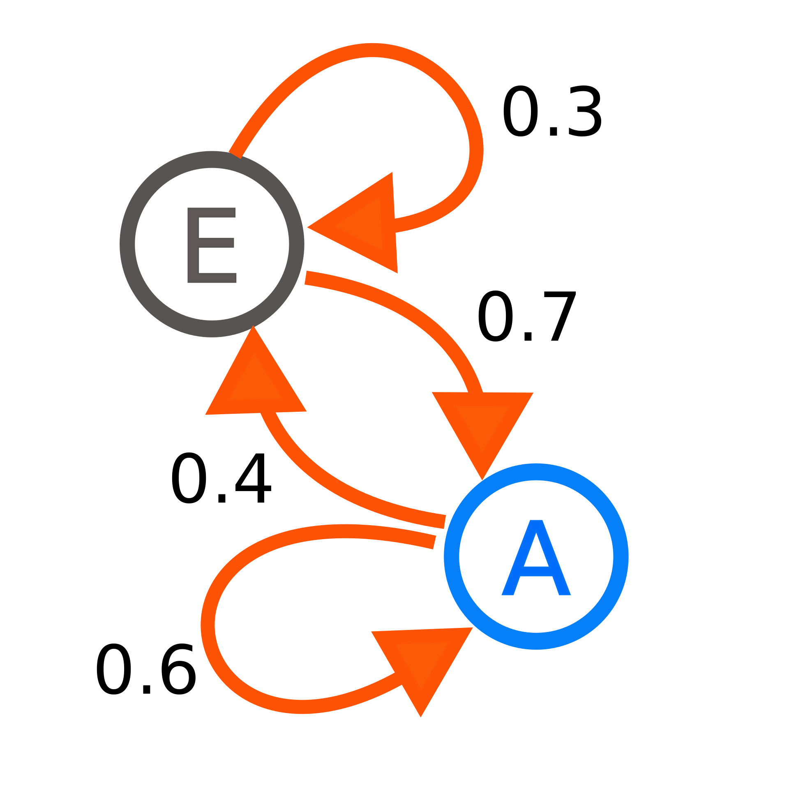

# 13_强化学习

强化学习是机器学习中相对特殊的一类。相比于监督学习、半监督学习等方法，强化学习并不一定需要大量已标注的数据，而是使用一个智能体，与一个环境进行交互，在交互的过程中探索学习，从而习得一系列策略，来完成一定的任务或者获取一定的奖励。

强化学习是一个有趣而强大的工具，谷歌使用它开发出了顶级的围棋人工智能 Alpha Go 和 Alpha Zero， 打通了老旧红白机(Atari games)上的各种游戏，Open AI使用它制作了可以和职业选手同台竞技的Dota2 游戏AI，亦有学者使用它制作了可以在模拟器以及现实环境中奔跑的四足机器人。它具有极强的泛化性和探索能力，因此其数学模型、各类变种亦难免略有些繁琐，希望读到这里的读者们可以坚持一下，仔细阅读思考并加以实践，从而更好地理解强化学习。

## 马尔可夫链（Markov chain）和马尔可夫决策过程

这一章节将从马尔可夫链与马尔可夫过程讲起。马尔可夫决策过程是一个表达能力极强的数学模型，非常多的实际问题，包括但不限于围棋，电子游戏，执行特定任务的机器人等，都可以表达成一个马尔可夫决策过程。

### 马尔可夫链

马尔可夫链（Markov chain），又称离散时间马可夫链（discrete-time Markov chain，缩写为DTMC），因俄国数学家安德烈·马尔可夫得名，为状态空间中经过从一个状态到另一个状态的转换的随机过程。该过程要求具备“无记忆”的性质：下一状态的概率分布只能由当前状态决定，在时间序列中它前面的事件均与之无关。这种特定类型的“无记忆性”称作马可夫性质。马尔科夫链作为实际过程的统计模型具有许多应用。

对于一个一般的随机过程，其下一时刻的状态分布可能是之前所有时刻历经的状态的函数：

$$
\mathcal{P}_{ss'} = \mathbb{P} [ S_{t+1} = s' | S_t = s_t , S_{t-1} = s_{t-1}, ...]
$$

而对于马尔可夫过程，其下一时刻的状态分布仅与当前状态有关，与再之前的状态无关：

$$
\mathcal{P}_{ss'} = \mathbb{P} [ S_{t+1} = s' | S_t = s]
$$

在马尔可夫链的每一步，系统根据概率分布，可以从一个状态变到另一个状态，也可以保持当前状态。状态的改变叫做转移，与不同的状态改变相关的概率叫做转移概率。随机漫步就是马尔可夫链的例子。随机漫步中每一步的状态是在图形中的点，每一步可以移动到任何一个相邻的点，在这里移动到每一个点的概率都是相同的（无论之前漫步路径是如何的）。

下图所示的例子为一个只有两个状态的马尔可夫链。当处于状态 $E$ 的时候，下一时刻，有 $70%$ 的概率转变为状态 $A$，而有 $30%$ 的概率保持状态 $E$ 不变；当处于状态 $A$ 的时候，下一时刻，有 $40%$ 的概率转变为状态 $E$，而有 $60%$ 的概率保持状态 $A$ 不变。

我们也可以使用矩阵来表示状态转移的概率：

$$
\mathcal{P} = \begin{bmatrix} [\mathcal{P}_{11} & \dots & \mathcal{P}_{1n} \\ \vdots & \dots & \vdots \\ \mathcal{P}_{n1} & \dots & \mathcal{P}_{nn} ] \end{bmatrix}
$$

其中 $\mathcal{P}_ij$ 代表状态为 $S_i$ 时，转移到 $S_j$ 的概率。显然应有 $ \forall i,  \sum_{k=1}^n \mathcal{P}_{ik} = 1$。

我们可以将一个马尔可夫过程记为 $<S, \mathcal{P}>$，其中 $S$ 为包含所有可能状态的集合，$\mathcal{P}$ 为状态转移矩阵。
 
### 马尔可夫奖励过程

马尔可夫奖励过程在马尔可夫过程的基础上引入了奖励 $R$ 和奖励衰减系数 $\gamma$： $<S, \mathcal{P}, R, \gamma>$。

$S$ 状态下的奖励定义为， 某一时刻处在状态 $s$ 下，下一个时刻能获得的奖励的期望：

$R_s = E[R_{t+1} | S_t = s]$

这里要注意，以离开该状态时的奖励的期望作为奖励仅仅是为方便起见进行的约定。同样我们也可以约定以进入该状态时的奖励作为该时刻的奖励，也是可以的。

我们将一个马尔可夫奖励过程中，时刻$t$之后获得的所有的奖励的有衰减的和定义为收益（gain, 也可称为收获或回报）：

$$
G_t = R_{t+1} + \gamma R_{t+2} + \gamma^2 R_{t_3} + \dots = \sum_{k=0}^{\infty} \gamma^{k} R_{t+k+1}
$$

这里我们常使用 $\gamma \in (0, 1]$ 作为衰减系数。直观上来说我们会选择一个小于$1$的衰减系数，可以认为我们并不平等地取之后所有奖励之和，而更青睐于短期内可以获得的奖励。这是一种相对简洁的数学表达。

接下来我们可以定义价值函数。一个马尔可夫奖励过程中，某一状态的价值函数定义为，从该状态开始的马尔可夫链的收益的数学期望：

$$
v(s) = E[G_t | S_t = s]
$$

价值函数给出了某一状态的长期价值。

到这里，我们有了马尔可夫过程这一模型，也有了一套评价各个状态好坏的价值函数。但是马尔可夫过程本身是随机的，我们并没有办法控制系统的状态，因此对于各个状态的好坏的评价意义也不大。下面我们来引入行动。

### 马尔可夫决策过程（Markov Decision Process, MDP）

相较于马尔可夫奖励过程，马尔可夫决策过程增加了每个状态下的行动。由一个状态转移为另一个状态并不再是完全随机的，而是由当前状态和当前状态下采取的行动决定的:

$$
\mathcal{P}_{ss', a} = \mathbb{P} [ S_{t+1} = s' | S_t = s , A_t = a]
$$

这个式子的意义为，在当前状态 $s$ 下采取行动 $a$， 状态将以一定的概率转移为 $s'$。

与此同时我们也可以定义奖励：

$$
\mathcal{R}_{s, a} = \mathbb{E} [ R_{t+1} | S_t = s , A_t = a]
$$

这里的奖励是在状态 $s$ 下采取行动 $a$，所获得的奖励的期望。

